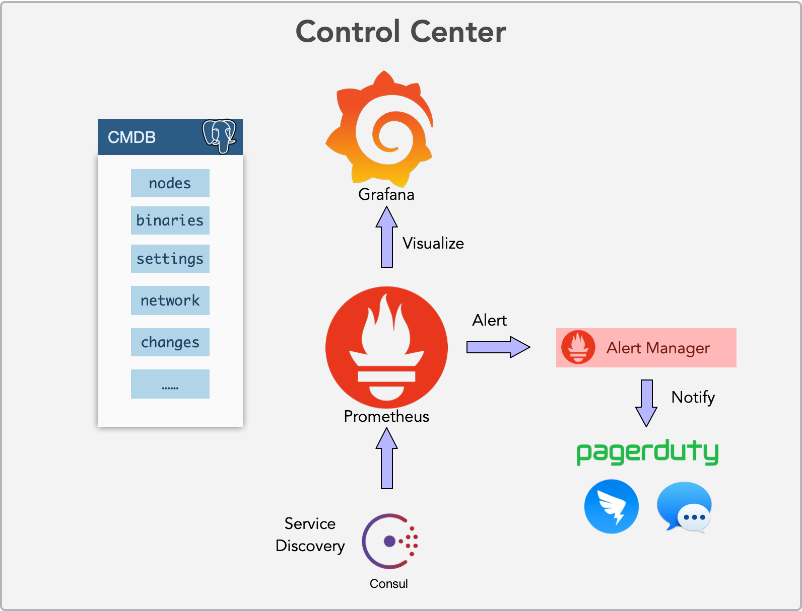

# PostgreSQL Alerting Overview

## **Why**

Alert is critical to Operations, It makes OPS

- Response in Time
- EventDriven instead of Polling

It is a fundamental part of Ops system. A robust system need a a proper alert system rather than waiting final user telling us there is a failure. We have a vivid case right in front of us.

In a naivel case, Failure handling would be like this:

- Factory production line halt, BizLevel Failure occur, TPM look into that, figure whether it's because of it's own problem, then found it's because of trace system down, then he calls backend developers
- Backend developers find that Application is down, then look into it, Try to figure what is the cause of application failure, After looking into that, he found it is because of database unreachable. Then he calls DBA.
- DBA find that database is down, He tries to figure it whether it is because of database itself (like slow queries, traffic jam, data corruption). After looking into it, He figure out it is because of physical machine is Down, then he calls to OPS
- OPS figure out that machine is down, He manage to fix it or wait it to be fixed.

While the ideal case would be

When something like primary machine down happens, TPM, DEV, DBA, OPS all get alert notifications and their corresponding levels. 

- When machine is down, The OPS knows it immediately (like after 1 min, triggers OPS_NODE_UNREACHABLE) 
- OPS inform DBA: our nodes is down, prepare for failover xxxxx. (and DBA may already receive alert and get hands on it because he receives DB Level alerts DB_PRIMARY_POSTGRES_DOWN)
- DBA notify DEV: database is going to failover, beware of xxxxxx (and Dev may already prepare for it because of App Level alert: APP_REQUEST_DROP_50_PERCENT)
- DEV notify TPM, our service is going to be down for xxxx, beware of that. (And TPM may already prepare for notifications because he received Biz Level Alert BIZ_PROCESS_CONTRONL_FAIL_RATE_HIGH )

It's a bottom-to-top procedure, Where the alert information is pass to different levels simultaneously. So the DRI need not wait until information is passed through a long chain to his layer. The responding time may reduce to 1~5minutes rather than 1~2 hours.


## **How**

So how can we setup an alerting system ? 

To setup the infrastructure is very simple, Prometheus & It's Alertmanager is enough for most common cases. While constructing an alerting system is not. because it is more about organization and responsibilities.

### **Infrastructure**

For the infrastructure part, we already have prometheus, the only thing todo is add alerting rules to 

prometheus.yml




### Specify RULES

Prometheus itself can evaluate rules and generate alert. add following config entries to prometheus.yml

```yaml
alerting:
  alertmanagers:
  - static_configs:
    - targets: 'http://localhost:9093'

rule_files:
  - "alert.rules"
```

And then put your own specific `alert.rules` to another conf file, things done.

Through prometheus UI - Alert Tab, You can view alerts status.


alertmanage is responsible for gather, merge , silence, mange, notify alerts, Firing alert is handled by prometheus itself.

### **Define Alert**

Before defining any specific alert event, We need categorize them first.

All alert events can be categorized via two demension:

- Respondent : Who is responsible for that alert (OPS/DBA/DEV/TPM)
- urgency: What is the pirority of that (P2/P1/P0)

A common practice is: Split 

respondent

into different level groups: System/Database/Application

- DevOps team is responsible for System Alert, such as AppDown, Node, Disk, Network, Infrastructure...
- DBA team is responsible for DB specifict Alerts (DB Down, CPU, RAM, Activity, Queing, SlowQuery,….)
- Backend is responsible for Application Layer Error (HTTP5XX, RequestDrop,HighErrRate,...)
- You may have another layer for Biz Layer TPM ( ProductionLineDown, ScrapeRateHigh, ProcessControlFailRateHigh )

The basic princple is that the 

**respondent team have enough privilege and ability to resolve the alert**

.

And alerts can be categorized as three different priority levels:

- P0: Service **down**, have actuall failure, impact , Loss. 
- P1: Service **degrade**, High Potential Cause Failure if Leave it for a while (hours).
- P2: Service **anomalies**that needs attention, May cause service degrade if leave it for serval days

## DB Alerts

Talk is cheap, Here I will take DB Alert as an example. We can define following alert event for database:

```
P0 DB_PRIMARY_POSTGRES_DOWN
P0 DB_PRIMARY_PGBOUNCER_DOWN

P1 DB_STANDBY_POSTGRES_DOWN
P1 DB_STANDBY_PGBOUNCER_DOWN
P1 DB_CPU_USAGE_HIGH
P1 DB_RAM_USAGE_HIGH
P1 DB_DISK_USAGE_HIGH
P1 DB_REPLCATION_LAG_HIGH
P1 DB_AGE_HIGH
P1 DB_SESSION_ACTIVE_HIGH
P1 DB_SESSION_IDLE_IN_XACT_HIGH
P1 PG_AVERAGE_QUERY_SLOW

P2 DB_CPU_USAGE_WARN
P2 DB_CPU_ONE_CORE_HIGH
P2 DB_RAM_USAGE_WARN
P2 DB_DISK_USAGE_WARN
P2 DB_REPLCATION_LAG_WARN
P2 DB_AGE_WARN
P2 PG_BACKUP_FAILURE
P2 PG_VACUUM_FAILURE
P2 PG_REPACK_FAILURE
```

Where the only P0 is DB_PRIMARY_POSTGRES_DOWN and DB_PRIMARY_PGBOUNCER_DOWN, which introduce direct impact to users. This will triggers phone call to every respondent. 

P1 alert is event/phenomena which may cause P0. Including: StandbyDown, CPU, RAM, DiskSpace, ReplicationDelay, DatabaseAge, TrafficJam, SlowQuery, TooMuchConnection, and a lot other stuffs. If you leave a P1 alert there, The situation may degrade into P0 failure in serval minutes or hours. This would triggers phone call or sms to on call respondent.

P2 alert is quite like anomalies notification, If you leave P2 alert there , it may grows to P1 in serval days. Usually triggers email report to notify DBA.

### **Example**

For example, the only P0 case of Database is Primary DB Down, which could be determined by prometheus alert rule:

```yaml
ALERT POSTGRES_PRIMARY_DOWN
IF avg_over_time(up{instance=~"(.*primary.csq.*)",service_port=~"(9127|9187)"}[2m]) < 0.3
FOR 2m
LABELS {team="dba",urgency="P0"}
ANNOTATIONS {description="POSTGRES_PRIMARY_DOWN, {{ $value }}% , {{ $labels.instance }} ",summary="P0_POSTGRES_PRIMARY_DOWN_CSQ, {{ $value }}% , {{ $labels.instance }} "}
```

That means in last 2 minutes, if the average up time is less than 30% and last for 2 minutes, from (`postgres_exporter(9187)|pgbouncer_exporter(9127)`). It will trigger a P0 error. 

While if a non-primary instance is down, it is a P1 rather than P0. which would be like:

```
ALERT POSTGRES_STANDBY_DOWN_FKS
IF avg_over_time(up{instance=~"(.*standby.fks.*)",service_port=~"(9127|9187)"}[2m]) < 0.3
FOR 2m
LABELS {team="dba",urgency="P1"}
ANNOTATIONS {description="POSTGRES_STANDBY_DOWN_FKS, {{ $value }}% , {{ $labels.instance }} ",summary="POSTGRES_STANDBY_DOWN_FKS, {{ $value }}% , {{ $labels.instance }} "}
```

And another example of P1 is 

```
DB_CUP_ALL_CORE_HIGH
ALERT DB_CPU_ALL_CORE_HIGH
IF 1-avg(rate(node_cpu{mode="idle",role=~".*(primary|standby).*",role!~".*statsdb.*"}[1m])) BY (instance, role) > 0.5
FOR 1m
LABELS {team="dba", urgency="P1"}
ANNOTATIONS {description="DB_CPU_ALL_CORE_HIGH, {{ $value}}% , {{ $labels.instance }}, {{ $labels.role }}", summary="DB_CPU_ALL_CORE_HIGH, {{ $value}}% , {{ $labels.instance }}, {{ $labels.role }}"}
```

This will check all primary/standby (online) instance, And if the average CPU Usage is above 50% continuesly for 1 minute, it will trigger a P1 `DB_CUP_ALL_CORE_HIGH` Alert. But that does not check DB for statistic OLAP usages (because their CPU high is a normal case)

### RULES

So here are the example rules for databases: 

```yaml
groups:
- name: db-alerts
  rules:
  - alert: DB_POSTGRES_PRIMARY_DOWN
    expr: avg_over_time(pg_up{instance=~"(.*primary.*pg)"}[2m]) < 0.3
    for: 2m
    labels:
      team: DBA
      urgency: P0
    annotations:
      summary: "{{$labels.instance}} DB Postgres Primary Down: {{ $value }}"
      description: "{{$labels.instance}} DB Postgres Primary Down: {{ $value }}"

  - alert: DB_STANDBY_POSTGRES_DOWN
    expr: avg_over_time(pg_up{instance=~".*(standby|offline).*pg"}[2m]) < 0.3
    for: 2m
    labels:
      team: DBA
      urgency: P1
    annotations:
      summary: "{{$labels.instance}} DB Postgres Standby Down: {{ $value }}"
      description: "{{$labels.instance}} DB Postgres Standby Down: {{ $value }}"


  - alert: DB_CPU_USAGE_HIGH
    expr: 1 - avg(rate(node_cpu_seconds_total{mode="idle",instance=~".*pg.*"}[1m])) BY (instance) > 0.5
    for: 2m
    labels:
      team: DBA
      urgency: P1
    annotations:
      summary: "{{$labels.instance}} CPU Usage High: {{ $value }}"
      description: "{{$labels.instance}} CPU All Core Usage Higher than 50% percent: {{ $value }}"

  - alert: DB_RAM_USAGE_HIGH
    expr: (node_memory_Buffers_bytes{instance=~".*pg.*"} + node_memory_MemFree_bytes{instance=~".*pg.*"} +  node_memory_Cached_bytes{instance=~".*pg.*"}) /  node_memory_MemTotal_bytes{instance=~".*pg.*"} < 0.1 and rate(node_memory_SwapFree_bytes{instance=~".*pg.*"}[1m]) >= 0
    for: 2m
    labels:
      team: DBA
      urgency: P1
    annotations:
      summary: "{{$labels.instance}} RAM Usage High: {{ $value }}"
      description: "{{$labels.instance}} RAM Usage Higher than 90 Percent: {{ $value }}"

  - alert: DB_DISK_USAGE_HIGH
    expr:  (node_filesystem_free_bytes{instance=~".*pg.*",device="/dev/sda1"} / node_filesystem_size_bytes{instance=~".*pg.*",device="/dev/sda1"}) < 0.1
    for: 2m
    labels:
      team: DBA
      urgency: P1
    annotations:
      summary: "{{$labels.instance}} Disk Free Space Less Than 10 Percent: {{ $value }}"
      description: "{{$labels.instance}} Disk {{$labels.device}} {{$labels.fstype}} {{$labels.mountpoint}} Free Space Less Than 10 Percent: {{ $value }}"

  - alert: DB_REPLCATION_LAG_HIGH
    expr: pg_replication_flush_diff{instance=~".*pg.*", application_name!~"pg_receivewal"} > 102400000
    for: 10m
    labels:
      team: DBA
      urgency: P1
    annotations:
      summary: "{{$labels.instance}} to {{$labels.application_name}} Replication Lag: {{ $value }}"
      description: "{{$labels.instance}} to {{$labels.application_name}} Replication Lag {{ $value }}"

  - alert: DB_AGE_HIGH
    expr: max(pg_database_age{instance=~".*pg.*"}) by (instance) > 600000000
    for: 10m
    labels:
      team: DBA
      urgency: P1
    annotations:
      summary: "{{$labels.instance}} DB_AGE_HIGH: {{ $value }}"
      description: "{{$labels.instance}} DB_AGE_HIGH: {{ $value }}"

  - alert: DB_ACTIVE_SESSION_HIGH
    expr: pg_activity_state_count{instance=~".*pg",state="active",datname!~'(postgres|template.)'} > 30
    for: 2m
    labels:
      team: DBA
      urgency: P1
    annotations:
      summary: "{{$labels.instance}} DB_ACTIVE_SESSION_HIGH Active connection: {{ $value }}"
      description: "{{$labels.instance}} DB_ACTIVE_SESSION_HIGH Active connection: {{ $value }}"

  - alert: DB_IDLE_IN_XACT_SESSION_HIGH
    expr: pg_activity_state_count{instance=~".*pg",state="idle in transaction",datname!~'(postgres|template.)'} > 5
    for: 1m
    labels:
      team: DBA
      urgency: P1
    annotations:
      summary: "{{$labels.instance}} DB_IDLE_IN_XACT_SESSION_HIGH IdleInXact connection: {{ $value }}"
      description: "{{$labels.instance}} DB_IDLE_IN_XACT_SESSION_HIGH IdleInXact connection: {{ $value }}"


  - alert: DB_CPU_USAGE_WARN
    expr: 1 - avg(rate(node_cpu_seconds_total{mode="idle",instance=~".*pg.*"}[1m])) BY (instance) > 0.3
    for: 2m
    labels:
      team: DBA
      urgency: P2
    annotations:
      summary: "{{$labels.instance}} CPU Usage Warning: {{ $value }}"
      description: "{{$labels.instance}} CPU Usage Warning: {{ $value }}"

  - alert: DB_CPU_ONE_CORE_HIGH
    expr: min(rate(node_cpu_seconds_total{mode="idle",instance=~".*pg.*"}[1m])) BY (instance, cpu) < 0.1
    for: 2m
    labels:
      team: DBA
      urgency: P2
    annotations:
      summary: "{{$labels.instance}} DB_CPU_ONE_CORE_HIGH {{$labels.cpu}}: {{ $value }}"
      description: "{{$labels.instance}} DB_CPU_ONE_CORE_HIGH {{$labels.cpu}}: {{ $value }}"

  - alert: DB_RAM_USAGE_WARN
    expr: (node_memory_Buffers_bytes{instance=~".*pg.*"} + node_memory_MemFree_bytes{instance=~".*pg.*"} +  node_memory_Cached_bytes{instance=~".*pg.*"}) /  node_memory_MemTotal_bytes{instance=~".*pg.*"} < 0.2
    for: 2m
    labels:
      team: DBA
      urgency: P2
    annotations:
      summary: "{{$labels.instance}} DB_RAM_USAGE_WARN: {{ $value }}"
      description: "{{$labels.instance}} RAM Usage Higher than 90 Percent: {{ $value }}"

  - alert: DB_DISK_USAGE_WARN
    expr:  (node_filesystem_free_bytes{instance=~".*pg.*",device="/dev/sda1"} / node_filesystem_size_bytes{instance=~".*pg.*",device="/dev/sda1"}) < 0.25
    for: 2m
    labels:
      team: DBA
      urgency: P2
    annotations:
      summary: "{{$labels.instance}} Disk Free Space Less Than 25 Percent: {{ $value }}"
      description: "{{$labels.instance}} Disk {{$labels.device}} {{$labels.fstype}} {{$labels.mountpoint}} Free Space Less Than 10 Percent: {{ $value }}"

  - alert: DB_REPLCATION_LAG_WARN
    expr: pg_replication_flush_diff{instance=~".*pg.*", application_name!~"pg_receivewal"} > 10240000
    for: 10m
    labels:
      team: DBA
      urgency: P2
    annotations:
      summary: "{{$labels.instance}} DB_REPLCATION_LAG_WARN to {{$labels.application_name}} Replication Lag: {{ $value }}"
      description: "{{$labels.instance}} DB_REPLCATION_LAG_WARN to {{$labels.application_name}} Replication Lag  {{ $value }}"

  - alert: DB_AGE_WARN
    expr: max(pg_database_age{instance=~".*pg.*"}) by (instance) > 250000000
    for: 10m
    labels:
      team: DBA
      urgency: P2
    annotations:
      summary: "{{$labels.instance}} DB_AGE_WARN: {{ $value }}"
      description: "{{$labels.instance}} DB_AGE_WARN: {{ $value }}"
```

### **Application Alert & System Alert**

And App(Backend) Sys(DevOps) can have there own Alerts, such as these (just for illustration)

```
P0 APP_SERVER_DOWN
P0 ALERT_PROCESS_CONTROL_30PERCENT_DROPS
P0 ALERT_GET_SERIAL_30PERCENT_DROPS
P0 ALERT_PUSH_LOG_30PERCENT_DROPS

P1 5XX_ERROR_EXCEED_30
P1 HIGH_NON_200_RESPONSE_CODE
P1 APP_RESPONSE_TIME_SLOW
P1 APP_CIRCUIT_BREAKER_TRIGGERED
P1 PROCESS_CONTROL_FAIL_RATE_HIGH
P1 SYS_ERROR_RATE_HIGH

P2 LOG_SERIAL_REQUEST_BRUST
P2 QPS_DOD_HIGH
```

## **Conclusion**

To setup an alert system is **very easy**, but tune it into good working condition not. It may take serval months 's tunning work to make it less annoying, and reduce false alert into a moderate level.