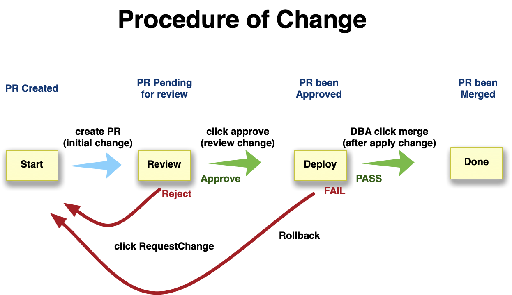

# PostgreSQL 变更管理

数据库有两种类型的变更：配置文件变更， 与模式变更。

* 配置变更：更改操作系统，数据库相关参数，修改IP白名单，等等

* 模式变更：修改数据库中的表定义，DDL，创建新用户，授权，等等。

两种变更的主要区别是，前者往往是由DBA自己发起的，而后者通常是由后端提出变更申请，然后由DBA审阅代理执行的。


## 方案

理想情况下，如果能有CMDB（Config Management Database），以及工单系统来干这个，当然是最方便不过。但绝大多数公司都没到那个规模，几十台机器搞个CMDB确实是浪费时间。但说走就走说发布就发布显然也是不行的。一种比较简单的方法是使用Github来管理变更。

举个例子，创建一个[Repo](https://github.com/Vonng/pg/tree/master/test/node)，每台机器（对应一台数据库实例）都有一个自己的目录，并以自己的角色域名命名。在目录中，会包含数据库相关的配置，以及一个特殊的`change`目录，用于存放一系列变更脚本。这里，变更的顺序通过其名称的数字前缀顺序来确定。

```bash
node
|---- 1.primary.test.pg/
|       |---- postgresql.conf
|       |---- pg_hba.conf
|       |---- pgbouncer.ini
|       |---- postgres_exporter.yaml
|       |---- change
|                 |---- 1_init_monitor.sql
|                 |---- 2_extensions.sql
|                 |---- 3_monitor_views.sql
|                 |---- 4_constant_tables.sql
|                 |---- 5_change_kernel_parameters.sh
|
|---- 1.standby.test.pg
|---- 1.offline.test.pg
|---- 1.remote.test.pg
|---- 1.datalake.test.pg
```

无论是DBA希望改变配置文件参数，还是开发想要提交变更脚本，都需要通过PullRequest的方式进行。

* Dev/Ops/DBA对配置文件进行修改，或添加新变更，并提PR，请求DBA 与TeamLeader Review。
* 当DBA与TL审阅通过后，Approve PR，进入调度执行阶段。
* 当执行完毕后，DBA Merge PR，变更正式归档进入Repo中，并与线上状态保持一致。



