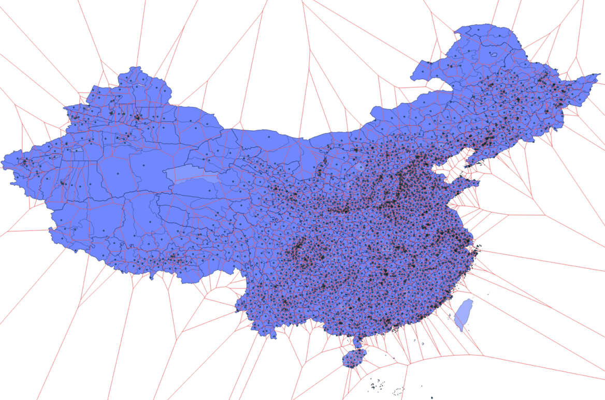

# 使用PostGIS高效解决行政区划归属查询问题

比如说，我们有用户的经纬度坐标，现在希望知道他在哪个省，哪个市，哪个县。

这就是所谓的“地理编码”， 从地理经纬度坐标，到（省-市-县）的文本地址的映射。

最简单的做法，就是找到最近的政府所在点。这就又变成了一个最近邻查询的问题：找到最近的县级人民政府

比如说，我们有用户的经纬度坐标，现在希望知道他在哪个省，哪个市，哪个县。

这就是所谓的“地理编码”， 从地理经纬度坐标，到（省-市-县）的文本地址的映射。

类似的问题包括：无人机禁飞区，商圈地理围栏。


### 朴素方法

**最近邻搜索—Vornoi方法**





```sql
CREATE TABLE counties
(
  adcode   INTEGER PRIMARY KEY,
  name     VARCHAR(64),
  province VARCHAR(64),
  city     VARCHAR(64),
  county   VARCHAR(64),
  center   GEOMETRY,
  fence    GEOMETRY
);

CREATE INDEX ON counties USING GIST(fence);
```


### 查询

查询的SQL使用：

```sql
SELECT adcode, province, city, county FROM counties 
WHERE ST_WithIn(ST_Point(100, 28),fence);

SELECT adcode, province, city, county FROM counties 
WHERE ST_Contains(fence, ST_Point(100, 28));
```

耗时0.6毫秒，完全达到生产水准


## 进一步包装为后端服务

#### 4行SQL包装为存储过程

```sql
CREATE FUNCTION locate(lon FLOAT, lat FLOAT) RETURNS JSON 
AS $$ SELECT row_to_json(l) FROM (
     SELECT adcode, province, city, county FROM counties
      WHERE ST_Contains(fence, ST_Point(lon, lat))
 ) l; $$ LANGUAGE SQL PARALLEL SAFE;
```

#### 15行Python包装为Web服务

```python
import http, json, http.server, psycopg2

class GetHandler(http.server.BaseHTTPRequestHandler):
    conn = psycopg2.connect("postgres://localhost:5432/geo")

    def do_GET(self):
        args = [float(f) for f in self.path.lstrip('/').split('/')]
        self.send_response(http.HTTPStatus.OK)
        self.send_header('Content-type','application/json')
        with GetHandler.conn.cursor() as cursor:
            cursor.callproc('locate', args)
            result = print(json.dumps(cursor.fetchone()[0], ensure_ascii=False))
            self.wfile.write(result.encode('utf-8'))

with http.server.HTTPServer(("localhost", 3001), GetHandler) as httpd:
    httpd.serve_forever()
```


## 返回结果

```bash
$ curl localhost:3001/100/28
{"adcode": 533401, "province": "云南省", "city": "迪庆藏族自治州", "county": "香格里拉市"}

$ curl localhost:3001/100/24
{"adcode": 530902, "province": "云南省", "city": "临沧市", "county": "临翔区"}

$ curl localhost:3001/100/29
{“adcode": 513336, "province": "四川省", "city": "甘孜藏族自治州", "county": "乡城县"}

$ curl localhost:3001/111/22
{"adcode": 440981, "province": "广东省", "city": "茂名市", "county": "高州市"}

```

但让我们换个角度，如果这个功能我们不使用PostGIS，而是自己来实现，那又需要多少行代码呢？

譬如，用C++从头实现这个功能，可能需要上千行代码。

计算使用现成的计算几何库并不会让问题简单太多，仍然需要几百行代码来完成。


## 问题二：最近的面

如果说单纯的以点圈点场景，还可以通过传统关系型的方式苟一下，那么以点圈线，以点圈面的场景恐怕就非得PostGIS不可了。

- 广告营销：周边客流画像（以面圈点）
- 地理围栏：无人机禁飞区（以点圈面）
- 行政归属：精确判断用户所处的省市区县
- 数据分析：从地理维度进行透视

考虑以下场景，我们获取了用户的经纬度坐标，现在希望将其所在位置，转换为省市县三级地址，如“河北省-张家口市-崇礼县”，同时，提供一张包含全国各县地理围栏的数据表`counties`：

```sql
CREATE TABLE counties
(
  adcode   INTEGER PRIMARY KEY,
  name     VARCHAR(64),
  province VARCHAR(64),
  city     VARCHAR(64),
  county   VARCHAR(64),
  center   GEOMETRY,
  fence    GEOMETRY
);

CREATE INDEX ON counties USING GIST(fence);
```

这是一个相当常见的服务，也有各种各样的简单近似实现方式，例如GeoHash逼近，Voronoi划分。

但最精确，最正确的实现，就是通过多边形与点的包含关系来确定。

```sql
SELECT * FROM counties WHERE ST_WithIn(ST_Point(100, 28),fence);
SELECT * FROM counties WHERE ST_Contains(fence, ST_Point(100, 28));
```

譬如，随便选个整数经纬度，看看落在哪个县？

```sql
SELECT * FROM counties WHERE ST_WithIn(ST_Point(100, 28),fence);
```

```
533401	香格里拉市	云南省	迪庆藏族自治州	香格里拉市
```

实际执行用时在0.5毫秒，性能表现非常优秀。


相比PostgreSQL自带的几何类型，PostGIS能正确且高效处理岛屿、飞地等边缘情况。

