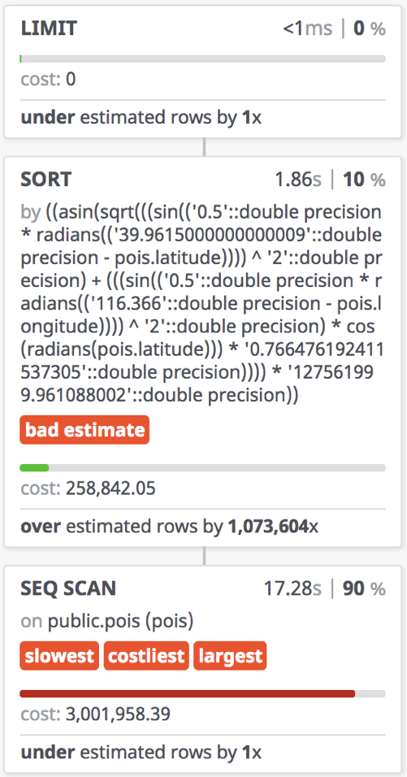
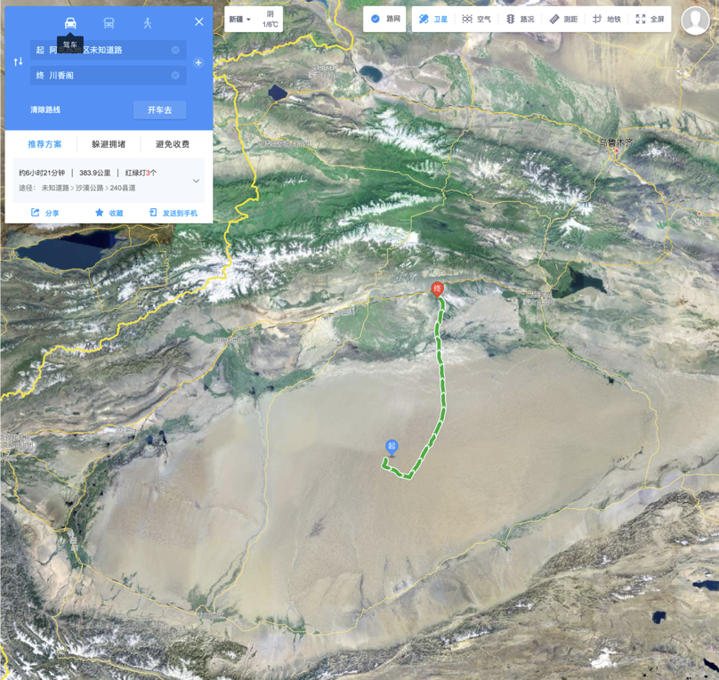
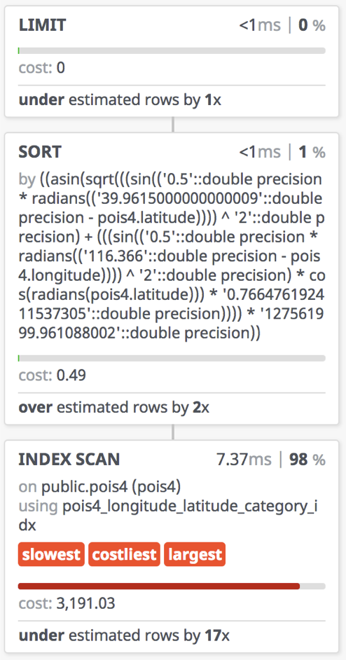
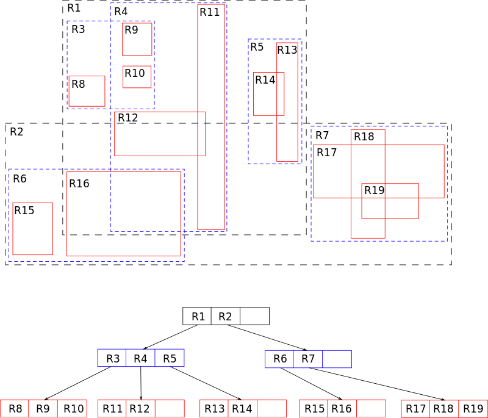
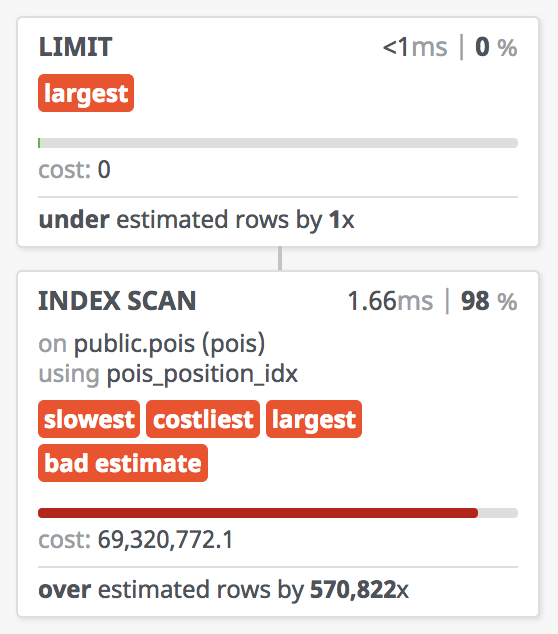

# KNN极致优化：从RDS到PostGIS

整理自本人在2018象形中国北京PostGIS专场所做分享，转载请保留出处。


## 总结

灵活应用数据库的功能，可以轻松实现三万倍的性能提升。

| Level |         方法         | 性能/耗时(ms) |  可维护性/可靠性   |                 备注                 |
| :---: | :------------------: | :-----------: | :----------------: | :----------------------------------: |
|   1   |       暴力扫表       |    30,000     |         -          |               形式简单               |
|   2   |       经纬索引       |      35       |  复杂度/魔数问题   |              额外复杂度              |
|   3   |       联合索引       |      10       |  复杂度/魔数问题   |              额外复杂度              |
|   4   |         GIST         |       4       | 最简表达，完全精确 | 形式简单，距离更精确，PostgreSQL限定 |
|   5   | `btree_gist`联合索引 |       1       | 最简表达，完全精确 | 形式简单，距离更精确，PostgreSQL限定 |


## 场景

互联网中的很多业务都涉及到地理相关的功能需求，最为普遍的需求莫过于最近邻查询了。

例如：

- 为用户推荐附近的POI（餐厅、加油站、公交站）
- 为用户推荐附近的用户（聊天匹配）
- 找到距离用户所处的地址（地理逆编码）
- 找到用户所处的商圈、省、市、区、县 (以点找面)


这些问题实质上都属于最近邻搜索或其变体。

有一些功能，它看上去和最近邻搜索无关，实际上剥了皮，也是最近邻搜索，典型的例如地理逆编码：

打车选择上车地点的时，点外卖选择送达位置时，都会将用户当前的经纬度坐标转换为文本地理位置，诸如：“某某小区几号楼”。实际上这也是最近邻搜索的问题：找到距离用户当前位置**最近的一个**坐标点。

**最近邻（knn，k nearest neighiboor）**，顾名思义，就是找出距离某个中心点最近的K个对象。其问题满足这样一种形式：

> 找出满足**某一条件**的最近的K个对象（及其属性）。


最近邻搜索是如此常用的功能，优化的效益非常显著。

下面我们从一个具体问题出发，讲述这一功能实现方式的演化——如何实现超过三万倍的性能提升。


## 问题

我们选择推荐最近的餐厅，作为此类问题的代表。

问题很简单：给定包含中国所有POI点的表`pois`，及一个经纬度坐标点。在**足够快**的时间内找出**距离**该坐标点最近的10家餐馆。并返回这十家餐馆的名称和**距离**。

细节说明：

* `pois`表包括一亿条记录，其中类型为餐馆的POI约占一千万。

* 给定的示例中心店：北京师范大学，116.3660 E, 39.9615 N。

* 足够快意味着在1毫秒内完成

* 距离意味着，以米计算的地球表面距离

* `pois`表模式定义：

  ```sql
  CREATE TABLE pois (
    id        CHAR(10) PRIMARY KEY,
    name      VARCHAR(100),
    position  GEOMETRY, -- PostGIS ST_Point
    longitude FLOAT,    -- Float64
    latitude  FLOAT,    -- Float64
    category  INTEGER   -- type of POI
  );
  ```

* 餐馆的特征是`WHERE category BETWEEN 50000 AND 51000`


### 同类问题

这个模式适用于许多的例子，例如对探探而言，其实就可以是：找出离用户所在位置最近的，且年龄位于某个范围，加上一些其他筛选条件的100个人。

对于美团点评而言，就是找出离用户最近的10个，类型为餐馆的POI。

对于逆地理编码而言，实质上就是找出离用户最近的POI（加上可选的类型限制，类型十字路口，地标建筑等）


### 坐标系？

> ### 题外话：坐标系WGS84与GCJ02
>
> 这是另外一个很多人都会搞混的地方。
>
> - 滴滴打车的魔幻偏移。
> - 港澳台边界，碎屑多边形。


绝大多数互联网中与地理相关的功能，都涉及到最近邻查询的需求。

比如对于谈朋友的场景，把这里的  `WHERE category BETWEEN 50000 AND 51000`

换成 `WHERE age BETWEEN 18 AND 27`就好。

很多打ACM的同学，熟练使用各种数据结构与算法。可能已经跃跃欲试了，R树，就决定是你了。

不过在真实项目中，数据表就是数据结构，而索引与查询方式就是算法。


### 距离如何定义？

欲解此题，需明定义。距离的定义并没有看上去那样简单。

例如，对于导航软件而言，距离可能意味着**路径长度**而非直线距离。


在二维平面坐标系中，通常距离指的是欧氏距离：$d=\sqrt{(x_2-x_1)^2+(y_2-y_1)^2}$

但在GIS中，通常使用的坐标系是球面坐标系，即通过经纬度来标识一个点。

在球面上，两点之间的距离等于所在球面大圆上的弧长，也就是其球面角 x 半径。

这就引入了一个问题，每一纬度对应的距离是基本恒定的，差不多都是111公里。

然而，每一经度对应的距离，随着纬度不同而变化，在赤道上和一纬度差不多，也是111公里，然而随着纬度升高，到了北纬40°时，一经度对应的弧长只有85公里了，而到了北极点，一经度对应的弧长距离为0。

事实上，还会有其他更棘手的问题。例如，地球实际上是一个椭球体，而非正球体。

地球非球，乃不规则椭球。在最开始的时候，为了省事，我们可以设其为球计算距离。

```sql
CREATE OR REPLACE FUNCTION sphere_distance(lon_a FLOAT, lat_a FLOAT, lon_b FLOAT, lat_b FLOAT)
  RETURNS FLOAT AS $$
SELECT asin(
           sqrt(
               sin(0.5 * radians(lat_b - lat_a)) ^ 2 +
               sin(0.5 * radians(lon_b - lon_a)) ^ 2 * cos(radians(lat_a)) * cos(radians(lat_b))
           )
       ) * 127561999.961088 AS distance;
$$
LANGUAGE SQL IMMUTABLE COST 100;
```

将经纬度坐标当成平面坐标使用并不是不可以，但对于需要精准排序的场景，这样的近似可能会产生很大的问题：

每一经度对应的距离，随着纬度不同而变化，在赤道上一经度和一纬度代表的距离差不多都是111公里，然而随着纬度升高，到了北纬40°时，一经度对应的弧长只有85公里了，而到了极点，一经度对应的弧长距离为0。

因此，平面坐标系上的圆，在球面坐标系上可能只是一个瘦长的椭圆。计算距离时，纬度与经度方向上的距离权重不同会导致严重的正确性问题：一个正北100米处的商店可能比正东70m处的商店距离排序更靠前。对于高纬度地区，这一类问题会变得非常严重。

因此，暴力扫表之后，通常需要使用精确的距离计算公式再次计算并排序。


注意，这里的距离，量纲单位并不是米，而是°的平方，考虑到1经度和1纬度对应的实际距离在不同的地方存在巨大差异，这一结果并没有精确的实际意义。

经纬度是球面坐标系，而不是二维平面坐标系中的坐标。然而对于快速粗略圈选，这种方式是可以接受的。

对于需要精确排序的场景，必须使用地球表面球面距离的计算公式，而不是简单地求欧氏距离。


### 足够快又是多快？

天下武功，唯快不破，互联网强调的就是一个快，跑的也快，写的也快。

足够快又是多快呢？一毫秒，足够快了。这也是我们的优化目标

好了，开始进入干货环节。在PostGIS展现真正的实力之前，让我们来先看一看传统的关系型数据库，对解决这一问题，能走到多远。


## 0x02 方案

让我们从传统关系型数据库开始


### LEVEL-1 暴力扫表

使用传统关系型数据库，此题有何解法？

暴力算法写起来是非常简单的，我们来看一下。

从POIS表中，首先找出所有的餐馆，拿出餐馆的名字，算出餐馆到我们这儿的距离，然后呢？再按距离排序，取距离最短的，也就是最近的10条记录。

新手拍拍脑袋，也可以很快写出这样Naive的SQL：

```sql
SELECT
  id,
  name,
  sphere_distance(longitude, latitude, 
                  116.3660 , 39.9615 ) AS d
FROM pois
WHERE category BETWEEN 50000 AND 51000
ORDER BY d
LIMIT 10;
```

为了简化问题，让我们暂时忽略经纬度其实是球面坐标，地球又是个椭球体的事实。

**在这一前提下，这个SQL确实能正确完成工作**。不过，谁要敢在生产环境这么用，DBA肯定得打死他。

让我们先考察其执行计划：



> ### 题外话：SQL内联
>
> SQL内联有助于正确使用索引。

在真实环境执行，缓存充分预热，实际耗时30秒；开启PostgreSQL并行查询（2 worker）后实际执行时间16秒。

用时30秒，实际执行时间17秒。

用户对于响应时间是很敏感的，响应时间一上去，用户满意度立马就会掉下来。打王者荣耀的时候，100毫秒的延迟都已经很让人抓狂了。如果是一个实时性

对于几千条记录的表也许可以凑合工作，但对于1亿量级的表，暴力扫表不可取。

用户无法接受十几秒的等待时间，更罔论这样的设计能有任何扩展性可言。


### 存在的问题

#### 开销离谱

这个查询每次都要计算**目标点**和**所有记录点**之间的距离，然后再按距离排序取TOP。

对于几千条记录的表也许可以凑合工作，但对于1亿量级的表，暴力扫表不可取。用户无法接受十几秒的等待时间，更罔论这样的设计能有任何扩展性可言。

#### 正确性堪忧

将经纬度坐标当成平面坐标使用并不是不可以，但对于需要精准排序的场景，这样的近似可能会产生很大的问题：

每一经度对应的距离，随着纬度不同而变化，在赤道上一经度和一纬度代表的距离差不多都是111公里，然而随着纬度升高，到了北纬40°时，一经度对应的弧长只有85公里了，而到了极点，一经度对应的弧长距离为0。

因此，平面坐标系上的圆，在球面坐标系上可能只是一个瘦长的椭圆。计算距离时，纬度与经度方向上的距离权重不同会导致严重的正确性问题：一个正北100米处的商店可能比正东70m处的商店距离排序更靠前。对于高纬度地区，这一类问题会变得非常严重。

因此，暴力扫表之后，通常需要使用精确的距离计算公式再次计算并排序。


### 题外话：错误的索引效果适得其反

有同学会说，这里POI类型字段，category出现在了查询的where条件中，可以通过索引来提高性能

这次他不直接扫表了，它先去扫描category上的索引，把属于餐厅的记录都过滤出来。

然后再按照索引，一个页面接一个页面地扫描。

结果顺序IO变成了随机IO。

那么索引的正确使用方式又是怎么样的呢？


## LEVEL-2 经纬索引

索引是关系型数据库的吃饭家伙，既然顺序扫表不可取，我们自然会想到利用索引来加速查询。

朴素的思路是这样的，通过索引筛选出目标点周围一定范围内的候选点，再进一步计算距离并排序。

索引是关系型数据库的吃饭家伙，既然顺序扫表不可取，我们自然会想到利用索引来加速查询。

使用经纬度上的索引是基于这样一种思路：

北师在帝都繁华之地宇宙中心，如果我们用一个边长一公里的正方形（直径一公里的圆）

去地图上画个圈，那么别说十家餐厅了，一百家都有可能。

反过来说呢，既然最近的10家餐厅一定落在这么大的一个圆里，

这个表里的POI点包括了全中国的POI点，

筛选出目标点周围一定范围内的候选点，再进一步计算距离并排序。

```sql
CREATE INDEX ON pois1 USING btree(longitude);
CREATE INDEX ON pois1 USING btree(latitude);
```

同时，为了解决正确性的问题，假设我们已经有了一个从经纬度计算球面距离的SQL函数`sphere_distance`

```plsql
CREATE FUNCTION sphere_distance(lon_a FLOAT, lat_a FLOAT, lon_b FLOAT, lat_b FLOAT) RETURNS FLOAT
IMMUTABLE LANGUAGE SQL COST 100 AS $$
SELECT asin(
           sqrt(
               sin(0.5 * radians(lat_b - lat_a)) ^ 2 +
               sin(0.5 * radians(lon_b - lon_a)) ^ 2 * cos(radians(lat_a)) *
               cos(radians(lat_b))
           )
       ) * 127561999.961088 AS distance;
$$;
```

$$
\Delta\sigma=\arccos\bigl(\sin\phi_1\cdot\sin\phi_2+\cos\phi_1\cdot\cos\phi_2\cdot\cos(\Delta\lambda)\bigr).
$$

于是，如果使用以目标点为中心的边长为1公里的正方形来做初筛，这个查询可以写作：

```sql
SELECT 
  id, name, 
  sphere_distance(longitude, latitude, 116.365798, 39.966956) as d
FROM pois1
WHERE
  longitude BETWEEN 116.365798 - 0.5 / 85 AND 116.365798 + 0.5 / 85 AND
  latitude BETWEEN 39.966956 - 0.5 / 111 AND 39.966956 + 0.5 / 111  AND
  category = 60000
ORDER BY 3 LIMIT 10;
```

预热后，实际执行平均耗时35毫秒，相比暴力扫表有了近千倍的性能提高，一个巨大的进步。


对于比较简单粗糙的产品，这种方法已经达到了‘可用’的级别。但这一方法仍然存在许多问题。

### 存在的问题

这种方法最大的问题在于额外复杂度。它使用了一个（多个）魔数，来确定候选点的大致范围。

而这个魔数的选取，是有赖我们的先验知识的。我们清楚地知道，以繁华的宇宙中心五道口的商铺密度，一公里见方内，商铺个数绝对超过10个了。但对于极端的场景（实际可能很常见），比如在塔克拉玛干大沙漠或者羌塘无人区，最近的商铺，逻辑上是必定存在的，不过其距离可能超过几百公里。

这种方法的性能表现对魔数的选取极其敏感：距离选择的太大，性能会急剧恶化，距离选择的太小，对于乡下偏僻的地方又可能无法返回结果。让程序员头大的事情又多了一个。

用时35毫秒

千倍提升，不错哦，但不能高兴的太早

这么多奇怪的常数又是几个意思？

一千倍的性能提升，让我们来看一下查询执行计划，看看它是怎么做到的。

首先呢，经度上，走了一个索引扫描，生成了一个位图。

然后呢，纬度上，也走了一个索引扫描，又生成了一个位图。

接下来，两个位图做了一个位运算，生成了一个新位图，筛选出了满足经纬度条件的记录。

然后，才去扫描这些满足条件的候选点，计算距离，并排序。

我们这个边界值选的比较巧，所以实际参与距离计算和排序的记录，可能只有三十多条。

比起先前一千多万次的距离计算与排序，显然是要高明的多了。


### 题外话：超参数与额外复杂度

因为这个边界魔数凑的很好，所以性能比较理想。

这种方法最大的问题在于额外复杂度。它使用了一个（多个）魔数，来确定候选点的大致范围。

而这个魔数的选取，是有赖我们的先验知识的。我们清楚地知道，以繁华的宇宙中心五道口的商铺密度，一公里见方内，商铺个数绝对超过10个了。但对于极端的场景（实际可能很常见），比如在塔克拉玛干大沙漠或者羌塘无人区，最近的商铺，逻辑上是必定存在的，不过其距离可能超过几百公里。

这种方法的性能表现对魔数的选取极其敏感：距离选择的太大，性能会急剧恶化，距离选择的太小，对于乡下偏僻的地方又可能无法返回结果。让程序员头大的事情又多了一个。

让我们先忽略这恼人的问题，看看传统关系型数据库还能不能再压榨压榨。


### Bad Case

因为这个边界魔数凑的很好，所以性能比较理想。

这种方法最大的问题在于额外复杂度。它使用了一个（多个）魔数，来确定候选点的大致范围。

而这个魔数的选取，是有赖我们的先验知识的。我们清楚地知道，以繁华的宇宙中心五道口的商铺密度，一公里见方内，商铺个数绝对超过10个了。但对于极端的场景（实际可能很常见），比如在塔克拉玛干大沙漠或者羌塘无人区，最近的商铺，逻辑上是必定存在的，不过其距离可能超过几百公里。

这种方法的性能表现对魔数的选取极其敏感：距离选择的太大，性能会急剧恶化，距离选择的太小，对于乡下偏僻的地方又可能无法返回结果。让程序员头大的事情又多了一个。

让我们先忽略这恼人的问题，看看传统关系型数据库还能不能再压榨压榨。

|           半径大了性能差           |                    半径小了圈不着                    |
| :--------------------------------: | :--------------------------------------------------: |
|   |  |
| 繁荣的五道口，一公里圈10家小意思。 |        300公里外才有一家，新疆人民哭晕在厕所         |


## LEVEL-3 联合索引与聚簇

抛开魔数带来的烦恼，我们来研究传统关系型数据库能在解决这个问题上走得有多远。

通过多列索引替换每一列上独自的索引，并将表按该索引聚簇。


仍然是一模一样的查询语句

从30毫秒提升到10毫秒，三倍的性能提升

对于传统关系型数据库，这差不多就是极限了

有没有优雅、正确、快速的解决方案呢？


```sql
CREATE INDEX ON pois4 USING btree(longitude, latitude, category);
CLUSTER pois4 USING pois4_longitude_latitude_category_idx;
```

相应的查询保持不变

```sql
SELECT id, name,
	sphere_distance(longitude, latitude, 116.365798, 39.966956) as d FROM pois4
WHERE
  longitude BETWEEN 116.365798 - 0.5 / 85  AND 116.365798 + 0.5 / 85  AND
  latitude  BETWEEN  39.966956 - 0.5 / 111 AND 39.966956  + 0.5 / 111 AND
  category = 60000
ORDER BY sphere_distance(longitude, latitude, 116.365798, 39.966956)
LIMIT 10;
```

联合索引查询的执行计划，实际执行时间可以压缩至7毫秒。



这差不多就是传统关系数据模型的极限了，对于大部分业务，这都是一个可以接受水平了。

因为这个边界魔数凑的很好，所以性能比较理想。


> ### 扩展变体：GeoHash
>
> GeoHash是此类方式的变体，通过将二维经纬度编码为一维字符串，可以使用传统的字符串前缀匹配操作来对地理位置进行过滤。然而固定的粒度使得其灵活度有显著下降，采用联合索引还是特殊编码的冗余字段需要针对具体场景进行分析。


仍然是一模一样的查询语句

从30毫秒提升到10毫秒，三倍的性能提升

对于传统关系型数据库，这差不多就是极限了

有没有优雅、正确、快速的解决方案呢？


## LEVEL-4 GIST

有没有一种办法，能够优雅，高效，简洁的完成这项工作呢？

PostGIS提出了非常优秀的解决方案，改用Geometry类型，并创建GIST索引。

```sql
CREATE TABLE pois5(
  id       CHAR(10) PRIMARY KEY,
  name     VARCHAR(100),
  position GEOGRAPHY(Point), -- PostGIS ST_Point
  category INTEGER   -- type of POI
);

CREATE INDEX ON pois5 USING GIST(position);
```

```sql
SELECT id, name FROM pois6 WHERE category = 60000
ORDER BY position <-> ST_GeogFromText('SRID=4326;POINT(116.365798 39.961576)') LIMIT 10;
```


### R树

R树的核心思想是，聚合**距离相近**的节点，并在树结构的上一层，将其表示为这些节点的**最小外接矩形**，这个最小外接矩形就成为上一层的一个节点。因为所有节点都在它们的最小外接矩形中，所以跟某个矩形不相交的查询就一定跟这个矩形中的所有节点都不相交。




实际查询中，该查询能在1.6毫秒完成，这是相当惊人的一个结果了。但要注意，这里`position`的类型是`GEOMETRY`，意味着它使用的是二维平面坐标，正确的计算距离需要使用Geography类型。

```sql
SELECT
  id,
  name,
  position <-> 
  ST_Point(116.3660, 39.9615)::GEOGRAPHY AS d
FROM pois5
WHERE category BETWEEN 50000 AND 51000
ORDER BY d
LIMIT 10;

```

因为球面距离的计算开销比平面距离要大很多，使用Geography替换Geometry产开销，约4.5ms。

一倍的性能损失相当可观，因此日常应用中需要仔细权衡精确性与性能之间的关系。

通常拓扑类的查询、粗略的圈人都适合用Geometry类型，而精确的计算与判断则必须使用Geography类型。这里，按照距离排序需要精确的距离，因此使用Geography。

|          Geometry: 1.6 ms           |                 Geography: 3.4 ms                  |
| :---------------------------------: | :------------------------------------------------: |
|  |  |

现在，我们来看看PostGIS交出的答卷。

PostGIS，使用了不一样的数据类型、索引、与查询方法。

首先，这里数据类型不再是两个浮点数，而变成一个Geography字段。里面存就是一对经纬度坐标。

然后，我们使用的索引，也不再是常见的Btree索引，而是GIST索引。

Generalized Search Tree. 通用搜索树，平衡树结构。对于空间几何类型而言，实现通常使用的是R树。

通常拓扑类的查询、粗略的圈人都适合用Geometry类型，而精确的计算与判断则必须使用Geography类型。这里，按照距离排序需要精确的距离，因此使用Geography。

> ### 题外话：Geometry还是Geography？
>
> 因为球面距离的计算开销比平面距离要大很多，使用Geography替换Geometry产开销
>
> 拓扑关系，粗略估计使用Geometry，精确计算使用Geography
>
> 计算开销约为一倍，需要仔细权衡正确性/精确性与性能之间的关系。


现在，我们来看看PostGIS交出的答卷。

PostGIS，使用了不一样的数据类型、索引、与查询方法。

首先，这里数据类型不再是两个浮点数，而变成一个Geography字段。里面存就是一对经纬度坐标。

然后，我们使用的索引，也不再是常见的Btree索引，而是GIST索引。

Generalized Search Tree. 通用搜索树，平衡树结构。对于空间几何类型而言，实现通常使用的是R树。

通常拓扑类的查询、粗略的圈人都适合用Geometry类型，而精确的计算与判断则必须使用Geography类型。这里，按照距离排序需要精确的距离，因此使用Geography。


## LEVEL-5 btree_gist

还能更进一步否？


观察Leve-4中的执行计划，我们发现category上的条件并没有用到索引。

可不可以像Level-3中的优化方式一样，创建一个 position 与 category 的联合索引呢？

不幸的是，B树与R树是两种完全不同的数据结构，甚至连使用方式都不一样


于是我们有这样一个想法，能不能把category当成 position的第三维坐标，让R树直接在三维空间里面进行索引呢？

这个思路是正确的， 但是完全不需要这么麻烦

GIST索引的一个问题在于，它的工作原理与B树不同，无法在不支持GIST索引方法的数据类型上创建GIST索引。

通常，几何类型，范围（range）类型支持GIST索引，但字符串，数值类型等都不支持GIST。这就导致了无法创建形如`GIST(position, category)`的多列索引。

PostgreSQL内置的`btree_gist`扩展解决了这一问题。


PostgreSQL内置的扩展 btree_gist，允许创建常规类型与几何类型的联合索引。

```sql
CREATE EXTENSION btree_gist;

CREATE INDEX ON pois6 USING GIST(position, category);

CLUSTER VERBOSE pois6 USING idx_pois6_position_category_gist;
```

同样的查询，可以简写为：

```sql
SELECT id, name, position <-> ST_Point(lon, lat) :: GEOGRAPHY AS distance
FROM pois6 WHERE category = 60000 ORDER BY 3 LIMIT 10;
```

| Geometry: 0.85ms / Geography: 1.2ms |
| :---------------------------------: |
|       |

```plsql
CREATE OR REPLACE FUNCTION get_random_nearby_store() RETURNS TEXT
AS $$
DECLARE
  lon FLOAT := 110 + (random() - 0.5) * 10;
  lat FLOAT := 30 + (random() - 0.5) * 10;
BEGIN
  RETURN (
    SELECT jsonb_pretty(jsonb_build_object('list', a.list, 'lon', lon, 'lat', lat)) :: TEXT
    FROM (
           SELECT json_agg(row_to_json(top10)) AS list
           FROM (
             SELECT id, name, position <-> ST_Point(lon, lat) :: GEOGRAPHY AS distance
             FROM pois6 WHERE category = 60000 ORDER BY 3 LIMIT 10 ) top10
         ) a);
END;
$$ LANGUAGE PlPgSQL;
```

```python
import http, http.server, random, psycopg2

class GetHandler(http.server.BaseHTTPRequestHandler):
    conn = psycopg2.connect("postgres://localhost:5432/geo")
    def do_GET(self):
        self.send_response(http.HTTPStatus.OK)
        self.send_header('Content-type','application/json')
        with GetHandler.conn.cursor() as cursor:
            cursor.execute('SELECT get_random_nearby_store() as res;')
            res = cursor.fetchone()[0]
            self.wfile.write(res.encode('utf-8'))
        return

with http.server.HTTPServer(("localhost", 3001), GetHandler) as httpd: httpd.serve_forever()
```


## 案例小结

| Level |         方法         | 性能/耗时(ms) |  可维护性/可靠性   |                 备注                 |
| :---: | :------------------: | :-----------: | :----------------: | :----------------------------------: |
|   1   |       暴力扫表       |    30,000     |         -          |               形式简单               |
|   2   |       经纬索引       |      35       |  复杂度/魔数问题   |              额外复杂度              |
|   3   |       联合索引       |      10       |  复杂度/魔数问题   |              额外复杂度              |
|   4   |         GIST         |       4       | 最简表达，完全精确 | 形式简单，距离更精确，PostgreSQL限定 |
|   5   | `btree_gist`联合索引 |       1       | 最简表达，完全精确 | 形式简单，距离更精确，PostgreSQL限定 |


那么好的，经过这么漫长的旅途，通过PostGIS与PostgreSQL，将原本需要3万毫秒的查询加速至1毫秒，三万倍的提升。相比传统关系型数据库，除了超过十倍以上的性能提升，还有很多优点：

SQL的形式非常简单，就是暴力扫表的SQL，不需要奇奇怪怪的额外复杂度。而且计算距离使用的是更精确的WGS84椭球球面距离。

那么从这个例子中我们可以得出什么结论呢？ PostGIS的性能表现是非常优秀的，那么它在实际生产环境里的表现又如何呢？

我们把这里的position，从餐厅的位置换为用户的位置，把poi的种类范围，换成候选人的年龄范围。这就是探探匹配功能所面临的场景。


### 实际场景中的表现

性能很重要。天下武功，唯快不破。

目前数据库总共用了220台机器，峰值的时候差不多接近250万QPS。其中核心数据库是1主19从的配置。

我们公司对于数据库的SLA是：99.99%的普通数据库请求需要在1毫秒内完成，而单个数据库节点的QPS峰值在3万上下。这两者之间其实有着紧密的联系，如果一个请求能在1毫秒内完成，那么对于单个线程而言，每秒钟就可以处理1000个请求。我们使用的数据库物理机CPU为24核48线程，不过超线程的机器CPU利用率在60%~70%左右。可以近似折算为30个可用核。那么，所有核能够承载的QPS量就是30*1000=30000。以极限水位80% CPU算，QPS上限在38k 左右，也与现实压测结果温和。


