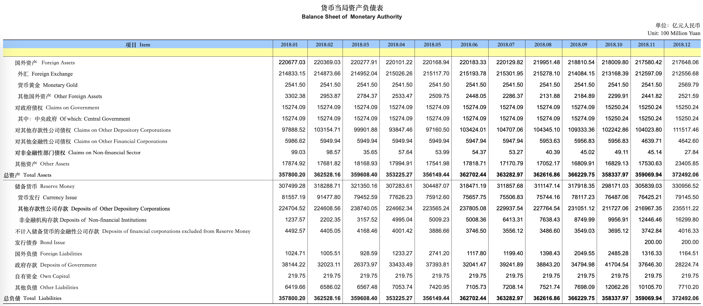

# 新年随想

> 本文可能引起不适，阅读请谨慎。

新年难得有闲暇独处，写下此篇随笔，想到哪儿就写到哪。

我一直认为选择要比努力重要：人的一生在形式上就是由一系列关键的选择组成的路径，做出正确的选择需要智慧，而坚持努力前行需要意志。智慧与意志两者都是珍贵而稀有的属性，但智慧相对更为重要，因为它决定了前进的方向，以及可行选择的多少。

在过去一年里，我做出了很多重要的选择：换了职业，换了行业，也换了工作。但要说最重要的选择是什么，我认为是将大量时间花在了社会认知水平的提高上。得益于职业特殊性，我有着大把的时间来学习，在近半年里平均每天花六个小时在当代史，宏观经济与新闻时事上。为什么呢？一个人的命运啊，当然要靠个人奋斗，但也要考虑到历史的进程。站在历史的转折点上，提高对未来形势的基本判断能力远比多掌握一点儿技术知识重要。

08年放水的时候我还懵懵懂懂，到了13年钱荒的时候我已经开始意识到阴霾了，16年已经清楚感觉到形势不太对头开始准备，每天收看新闻联播，关注境内外消息以及相关经济数据，卖房健身攒钱。18年初当AI和区块链泡沫仍然火热时，我意识到了互联网到顶了，在最后关头踩着裁员潮的点离开这个行业。当然这种程度的判断力还是过于迟钝了，我所知的最牛逼的人，在09年从王储的“吃饱了没事干”论就发现端倪，推断出剧本跑路了。

那么，剧本是什么？我猜到了一些，按理说闷声发大财才是最好的，但我实在不忍心作壁上观。因此今天与大家分享一下自己的看法。**贾雨村言，疯言妄语，如有雷同，纯属巧合，本人不负任何责任。**

## 前言

三十年河东，三十年河西，六十年一个康波周期。前三十年社会主义建设，后三十年改革开放征程。人的选择决定命运，国的选择决定国运：今年已经是改革开放40周年了，从08年选择了放水刺激开始，党国就选择走上逆天改命的不归路。2008年，13年，15年本来已经要着陆，但不印钞就闹，在无底线的放水下硬续了三次，硬生生地把周期的下半场拉长了十年。其实很多崩溃论者是看到了问题，但狼来了喊早了，傻空了十年。违背经济规律总是要还的，吹的越高，摔的就越狠。就目前来看，放水刺激基本失效，外部环境也发生巨大变化，想靠AI推动下一次科技革命续命也基本无望，所以，故事也基本确定下来。

可以说中国能有今天的成就，“关键一招”实际上是加入WTO，参与世界贸易分工体系。中国成为了世界工厂，依靠着勤劳勇敢的中国人民，改革红利与人口红利，几乎将所有全球的中低端制造业岗位收入囊中，并不断尝试向产业链上游攀爬，成为所谓“发达国家粉碎机”。中国，是当下国际秩序中最大的受益者，而最大的受害者则是发达国家的中下阶层，他们的工作被中国人“夺去了”，钱也让中国人“赚走了”。美国，是这个国际秩序的维护者，但它已不愿再扮演世界政府来维持这个体系，中下层选出来特朗普，美帝亲自下场肉搏。无敌国外患者国恒亡，而美帝的头号战略对手就是中国。这就是贸易战与冷战2.0的大背景。

贸易战与冷战的事实本身已经没有任何悬念了，三月一号就是外贸节点最后通牒，当然实际上可能还会往后再拖一拖。贸易谈判再怎么谈，说到底就是拿钱买时间（所谓战略机遇期），美帝收下大红包后很快还会再回来的，25%也不会是最终结果。老大准备敲打老二前首先要做的事情，就是先把与之相连的贸易往来切到别的地方去，以减小对自己经济的冲击。等到主要供应链从中国转移出去之后，才能放心的抽手大干一场。有一点是确定的，无论贸易谈判谈成什么样子，关税加或不加，都不会影响接下来ColdWar2.0的技术封锁与禁运。

因此，摆在我朝面前的乃是40年未有之变局，总书记将其形容为“难以想象的惊涛骇浪”。对最高领导人而言的惊涛骇浪，还是难以想象的，这句话的分量太重了。

改革开放四十年了，从80后到00后，已经足够放下两代人和十几条代沟了。这些年龄在四五十岁以内的人出生在一个黄金时代，在和平与发展的主旋律中，乘着改革春风，踏着全球化浪潮，一路春风得意马蹄疾。在十几年的经济奇迹中，这些人将**明天会更好**视作理所当然，充满着对未来的美好预期。这些人接受着去政治化的洗脑教育（刻意设计的死板思政课程），忙着当奋斗者向上爬，根本没空，也对社会现实漠不关心。不过，轮回之终末时，很多人都将成为时代的祭品。对大多数人而言，知道剧本并不能让自己躲过收割的镰刀，只会失去无知的幸福。因此现在关闭本文退出阅读还来得及。

## 剧本

那么进入正题，接下来的剧本是怎么样的呢？

未来10~20年的走向我是这样推测的，这也是我对所谓“系统性风险“的理解。

### 背景

首先说一下背景，中国是出口导向性的经济，外贸出口一直是中国经济增长的发动机，一半以上的进口都是为出口服务的，乃是典型的来料加工模式。外贸为中国带来天量的外汇储备，消化了巨大的国内产能，解决了就业问题，经常项目盈余（顺差，赚的外汇）乃是我朝经济的灵魂。天朝的主要顺差则来自欧美，对日韩台湾则完全是逆差。2018年货物贸易顺差中的**92%都来自美国**，因此改革开放说到底实质上就是**对美开放** 。美国是全球最重要的出口商品终极市场，在打贸易战全面+25%关税的情况下，失去美国市场需求，中国外贸总量减半都有可能，会直接打崩中国的国际收支。说成白话就是：货卖不掉了，挣不到钱了。

**图：中国GDP走势，可以看出真正的起飞是在01年中国加入WTO后**

这里说一句题外话，什么是**钱**？在信用货币时代，货币乃是**由国家暴力背书的国家信用**。在世界上美元是硬钱，而人民币国际化中道崩殂，离硬货还很远，因此我朝采用了锚定美元的方式为人民币获取信用。人民币实质上乃是对中国央行的债权凭证，而债权的抵押物则写在央行资产负债表的资产栏里 —— 主要部分是外汇储备（美元）。人民币以美元为锚的意思是，每当我们挣回1美元时，央行会按汇率发行等值的约7块人民币换走它。而当我们用人民币向央行购汇兑现债权，每取出1美元时央行都会按汇率注销等值的7块人民币。因此拿着人民币能换到美元，这就成为了人民币的信用来源。

**图：货币当局资产负债表，可以看到外汇占款是人民币对应资产的大头**

回到正题，中国加入WTO后攒下了天量的外汇储备（硬钱），峰值约4万亿美元，央行以这些美金作为抵押品印出了二十多万亿的人民币外汇占款（基础货币）。这些基础货币又通过银行贷款衍生出约182万亿的M2（准货币，银行存款）。二十年间M2供应量翻了十倍达到182万亿。印了十倍的钱但粮价与各类生活必需品的价格并没有翻十倍，因为这些钱都被房地产以及IT金融等企业蓄走了。房子与企业成了超发货币的储值工具，因此买房的人与IT金融行业的高薪从业人员，都应该清醒的意识到自己赚到的钱乃是时代的红利。

**图：20年来准货币供应量M2变化**

伴随M2暴涨的是天量的贷款与天量的债务（杠杆），企业借钱续命，个人借钱买房，地方政府借钱搞铁公基。全社会杠杆率已经达到了250%，即整个社会欠的债达到GDP的2.5倍，这些债务光是利息就是一个天文数字。在经济上行阶段这些问题都可以掩盖住，赚来的美元源源不断地变成人民币来还利息。但外贸如果垮了，美元外流，人民币需要注销，基础货币流失，宏观上流动性一紧张，总有地方债务要爆炸。失业的房奴还不起月供，企业现金流断裂破产，18年下半年P2P的暴雷潮，债券违约潮已经为我们展现了一幅生动的图景。至于地方政府50万亿的狗屎债则压根就没打算还，如何收场，那只能让银行咽下去了（银行破产，个人存款有50w保险）。

同时，贫富差距加大，房地产一业兴百业衰，高涨的地租抬高了各行各业的成本，吭哧投钱干制造业完全不如拿钱躺着炒房，扼杀企业家精神；上游供给侧改革，提高原料能源价格，肥了国企苦了下游企业；人口红利消退，中国的劳动力成本已经不低了（深圳招工4000~6000元，同样的工作在越南只要2000~3000元，柬埔寨只要1000）。种种因素相互叠加，经济中赚钱的机会变的越来越少，深圳已经出现企业排队注销的盛况。这时候如果再来25%的全面关税，外企撤离，民企破产潮指日可待（其实已经开始了）。经济萧条会摧毁人们的信心，外资撤离，权贵转移资产，跑冒滴漏根本堵不住。资本外逃导致外汇储备下降，进而基础货币下降流动性紧张，引发经济形势进一步恶化，引发更多资本外逃，最终形成一个正反馈恶性循环。

第三个问题是科学技术封锁与高科技产品禁运，以及制裁，禁运与制裁可以说是冷战的标志之一。中国的应用技术非常牛逼（抄袭与微创新能力一流，同人逼死原创），市场巨大（市场换技术），有低人权优势（隐私换便利）。但基础科研除了物理方面几乎没啥特别拿得出手的东西，大把捡面包屑吃的所谓“科研”，别的行业就不说了，IT行业看着国家科学技术奖的什么“透明计算”，“云端融合系统的资源反射机制及高效互操作技术”简直就是个天大的笑话。现在是我们自己建墙也允许科研人员翻墙，门要两边都堵住才能关上，如果老美也修了墙搞封锁那就瞎了。譬如国内互联网，基本就靠两条腿走路，一条硬件腿主要是芯片，基本都靠进口，另一条软件腿，基本都靠开源，Github和StackOverflow目测提供了国内互联网公司90%以上的技术生产力。一旦发生禁运封锁与断网，那画面太美不敢看。美国两院议员已经提案对中兴华为芯片禁运了，整体禁运为时不远。指望自力更生基本不现实。因此基础科研被锁死后全要素生产率提高缓慢，与美国的差距会越来越大。目测除了军工和一些舍得砸钱的战略行业， 其他领域前景堪忧。

封锁禁运与制裁是很难受，可以看到朝鲜，委内瑞拉，伊朗在制裁之下的惨状。接下来的制裁不仅仅会来自美帝，而是整个西方世界，也许再加一个日本。世界范围的民族主义回潮会让西方文明抱团成一个整体（基督教文明），而中国（华夏文明），俄罗斯（东正教文明），伊朗（伊斯兰文明）三者只能抱团取暖，自己的经济进入内循环。但中国这台经济机器曾是为整个世界的需求而服务的：一个唐山市的瞒报钢产量能超过整个德国的钢产量，一个乡镇生产出的袜子能占全世界的三分之一。进入内循环后，这些爆炸的产能根本没有可能被内需消化，更何况居民的内部消费能力已经早已被房子掏干净了。因此需要“供给侧改革”去产能，把这些不姓赵的厂子都提早关掉，将失业压力缓释出来。

上面是贸易战与冷战的三个直接后果，资本外逃，企业破产，科技封锁。概括地讲，外储流失则基础货币减少，流动性紧张引发债务危机进入明斯基时刻，引发资产抛售潮与资产通缩。与此同时超发货币从资产端流出，又不能换美元跑掉，那必然会冲击日常必须品导致食品房租价格通天，必需品通胀。最终形成资产通缩与必需品通胀的经济奇观。外企撤资与民企破产则引发大面积的失业潮，房奴断供引发抛售房产，失去经济来源的人报复社会引起治安恶化（例如大下岗时的刨锛党），处理不慎甚至会引发社会动荡，遍地张献忠。这些直接后果又会进一步引发其他问题，这就是所谓的“系统性风险”，下面依次展开。

### 系统性风险

**系统性风险始于外汇储备流失**，外汇是老大哥的命根子，因为外汇才是真的钱，能买到粮食，石油和其他资源。当失去挣外汇的能力后，最严峻的问题就是**资源不足**，最关键的两样资源是石油与粮食。为什么要强推新能源车？因为我们不缺煤不愁电，但宝贵的石油需要进口，要留给化工行业做原料塑料化肥。另一个要命的问题是粮食危机，进口粮食实在是太便宜了，国产粮基本只能卖给政府收储，政府也不情不愿，纯粹是出于粮食自给安全的考虑。一亩田辛辛苦苦到头才赚几百块钱，完全不如进城打工，很多农民都抛荒不种田了。粮食危机有人写过专门的文章分析，自给率测算约七成左右（对此数据不负任何责任），很多粮食都是走私进来的（搜索广西粮食走私有惊喜）。不过只要社会秩序不乱，通过粮票配给制和计划经济减少浪费，饿死人还是不太可能的。**供销社**就是为粮食物资短缺准备的，这个计划经济时代的组织随着证监会641离任又重回人们的视野中。2012年，供销社的覆盖率才到56%，2018就到了95%，计划经济时代的组织为什么还要花力气重建呢？这么看来党国至少几年前早就在为今天准备了。除了粮食与能源，很多需要外汇的进口商品也会成为奢侈品，出国旅游留学肯定不允许了。譬如最近国家已经取消了公派留学硕士，旅游目测在路上。最高法刚出台了外汇非法买卖认定标准，可以学习一下。

**系统性风险的第二个问题是通胀**，超发货币会冲击生活必需品。其实最近几年已经有这样的例子出现了，09年经济要着陆大放水，热钱冲击生活必需品，著名例子的“蒜你狠”，“豆你玩”，“姜你军”等等。当股市房市债市收益率维持不下去时，资本一定会去冲击最有赚头的地方，也就是炒作生活必需品。其实现在的肉价菜价涨幅很多人应该已经有了切身感受了。另一个例子是房租，买房不是刚需，居住才是刚需。因此租房作为生活必需品也会成为炒作的对象。因此我们能看到房价跌落但房租大涨的现象，我在北京3000租的房子半年不到就涨到4000了。按照剧本，这些生活必需品的价格会持续上涨，危机爆发后会炒到天上去。按照党国的想法，要先利用高涨的生活成本把把潜在失业人口先一步从大城市赶出去。然后在人民受不了物价通天，呼唤政府干涉时，顺天承运，名正言顺地引入粮票配给制，进入计划经济模式。这个剧本，大体可以参照建国初期的粮棉之战。

**系统性风险的第三个问题是失业**，失业是会直接影响社会稳定程度的。有恒产者有恒心，无恒产者无恒心。苟无恒心，**放僻邪侈，无不为已**。说我朝唯GDP至上其实是一个误解，真正的底线是执政稳定，这是一票否决制的核心目标函数与KPI，没有之一。任何进展都要建立在“稳”的基础上：稳中向好，稳中有进，稳中有变，稳定压倒一切，维稳支出已经超过国防经费，可见一般。六稳中，稳就业是排在第一位的。就业形势很严峻，这一次的下岗潮目测要比98年厉害的多。IT金融算是最好的行业，现在也进入裁员潮了，至于其他行业，相信时至今日不用多说，大家应该都有切身体会了。

民营企业创造了80%的就业岗位，并创造了净出口量的154% （因为国企赔钱所以占比超过100%）。贸易战老美要求把账做平，难不成还真的每天买五百万吨大豆？最后只能是自己去产能少赚钱，而因为理直气壮做大国企，去产能关厂子的锅一定是民企来背。去了产能之后产生的大面积的失业如何处理，这是一个很棘手的问题。失业压力不能一次性释放，那会直接导致社会动荡，因此必须缓释。16年开始的供给侧改革很多人都说不清到底是个啥东西。但不看广告看疗效，环保风暴也好，上游涨价也好，供给侧改革目的或者效果，就是让这些民营企业，特别是劳动密集型企业趁早关门，提早把失业压力释放出来。能活下来的，比较重要的，像阿里腾讯头条这种，那就要划为“自己人”，收归国有或国家掌握实际控制权，由这个剧本可以参照社会主义公私合营改造。

至于外企，很多能跑的其实已经跑了。外企撤资又会带走大量外汇，引发大面积失业。以外企劳模大苹果为例，新闻称苹果说如果关税加到25%就考虑将iPhone组装业务搬离中国了。苹果在中国带动了上下游500万的就业岗位，如果Apple跑路了，那产业链上一系列供应商恐怕只能喝西北风了。有爆料称富士康要裁三四十万员工，这规模跟跟屠城差不多了。没有城市里的工作机会，农民工只能“返乡创业”去了，去年据说有800万返乡创业的，实际不过是失业的委婉说法罢了。

另一个重点失业群体是高效毕业生。2018年有820万高校毕业生，实在是可怜，一毕业就遭遇到了经济寒冬。学生思想比较天真偏激，而且还学过一些革命方法论，所谓“知识越多越反动”。解决不好学生的就业是会出大问题的。我朝历史上应对失业危机的办法是上山下乡，总共搞过三次：知识青年到农村去，把学生塞进农村当乡村教师赤脚医生。有兴趣可以看看最近一些高校的实习项目都是在干嘛的，上山下乡4.0早就准备好了。乡村一直扮演着中国经济缓冲垫的角色，不过距离上一次已经几十年了，这一次再搞能有多大效果也堪忧。

伴随失业潮的是社会治安的快速恶化，经历过东北90年代下岗潮的同学可能会对此有所体会。经济萧条的年代社会充满了戾气，最近恶性报复社会的案件明显增多，一个具有代表性的例子是北京西城区小学事件，犯罪嫌疑人就是因为被裁发泄不满而行凶的。实际上这种事情越来越多，但绝大多数都被噤声了，有心的话可以关注一下。就治安而言，大城市一定是最后才乱的。对于个人来说如果有能力留在大城市那是最好，一直在富裕状态下成长起来的人要温和的多。不过这并不容易。北京14年就开始往外赶人了，18年人口同比减少了17万，三产总利润减少11.7%，社会消费扣除CPI实际是下降的。为什么宁可亏钱也要撵人？就是为了提早释放失业压力，避免冲击波到来时一次性崩盘。国师说：要为最坏的情况做准备。最坏的情况指的可不是丢了工作在家赋闲，其实也许他想说的是五胡乱华两脚羊副本，不吃特供哪来的救生艇呢？

既然说到了失业，作为前互联网从业人员，我也特别提一下国内互联网行业的命运，之前专门写过一篇《互联网的挫折》不过被删了。这里提一下结论，冷战开始后，国内互联网是注定💊的：

1. CW引发意识形态分歧回归，文化阵地管制加强。
2. 互联网具有社会动员能力与舆论影响力，不可控。
3. CW引发技术制裁，芯片禁运，物质基础不复存在。
4. CW引发经济危机，互联网科技提升效率与政府维稳的KPI相悖。

互联网科技公司的核心价值在于提高效率，解放生产力。它将多数的低端岗位转化为了少数高端岗位，这有悖于保就业的KPI。一人吃好和十人吃饱，老大哥会怎么选那是毫无疑问的。此外，信息系统开发阶段和维护阶段需要的人数是不同的。一但增长见顶，不需要新功能，那么开发就失业了。不少现有系统还需要持续运转，运维可以多苟一段时间。但总体上讲，野生的IT企业要么被收编，要么就在文化压制中消亡。最后可能的结果就是几百万下岗IT码农角逐极少量数政府内部，强力部门军警政法，国企内部的运维岗。

很多互联网企业高层已经意识到了情况，开始裁员，进入过冬模式，现在基本就差BAT了。不过这几个重要的企业不出意外会被收编。马老板激流勇退放弃控制权退休去教书是有智慧的，可以参考刘伯承。

**系统性风险的第四个影响是文化的变革**，具体叫什么名字并不重要，你也可以管它叫文化大革命2.0。重要的是，上层建筑必须要与经济基础相适应。过苦日子就必须要有配套的文化，娱乐至死是奢望，资源不足怎么奶头乐？需要的是主题思想与苦难行军精神。因此我特别建议大家了解一下朝鲜的历史。文化需要回归主旋律，那么排斥外来文化也是可期的了。抵制圣诞节，抵制美国大片，抵制日本车，抵制iPhone；弱化高考中英语的地位，强化语文的地位。WG2.0的目标是将所有人的思想格式化，统一到共克时艰定于一尊上来，比如马上要来的全民“学习强国App”每日定额学习任务。

此外，我朝还会尝试从传统儒家文化中寻找合法性，这些东西新闻联播里隔三差五就会放一下：家风，乡贤，忠孝，女德。孔老夫子从臭老九又变成了孔圣人，忠孝这一套封建的东西确是有助于提高社会稳定性维护统治。同时还会大力提倡“女德”，把妇女赶回家庭，以缓解就业压力与老龄化。当然这样开倒车阻力很大，一定是通过明面上提高妇女福利，实际上削弱就业竞争力的方式进行的。有兴趣可以搜一下人日最新出炉的关于山东过年女人不能上桌吃饭的评论。

另外一个操作是断网。国际互联网在今日实质上已经接近为几个局域网，即所谓网络主权。不过这里说的不是GFW的断网，而是局域网都莫得用。毕竟要想改变文化，一个必要的条件就是切断其他信息来源，由主流媒体掌握一切话语权。这个操作其实已经在新疆进行过一次试点演习了，不多说。

当事情发展超出预期时，天朝还有一剂肾上腺素，矛盾转移大法。走民族主义狂潮路线就是打湾湾；走阶级斗争路线就是粉红狂潮斗地主。不过这些操作太危险，一定会留在最危急的时候用。

最后，凡事预则立不预则废，最近新闻联播特别强调底线思维，党国当然也做好了最坏情况的预案，海南全省学习英语，在弱化英语教育的大背景下这意味着什么，值得仔细思考。能当领导的人在斗争方面都是顶尖的人精，要说有更嘿嘿的PlanB也一点都不让人奇怪，不展开。

说完这几个问题，那么这样的情况会持续多久呢？十年到三十年不等吧。主要还是一个心理预期管理的问题，对于山区农民来说可能也没有特别大的影响。对普通人而言，集权秩序或者地方秩序都好于没有秩序，去年全球气候显著变化粮食大减产，一但生产秩序崩溃，直接进入岁大饥模式。消息灵通，脑袋灵光的人早就跑路了，现在还剩着的人老老实实共度时艰吧。移民西方国家也要小心，旅游可能没什么但移民可就说不准了，可以了解一下二战中美国和加拿大日裔的遭遇；留学的话一不小心就变成间谍了，说不定回国也被当成间谍了，参考WG时期回国的知识分子。这个世界太疯狂，逃无可逃啊。

再次强调，以上都是发生在平行世界里的虚构推演。贾雨村言，不可当真，不负任何责任。

好了，魔幻的故事讲完了。觉得玩弄滑坡谬误也好，杞人忧天也好，贩卖焦虑也罢，那都无所谓了，毕竟世界运转不以个人意志为转移。当然也可能是我陷入了负面回声室中，但数据可不会说谎（但可以造假）。开年以来很多经济数据已经开始出现失速了，以至于网信办刚发了个规定：“金融信息服务提供者不得散布虚假信息”，连很多经济数据都不让公开讨论了。

草蛇灰线，伏脉千里。如果关注新闻就会发现，很多事情党国早就开始准备了，我猜测厅局级以上的干部应该是非常清楚的。观察一些高位公众人物的言论也能看出很多端倪（特别推荐的两个样本是，环球时报总编胡锡进和天风证券首席社科院博导刘煜辉，都是话痨，信息量大）。

## 结语

> Ignorance is bliss

2018年经济是过去10年最差的一年，但会是未来20年最好的一年。安信首席高善文说，30岁以下的年轻人可以洗洗睡了。马上大家伙就能切身体会到啦，人生有多少个二十年呢？

危机之所以称为危机，就是普通人基本没有机会与能力逃过，无论如何都会被收割。

无知即幸福。知道这些东西之后，肯定有人会感到后悔。毕竟你又无力改变什么，只能干着急焦虑。如果能够无知地快乐，又为什么要选择清醒着痛苦呢？

不过我还是愿意选择直面惨淡的人生。毕竟正如罗曼·罗岚所说：世上只有一种英雄主义，那就是认清世界的真相后依然热爱它。

祝大家新年快乐！

