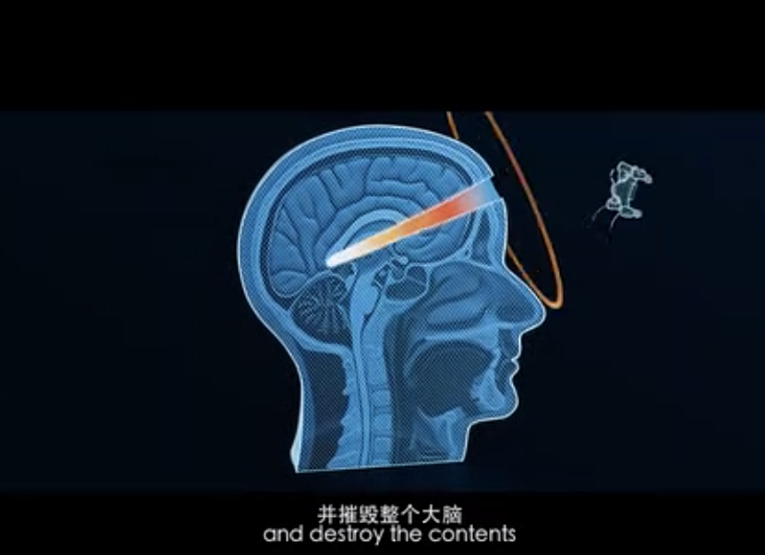
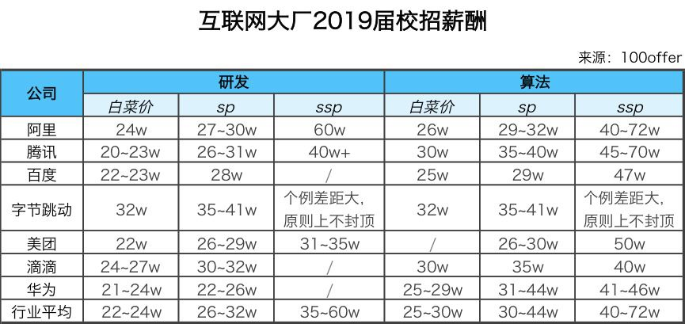

# 理解互联网

​	我曾经觉得互联网的本质，互联网行业的发展，互联网公司的战略这些“高大上”的东西都应该是政府官员，公司高管思考的问题。作为一个互联网从业人员，一名软件工程师，能把自己领域的技术钻研透就不错了。但现在的我改变了想法：一个人的命运啊，当然要靠自我奋斗，但也要考虑到历史的进程。

​	世界潮流，浩浩汤汤。顺之则昌，逆之则亡。站在历史转折的十字路口，只有认清大势才不会迷茫。这几个月的空闲时间，几乎全部被我投入到了认识世界的过程之中。大致看清了当前的形势的轮廓，并对未来的走势形成了影影绰绰的直觉；虽然技术进步的脚步缓了下来，但我认为这是非常值得的。下面是一些感想与心得。

## 互联网的本质

> 周虽旧邦，其命维新。
>
> —— 《诗经·大雅·文王》

​	让我们先从最宏大的叙事开始，互联网的本质是什么？

​	互联网在最本质上是一种**社会组织形式**，与之类似的概念是**民族国家（Nation）**。

​	很多人认为互联网是一样技术，一个行业，一种工具。这种观点虽不能说错，但理解过于片面。互联网是工业革命后的一次重大技术革命，但它对于世界的影响要更为深远。

​	生产力决定生产关系，而信息技术则是生产力的一个重要代表。信息传播的方式与速度，决定了社会的组织能力与动员能力。信息技术与历史变迁王朝更迭之间有着紧密的联系。从历史上来看，与互联网在同一个量级的技术有这么几样：竹简，造纸术，印刷术，这些都是可以划分纪元的标志性技术：竹简出现于西周，与奴隶制国家相对应；纸张出现于西汉，与古典帝国封建王朝相对应；印刷术出现于文艺复兴时期（北宋），与资本主义、民族国家相呼应。而互联网则对应着下一个纪元，也许与**真正的**社会主义相对应。

​	当今的世界秩序，实际上是由一系列**民族国家（Nation）**组成的国际社会，源头可以追溯到17世纪的威斯特伐利亚体系。我们今日习以为常的概念，譬如**国家**，就是在那个时代形成的。但国家并不是天经地义自古以来就有的实体概念。如果当年大明王朝做了不一样的选择，也许今天的世界秩序就是四方来贺，八方来朝的，以天朝为中心的**朝贡体系**了。

​	民族国家是一个想象中的共同体，需要通过文字（阅读）来构成民众的想象。因此可以说，民族国家是印刷术时代的产物。即使是当今世界的政府，也依然按照印刷术时代的方式来运转：公文，案牍，档案，报纸，出版，这些都是印刷术时代留下的深刻印记。但是，互联网将改变所有的这一切，带来一场前所未有的革命。

## 互联网所统治的世界

> 阿里巴巴要做全球第五大经济体
>
> —— 马云

仔细思考这样一个问题，我们每天抛开学习工作吃饭睡觉，剩下的时间有多大一部分被手机占据了？

餐馆聚餐，地铁公交，上厕所，很多人都是手机片刻不离。一旦手机忘带遗失就会陷入严重的焦虑不安中。手机已经深入了我们生活的方方面面，成为了一个体外的器官。

​	但吸引我们的不是手机本身，而是手机背后的互联网世界，手机只是互联网的访问媒介。通过互联网和手机，我们可以随时随地的与人沟通，购买几乎一切你能想到的商品与服务，衣食住行，吃喝拉撒，科教文卫，无所不包；我们可以在手机上浏览最新的资讯，听音乐，看电影，玩游戏，炒股；我们可以在手机上办理工商登记，交税纳社保，提取公积金，转账汇款，完成股票交易。

​	对普通人而言，与互联网打交道的时间要远远超过与政府和国家打交道的时间。我们享受着互联网带来的无比便利的生活，但从另一种角度讲，也可以认为我们正在被互联网公司们所统治。与国家的区别在于，国家本质上是通过强制性暴力进行统治的，而互联网公司则通过知识，以一种低调、隐秘而微妙方式，让人心甘情愿地接受统治。互联网公司，或者说科技巨头们在不知不觉中已经掌握了巨大的权力。

​	权力就其效果本质而言，是一种让他人服从于自己意志的能力。它有三大来源：暴力，财富与知识。暴力已经被国家所垄断，因此互联网公司的权力主要来自其知识。知识，或曰数据，潜藏着巨大的影响力与能量；作为一种权力的来源，它往往不为常人所关注，但互联网公司对此心知肚明。资本家与知本家并不都是慈善家，可为什么很多优质的互联网服务都是免费的？因为用户在使用这些服务时就已经付出了代价——自己的数据，并将自己置身于互联网公司的监控——也就是统治之下。就目前而言，这些数据大体上仍然是以一种相对“无害”而温和的方式使用的——诸如广告系统与个性化推荐。但就其未来发展而言，我们必须意识到硬币的另一面。

​	从另一个角度来看，互联网公司的“权力”以一种更直接的方式体现出来。以阿里巴巴为例，2017年的GMV突破五千亿美元，如果将其视作一个经济体，可以在世界上排到第21位。而马云更是放出豪言：“阿里巴巴要做全球第五大经济体”。如果将阿里视作一个国家，那么它高效地掌握了整个平台市场上所有商品的供需关系。一个关键词排名差那么一两位，商家收入的可能以千万、亿来计。毫无疑问，在这样的环境中，它就是市场经济中的“计划委员会”，掌握着生杀予夺的权力。

​	我丝毫不怀疑，当人工智能与无人机/机器人技术发展到科技公司可以垄断暴力的时候，这个世界将完全被科技公司所主宰。

## 权力的转移

> 新事物符合历史发展的必然趋势，具有强大的生命力和光明的前途，新事物必然代替旧事物。
>
> —— 《马克思主义基本原理概论》

互联网行业很有钱，有钱到很多传统行业的从业人员都开始怀疑人生。以2019届校招为例，国内互联网为校招应届生给出的价格如下表所示：

而互联网中坚力量的价格也非常感人，小道消息称，阿里P7（技术专家，3-5年）的总包约为税前100W，而P8（高级技术专家）的总包约在税后100W。传统企业的高管或领导层都不一定有这样的薪资。

互联网是一台造富机器，它不仅仅是让个别的人实现了阶级跨越，而是成规模，批量的生产中产阶级。为什么互联网从业人员能富得流油，扪心自问，程序员的劳动难道要比煤矿工人辛苦，学习要比搞数学物理科研艰难？都不是，**势也**。如果说互联网将替代国家，成为新时代的社会组织形式。那么自然而然地，掌握这些技术与数据的互联网从业人员，就将是新时代的官僚阶级，或曰：统治阶级。

​	互联网公司追求效率，互联网公司的网状实时协同组织要比民族国家的传统科层制度要高效的多，任何在大型互联网公司内工作的人都应该对此有所感受。传统的**官僚制度（ bureaucracy）**按照层次组织，内部的管理与协作都是单向线性的，围绕着固定的规章制度流程而运转；知识与信息散布在不同的组织中，各个部门之间的协同存在很多困难。而互联网的根本优势就在于，它能够提供**大规模，社会化的协作机制**。各类IM能让全社会之间的沟通效率大大提高；各类应用能够解决衣食住行方方面面的需求；微博与推特可以让全社会的人对共同关心的议题进行讨论；直播则让人能实时快捷地传播自己的思想；区块链与智能合约可以用于达成去中心化的共识，解决投票，公证，登记，断案，公告等一系列组织问题。互联网作为一种革命性的社会组织形式，终将取代民族国家。它与民族国家之间符合新旧事物之间的辩证关系。

​	因此就不难理解，为什么这么多互联网公司都富得流油，为什么互联网从业人员有很高的薪水。这是资本在下注，资本在拥抱新的组织形式。因此即使互联网公司不盈利，资本也愿意往里砸钱。以至于有一段时间，很多荒诞可笑的项目都可以轻松骗到钱。因为在这种认识下，互联网公司已经不再是单纯的公司，而是一种储值工具，一枚通向未来的筹码。未来是由资本与科技统治的，这也是IT从业人员薪资如此之高的原因：他们是未来的统治阶级—— 知本家。

​	资本没有祖国，互联网也是。跨国资本与科技公司一贯都是全球化与多元化的坚定支持者。因为在未来的新秩序中，**国家/民族（nation）**只是一个次要的文化属性。亲不亲，阶级（兴趣）分。在互联网时代，人们会按照兴趣自由组成小团体。这时候的人们，首要的自我身份认同不是“我是XXX国/族人”，而是，我们都喜欢玩《欧陆风云》，他们都喜欢打《吃鸡》，那些人对数据库感兴趣，诸如此类。

​	互联网的天命，就是连接与融合。而民族国家，这一人为设置的藩篱恰恰是其天命的最大阻碍。因此可以预见，权力的转移之路注定不会顺利，甚至可能伴随着血雨腥风…。

## 未来的冲击

> 前途是光明的，道路是曲折的。
>
> —— 毛泽东

​	天下大势，分久必合，合久必分。中国历史上一共有三次大分裂时期：东周/春秋战国，东晋/南北朝，南宋/金辽西夏。

​	周朝出现了竹简，文字不再是仅仅刻在大鼎和龟壳上。知识变得更为廉价，不再被极少数统治阶级垄断。知识扩散到了士大夫群体中，最终形成了新兴的阶层——诸子百家民间私学由此而起，并孕育了第一次大分裂——春秋战国。

​	东汉出现了纸张，但直到西晋，洛阳纸贵，方才普及。纸张的发明应用也促生出了新兴的知识分子阶级——西晋士族阶层，西晋也很快亡了，华夏进入第二次大分裂——五胡十六国。

​	北宋出现了成熟的雕版印刷术，催生出书商、印刷局甚至纸币，知识的传播范围与信息传播速度进一步扩大，孕育出——北宋文官集团，最终导致华夏进入第三次大分裂——南宋/金/辽/西夏。

​	这三次大分裂背后其实存在着一种共性：即信息传播方式的改变与新兴阶层的崛起。传播方式与媒介的变化扩大了知识的传播范围，因而催生出新兴的知识阶层。手握新技术的阶层希望获得凌驾于统治阶级的话语权，产生阶级对立并不断蓄积矛盾，进而孕育出革命性的破坏力与创造力，最终开创出一个新时代。我们不禁会想，这一次，以互联网（或者加上区块链，人工智能，或者整个信息技术）为代表的革命性信息技术，又会如何推动历史的车轮呢？

​	互联网孕育出一批新兴阶层 —— 软件工程师，流量明星/主播，公共意见领袖，等等。现阶段，在国内，这些人在我党面前都还是瑟瑟发抖的小白兔。但总有一天，他们会主张与其经济地位相匹配的政治权力。进而对现有的统治产生挑战。而现有秩序的维护者也不会坐以待毙，必然会进行疯狂的反扑。实际上，我们已经可以在很多地方感受到这种压制了。

​	互联网的前途是光明的，但道路是非常曲折的。曲折程度甚至可能远超人们的想象。中美现在的新冷战背后也有这种意图存在，双方政府通过冷战强化巩固自身的权力，并腾出手来收拾各自国内的互联网科技公司，在斗争中有合作，在合作中有斗争，既要借力科技公司的生产力，又要避免让它们摘了桃子。因此，接下来的一段日子，国内互联网公司可能会非常非常难过。审核，约谈，下架，甚至断网都是有可能的，倒闭潮伴随着硅谷码农回流的冲击国内就业岗位，惨烈程度也许会超出很多天真码龙的想象。这一段苦日子至少会持续廿年，或者更长。

​	欲戴王冠，必承其重。只要有了方向，就有了希望。

