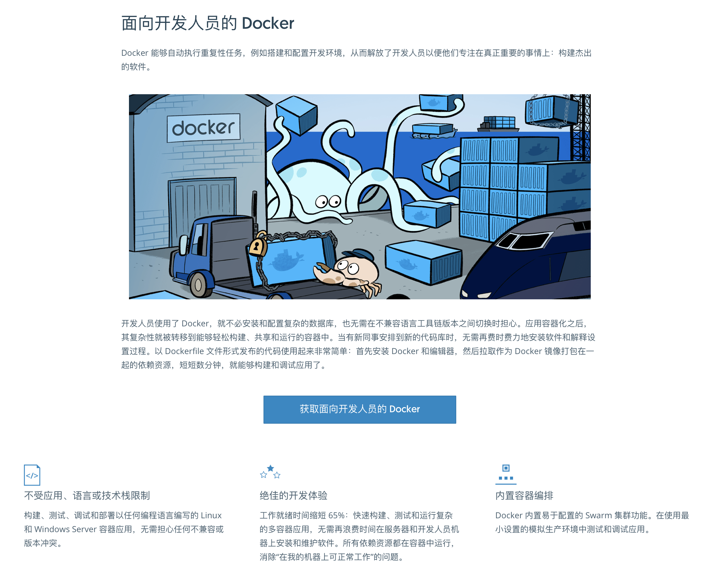
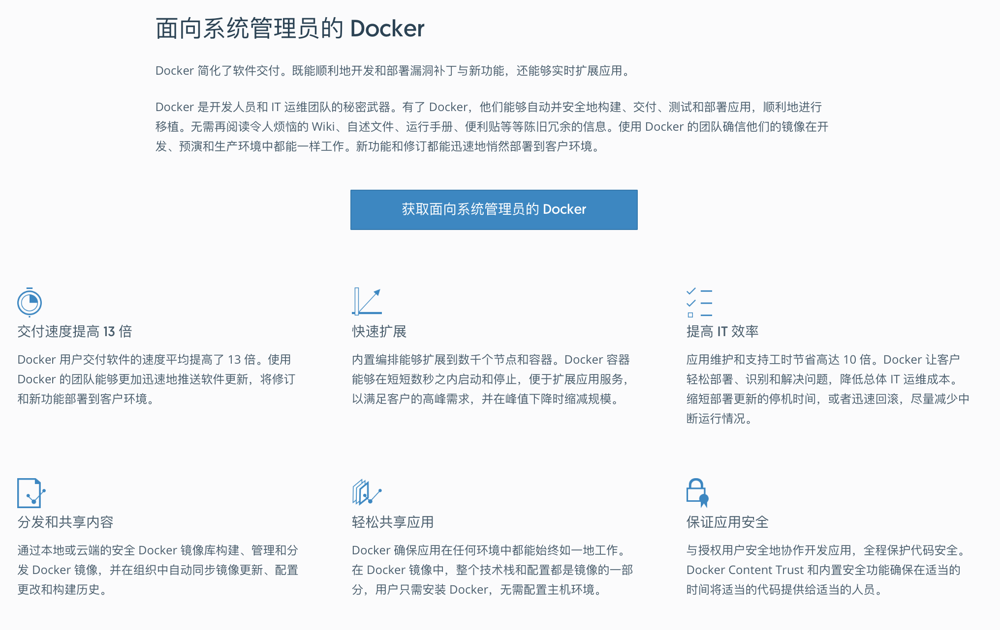

# 把数据库放入Docker是一个好主意吗？

对于无状态的应用服务而言，容器是一个相当完美的开发运维解决方案。然而对于带持久状态的服务 —— 数据库来说，事情就没有那么简单了。**生产环境的数据库**是否应当放入容器中，仍然是一个充满争议的问题。

站在开发者的角度上，我非常喜欢Docker，并始终相信Docker是未来软件开发部署运维的标准方式，而Kubernetes则是事实上的下一代“操作系统”。但站在DBA的立场上，我认为就**目前而言**，将生产环境数据库放入Docker中仍然是一个馊主意。


## Docker解决什么问题？

让我们先来看一看Docker对自己的描述。





Docker用于形容自己的词汇包括：轻量，标准化，可移植，节约成本，提高效率，自动，集成，高效运维。这些说法并没有问题，Docker在整体意义上确实让开发和运维都变得更容易了。因而可以看到很多公司都热切地希望将自己的软件与服务容器化。但有时候这种热情会走向另一个极端：将一切软件服务都容器化，甚至是**生产环境的数据库**。

容器最初是针对**无状态**的应用而设计的，在逻辑上，容器内应用产生的临时数据也属于该容器的一部分。用容器创建起一个服务，用完之后销毁它。这些应用本身没有状态，状态通常保存在容器外部的数据库里，这是经典的架构与用法，也是容器的设计哲学。

但当用户想把数据库本身也放到容器中时，事情就变得不一样了：数据库是有状态的，为了维持这个状态不随容器停止而销毁，数据库容器需要在容器上打一个洞，与底层操作系统上的数据卷相联通。这样的容器，不再是一个能够随意创建，销毁，搬运，转移的对象，而是与底层环境相绑定的对象。因此，传统应用使用容器的诸多优势，对于数据库容器来说都不复存在。


## 可靠性

让软件跑起来，和让软件可靠地运行是两回事。数据库是信息系统的核心，在绝大多数场景下属于**关键（Critical）**应用，Critical Application可按字面解释，就是出了问题会要命的应用。这与我们的日常经验相符：Word/Excel/PPT这些办公软件如果崩了强制重启即可，没什么大不了的；但正在编辑的文档如果丢了、脏了、乱了，那才是真的灾难。数据库亦然，对于不少公司，特别是互联网公司来说，如果数据库被删了又没有可用备份，基本上可以宣告关门大吉了。

**可靠性（Reliability）**是数据库最重要的属性。可靠性是系统在困境（adversity）（硬件故障、软件故障、人为错误）中仍可正常工作（正确完成功能，并能达到期望的性能水准）的能力。可靠性意味着容错（fault-tolerant）与韧性（resilient），它是一种**安全属性**，并不像性能与可维护性那样的**活性属性**直观可衡量。它只能通过长时间的正常运行来证明，或者某一次故障来否证。很多人往往会在平时忽视安全属性，而在生病后，车祸后，被抢劫后才追悔莫及。安全生产重于泰山，数据库被删，被搅乱，被脱库后再捶胸顿足是没有意义的。

回头再看一看Docker对自己的特性描述中，并没有包含“可靠”这个对于数据库至关重要的属性。

### 可靠性证明与社区知识

如前所述，可靠性并没有一个很好的衡量方式。只有通过长时间的正确运行，我们才能对一个系统的可靠性逐渐建立信心。在裸机上部署数据库可谓自古以来的实践，通过几十年的持续工作，它很好的证明了自己的可靠性。Docker虽为DevOps带来一场革命，但仅仅五年的历史对于可靠性证明而言仍然是图样图森破。对关乎身家性命的生产数据库而言还远远不够：**因为还没有足够的小白鼠去趟雷**。

想要提高可靠性，最重要的就是从故障中吸取经验。故障是宝贵的经验财富：它将未知问题变为已知问题，是运维知识的表现形式。**社区的故障经验绝大多都基于裸机部署的假设**，各式各样的故障在几十年里都已经被人们踩了个遍。如果你遇到一些问题，大概率是别人已经踩过的坑，可以比较方便地处理与解决。同样的故障如果加上一个“Docker”关键字，能找到的有用信息就要少的多。这也意味着当**疑难杂症**出现时，成功抢救恢复数据的概率要更低，处理紧急故障所需的时间会更长。

> 微妙的现实是，如果没有特殊理由，企业与个人通常并不愿意分享故障方面的经验。故障有损企业的声誉：可能暴露一些敏感信息，或者是企业与团队的垃圾程度。另一方面，故障经验几乎都是真金白银的损失与学费换来的，是运维人员的核心价值所在，因此有关故障方面的公开资料并不多。

### 额外失效点

开发关心Feature，而运维关注Bug。相比裸机部署而言，将数据库放入Docker中并不能降低硬件故障，软件错误，人为失误的发生概率。用裸机会有的硬件故障，用Docker一个也不会少。软件缺陷主要是应用Bug，也不会因为采用容器与否而降低，人为失误同理。相反，引入Docker会因为**引入了额外的组件，额外的复杂度，额外的失效点，导致系统整体可靠性下降**。

举个最简单的例子，dockerd守护进程崩了怎么办，数据库进程就直接歇菜了。尽管这种事情发生的概率并不高，但它们在裸机上**压根不会发生**。

此外，一个额外组件引入的失效点可能并不止一个：Docker产生的问题并不仅仅是Docker本身的问题。当故障发生时，可能是单纯Docker的问题，或者是Docker与数据库相互作用产生的问题，还可能是Docker与操作系统，编排系统，虚拟机，网络，磁盘相互作用产生的问题。可以参见官方PostgreSQL Docker镜像的Issue列表：https://github.com/docker-library/postgres/issues?q=。

此外，彼之蜜糖，吾之砒霜。某些Docker的Feature，在特定的环境下也可能会变为Bug。

### 隔离性

Docker提供了进程级别的隔离性，通常来说隔离性对应用来说是个好属性。应用看不见别的进程，自然也不会有很多相互作用导致的问题，进而提高了系统的可靠性。但隔离性对于数据库而言不一定完全是好事。

一个微妙的**真实案例**是**在同一个数据目录上启动两个PostgreSQL实例**，或者在宿主机和容器内同时启动了两个数据库实例。在裸机上第二次启动尝试会失败，因为PostgreSQL能意识到另一个实例的存在而拒绝启动；但在使用Docker的情况下因其**隔离性**，第二个实例无法意识到宿主机或其他数据库容器中的另一个实例。如果没有配置合理的Fencing机制（例如通过宿主机端口互斥，pid文件互斥），两个运行在同一数据目录上的数据库进程能把数据文件搅成一团浆糊。

数据库需不需要隔离性？当然需要， 但不是这种隔离性。数据库的性能很重要，因此往往是独占物理机部署。除了数据库进程和必要的工具，不会有其他应用。即使放在容器中，也往往采用独占绑定物理机的模式运行。因此Docker提供的隔离性对于这种数据库部署方案而言并没有什么意义；不过对云数据库厂商来说，这倒真是一个实用的Feature，用来搞多租户超卖妙用无穷。

### 工具

数据库需要工具来维护，包括各式各样的运维脚本，部署，备份，归档，故障切换，大小版本升级，插件安装，连接池，性能分析，监控，调优，巡检，修复。这些工具，也大多针对裸机部署而设计。这些工具与数据库一样，都需要精心而充分的测试。**让一个东西跑起来，与确信这个东西能持久稳定正确的运行，是完全不同的可靠性水准。**

一个简单的例子是插件，PostgreSQL提供了很多实用的插件，譬如PostGIS。假如想为数据库安装该插件，在裸机上只要`yum install`然后`create extension postgis`两条命令就可以。但如果是在Docker里，按照Docker的实践原则，用户需要在镜像层次进行这个变更，否则下次容器重启时这个扩展就没了。因而需要修改Dockerfile，重新构建新镜像并推送到服务器上，最后**重启数据库容器**，毫无疑问，要麻烦的多。

再比如说监控，在传统的裸机部署模式下，**机器**的各项指标是数据库指标的重要组成部分。容器中的监控与裸机上的监控有很多微妙的区别。不注意可能会掉到坑里。例如，CPU各种模式的时长之和，在裸机上始终会是100%，但这样的假设在容器中就不一定总是成立了。再比方说依赖`/proc`文件系统的监控程序可能在容器中获得与裸机上涵义完全不同的指标。虽然这类问题最终都是可解的（例如把Proc文件系统挂载到容器内），但相比简洁明了的方案，没人喜欢复杂丑陋的work around。

类似的问题包括一些故障检测工具与系统常用命令，虽然理论上可以直接在宿主机上执行，但谁能保证容器里的结果和裸机上的结果有着相同的涵义？更为棘手的是紧急故障处理时，一些需要临时安装使用的工具在容器里没有，外网不通，如果再走Dockerfile→Image→重启这种路径毫无疑问会让人抓狂。

把Docker当成虚拟机来用的话，很多工具大抵上还是可以正常工作的，不过这样就丧失了使用的Docker的大部分意义，不过是把它当成了另一个包管理器用而已。有人觉得Docker通过标准化的部署方式增加了系统的可靠性，因为环境更为标准化更为可控。这一点不能否认。私以为，标准化的部署方式虽然很不错，但如果运维管理数据库的人本身了解如何配置数据库环境，将环境初始化命令写在Shell脚本里和写在Dockerfile里并没有本质上的区别。


## 可维护性

软件的大部分开销并不在最初的开发阶段，而是在持续的维护阶段，包括修复漏洞、保持系统正常运行、处理故障、版本升级，偿还技术债、添加新的功能等等。可维护性对于运维人员的工作生活质量非常重要。应该说可维护性是Docker最讨喜的地方：Infrastructure as code。可以认为Docker的最大价值就在于它能够把软件的运维经验沉淀成可复用的代码，以一种简便的方式积累起来，而不再是散落在各个角落的install/setup文档。在这一点上Docker做的相当出色，尤其是对于逻辑经常变化的无状态应用而言。Docker和K8s能让用户轻松部署，完成扩容，缩容，发布，滚动升级等工作，让Dev也能干Ops的活，让Ops也能干DBA的活（迫真）。

### 环境配置

如果说Docker最大的优点是什么，那也许就是环境配置的标准化了。标准化的环境有助于交付变更，交流问题，复现Bug。使用二进制镜像（本质是物化了的Dockerfile安装脚本）相比执行安装脚本而言更为快捷，管理更方便。一些编译复杂，依赖如山的扩展也不用每次都重新构建了，这些都是很爽的特性。

不幸的是，数据库并不像通常的业务应用一样来来去去更新频繁，创建新实例或者交付环境本身是一个极低频的操作。同时DBA们通常都会积累下各种安装配置维护脚本，一键配置环境也并不会比Docker慢多少。因此在环境配置上Docker的优势就没有那么显著了，只能说是Nice to have。当然，在没有专职DBA时，使用Docker镜像可能还是要比自己瞎折腾要好一些，因为起码镜像中多少沉淀了一些运维经验。

通常来说，数据库初始化之后连续运行几个月几年也并不稀奇。占据数据库管理工作主要内容的并不是创建新实例与交付环境，主要还是日常运维的部分。不幸的是在这一点上Docker并没有什么优势，反而会产生一些麻烦。

### 日常运维

Docker确实能极大地简化来无状态应用的日常维护工作，诸如创建销毁，版本升级，扩容等，但同样的结论能延伸到数据库上吗？

数据库容器不可能像应用容器一样随意销毁创建，重启迁移。因而Docker并不能对数据库的日常运维的体验有什么提升，真正有帮助的倒是诸如ansible之类的工具。而对于日常运维而言，很多操作都需要通过`docker exec`的方式将脚本透传至容器内执行。底下跑的还是一样的脚本，只不过用`docker-exec`来执行又额外多了一层包装，这就有点脱裤子放屁的意味了。

此外，很多命令行工具在和Docker配合使用时都相当尴尬。譬如`docker exec`会将`stderr`和`stdout`混在一起，让很多依赖管道的命令无法正常工作。以PostgreSQL为例，在裸机部署模式下，某些日常ETL任务可以用一行bash轻松搞定：

```bash
psql <src-url> -c 'COPY tbl TO STDOUT' |\
psql <dst-url> -c 'COPY tdb FROM STDIN'
```

但如果宿主机上没有合适的客户端二进制程序，那就只能这样用Docker容器中的二进制：

```bash
docker exec -it srcpg gosu postgres bash -c "psql -c \"COPY tbl TO STDOUT\" 2>/dev/null" |\ docker exec -i dstpg gosu postgres psql -c 'COPY tbl FROM STDIN;'
```

当用户想为容器里的数据库做一个物理备份时，原本很简单的一条命令现在需要很多额外的包装：`docker`套`gosu`套`bash`套`pg_basebackup`：

```bash
docker exec -i postgres_pg_1 gosu postgres bash -c 'pg_basebackup -Xf -Ft -c fast -D - 2>/dev/null' | tar -xC /tmp/backup/basebackup
```

如果说客户端应用`psql|pg_basebackup|pg_dump`还可以通过在宿主机上安装对应版本的客户端工具来绕开这个问题，那么服务端的应用就真的无解了。总不能在不断升级容器内数据库软件的版本时每次都一并把宿主机上的服务器端二进制版本升级了吧？

另一个Docker喜欢讲的例子是软件版本升级：例如用Docker升级数据库小版本，只要简单地修改Dockerfile里的版本号，重新构建镜像然后重启数据库容器就可以了。没错，至少对于无状态的应用来说这是成立的。但当需要进行数据库原地大版本升级时问题就来了，用户还需要同时修改数据库状态。在裸机上一行bash命令就可以解决的问题，在Docker下可能就会变成这样的东西：https://github.com/tianon/docker-postgres-upgrade。

如果数据库容器不能像AppServer一样随意地调度，快速地扩展，也无法在初始配置，日常运维，以及紧急故障处理时相比普通脚本的方式带来更多便利性，我们又为什么要把生产环境的数据库塞进容器里呢？

Docker和K8s一个很讨喜的地方是很容易进行扩容，至少对于无状态的应用而言是这样：一键拉起起几个新容器，随意调度到哪个节点都无所谓。但数据库不一样，作为一个有状态的应用，数据库并不能像普通AppServer一样随意创建，销毁，水平扩展。譬如，用户创建一个新从库，即使使用容器，也得从主库上重新拉取基础备份。生产环境中动辄几TB的数据库，用万兆网卡也需要个把钟头才能完成，也很可能还是需要人工介入与检查。相比之下，在同样的操作系统初始环境下，运行现成的拉从库脚本与跑`docker run`在本质上又能有什么区别？毕竟时间都花在拖从库上了。

使用Docker承放生产数据库的一个尴尬之处就在于，数据库是有状态的，而且为了建立这个状态需要额外的工序。通常来说设置一个新PostgreSQL从库的流程是，先通过`pg_baseback`建立本地的数据目录副本，然后再在本地数据目录上启动`postmaster`进程。然而容器是和进程绑定的，一旦进程退出容器也随之停止。因此为了在Docker中扩容一个新从库：要么需要先后启动`pg_baseback`容器拉取数据目录，再在同一个数据卷上启动`postgres`两个容器；要么需要在创建容器的过程中就指定好复制目标并等待几个小时的复制完成；要么在`postgres`容器中再使用`pg_basebackup`偷天换日替换数据目录。无论哪一种方案都是既不优雅也不简洁。因为容器的这种进程隔离抽象，对于数据库这种充满状态的多进程，多任务，多实例协作的应用存在**抽象泄漏**，它很难优雅地覆盖这些场景。当然有很多折衷的办法可以打补丁来解决这类问题，然而其代价就是大量非本征复杂度，最终受伤的还是系统的可维护性。

总的来说，不可否认Docker对于提高系统整体的可维护性是有帮助的，只不过针对数据库来说这种优势并不显著：容器化的数据库能简化并加速创建新实例或扩容的速度，但也会在日常运维中引入一些麻烦和问题。不过，我相信随着Docker与K8s的进步，这些问题最终都是可以解决克服的。


## 性能

性能也是人们经常关注的一个维度。从性能的角度来看，数据库的基本部署原则当然是离硬件越近越好，额外的隔离与抽象不利于数据库的性能：越多的隔离意味着越多的开销，即使只是内核栈中的额外拷贝。对于追求性能的场景，一些数据库选择绕开操作系统的页面管理机制直接操作磁盘，而一些数据库甚至会使用FPGA甚至GPU加速查询处理。

实事求是地讲，Docker作为一种轻量化的容器，性能上的折损并不大，这也是Docker相比虚拟机的优势所在。但毫无疑问的是，将数据库放入Docker只会让性能变得更差而不是更好。


## 总结

容器技术与编排技术对于运维而言是非常有价值的东西，它实际上弥补了从软件到服务之间的空白，其愿景是将运维的经验与能力代码化模块化。容器技术将成为未来的包管理方式，而编排技术将进一步发展为“数据中心分布式集群操作系统”，成为一切软件的底层基础设施Runtime。当越来越多的坑被踩完后，人们可以放心大胆的把一切应用，有状态的还是无状态的都放到容器中去运行。但现在，起码对于数据库而言，还只是一个美好的愿景。

最后需要再次强调的是，以上讨论仅限于**生产环境数据库**。换句话说，对于开发环境而言，我其实是很支持将数据库放入Docker中的，毕竟不是所有的开发人员都知道怎么配置本地测试数据库环境，使用Docker交付环境显然要比一堆手册简单明了的多。对于生产环境的**无状态**应用，甚至一些带有衍生状态的不甚重要衍生数据系统（譬如Redis缓存），Docker也是一个不错的选择。但对于生产环境的核心关系型数据库而言，如果里面的数据真的很重要，使用Docker前还望三思：我愿意当小白鼠吗？出了疑难杂症我能Hold住吗？真搞砸了这锅我背的动吗？

任何技术决策都是一个利弊权衡的过程，譬如这里使用Docker的核心权衡可能就是**牺牲可靠性换取可维护性**。确实有一些场景，数据可靠性并不是那么重要，或者说有其他的考量：譬如对于云计算厂商来说，把数据库放到容器里混部超卖就是一件很好的事情：容器的隔离性，高资源利用率，以及管理上的便利性都与该场景十分契合。这种情况下将数据库放入Docker中也许就是利大于弊的。但对于多数的场景而言，可靠性往往都是优先级最高的的属性，牺牲可靠性换取可维护性通常并不是一个可取的选择。更何况实际很难说运维管理数据库的工作会因为用了Docker而轻松多少：为了安装部署一次性的便利而牺牲长久的日常运维可维护性，并不是一个很好的生意。

综上所述，我认为就目前对于普通用户而言，将生产环境的数据库放入容器中恐怕并不是一个明智的选择。