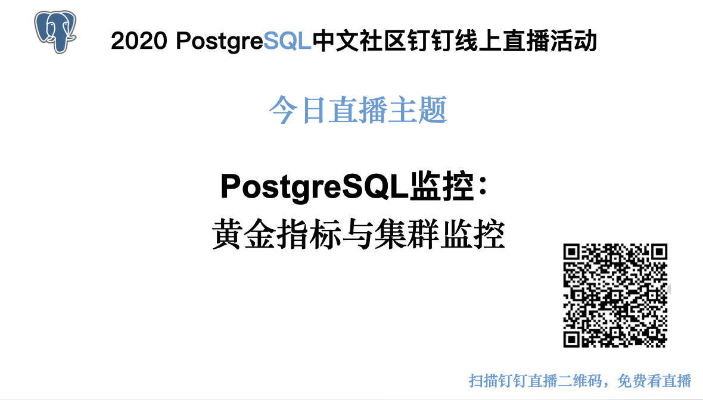

# PostgreSQL监控：黄金指标与集群监控



[TOC]

## 概述

玩数据库和玩车有一个共通之处，就是都需要经常看仪表盘。

盯着仪表盘干什么，看指标。为什么看指标，掌握当前运行状态才能有效施加控制。


车有很多指标：车速，胎压，扭矩，刹车片磨损，各种温度，等等等等，各式各样。

但人的注意力空间有限，仪表盘也就那么大，

所以，指标可以分两类：

* 你会去看的：**黄金指标 / 关键指标 / 核心指标**
* 你不会看的：黑匣子指标 / 冷指标。

黄金指标就是那几个关键性的核心数据，需要时刻保持关注（或者让自动驾驶系统/报警系统替你时刻保持关注），而冷指标通常只有故障排查时才会去看，故障排查与验尸要求尽可能还原现场，黑匣子指标多多益善。需要时没有就很让人抓狂


今天我们来说说PostgreSQL的核心指标，数据库的核心指标是什么？


## 数据库的指标

在讲数据库的核心指标之前，我们先来瞄一眼有哪些指标。

```
avg(count by (ins) ({__name__=~"pg.*"}))
avg(count by (ins) ({__name__=~"node.*"}))
```

1000多个pg的指标，2000多个机器的指标。

这些指标都是数据宝藏，挖掘与可视化可以提取出其中的价值。

但对于日常管理，只需要少数几个核心指标就可以了。

可用指标千千万，哪些才是核心指标？


## 核心指标

根据经验和使用频度，不断地做减法，可以筛选出一些核心指标：

| 指标                     | 缩写          | 层次        | 来源     | 种类   |
| ------------------------ | ------------- | ----------- | -------- | ------ |
| 错误日志条数             | Error Count   | SYS/DB/APP  | 日志系统 | 错误   |
| **连接池排队数**         | Queue Clients | DB          | 连接池   | 错误   |
| ==**数据库负载饱和度**== | PG Load       | DB          | 连接池   | 饱和度 |
| **主从复制延迟**         | Repl Lag      | DB          | 数据库   | 延迟   |
| **平均查询响应时间**     | Query RT      | DB          | 连接池   | 延迟   |
| **活跃后端进程数**       | Backends      | DB          | 数据库   | 饱和度 |
| **数据库年龄**           | Age           | DB          | 数据库   | 饱和度 |
| **每秒查询数**           | QPS           | ==**APP**== | 连接池   | 流量   |
| **CPU使用率**            | CPU Usage     | SYS         | 机器节点 | 饱和度 |

紧急情况下：错误是始终是第一优先级的黄金指标。

常规情况下：应用视角的黄金指标：QPS与RT

常规情况下：DBA视角的黄金指标：DB饱和度（水位）


## 为什么是它们？

### **错误指标**

第一优先级的指标永远是**错误**，错误往往是直接面向终端用户的。

如果只能选一个指标进行监控，那么选**错误指标**，比如应用，系统，DB层的每秒错误日志条数可能最合适。

一辆车，只能选一个仪表盘上的功能，你会选什么？

选错误指标，小车不停只管推。


错误类指标非常重要，直接反映出系统的异常，譬如连接池排队。但错误类指标最大的问题就是，它只在告警时有意义，难以用于日常的水位评估与性能分析，此外，错误类指标也往往难以精确量化，往往只能给出定性的结果：有问题 vs 没问题。

此外，错误类指标难以精确量化。我们只能说：当连接池出现排队时，数据库负载比较大；队列越长，负载越大；没有排队时，数据库负载不怎么大，仅此而已。对于日常使用管理来说，这样的能力肯定也是不够的。

**定指标，做监控报警系统的一个重要原因就是用于预防系统过载，如果系统已经过载大量报错，那么使用错误现象反过来定义饱和度是没有意义的**。

指标的目的，是为了衡量系统的运行状态。，我们还会关注系统其他方面的能力：吞吐量/流量，响应时间/延迟，饱和度/利用率/水位线。这三者分别代表系统的能力，服务质量，负载水平。

关注点不同，后端（数据库用户）关注系统能力与服务质量，DBA（数据库管理者）更关注系统的负载水平。


### **流量指标**

流量类的指标很有潜力，特别是QPS，TPS这样的指标相当具有代表性。

流量指标可以直接衡量系统的能力，譬如每秒处理多少笔订单，每秒处理的多少个请求。

 与车速计有异曲同工之妙，高速限速，城市限速。环境，负载。

但像TPS QPS这样流量也存在问题。一个数据库实例上的查询往往是五花八门各式各样的，一个耗时10微秒的查询和一个10秒的查询在统计时都被算为一个Q，**类似于QPS这样的指标无法进行横向比较，只有比较粗略的参考意义**，甚至当查询类型发生变化时，都无法和自己的历史数据进行纵向比较。此外也很难针对QPS、TPS这样的指标设置利用率目标，同一个数据库执行`SELECT 1`可以打到几十万的QPS，但执行复杂SQL时可能就只能打到几千的QPS。不同负载类型和机器硬件会对数据库的QPS上限产生显著影响，只有当一个数据库上的查询都是高度单一同质且没有复杂变化的条件下，QPS才有参考意义，在这种苛刻条件下倒是可以通过压力测试设定一个QPS的水位目标。


### **延迟指标**

与档位类似，查询慢，档位低，车速慢。查询档次低，TPS水位低。查询档次高，TPS水位高

延迟适合衡量系统的服务质量。

比起QPS/TPS，RT（响应时间 Response Time）这样的指标反而更具有参考价值。因为响应时间增加往往是系统饱和的前兆。根据经验法则，数据库的负载越大，查询与事务的平均响应时间也会越高。RT相比QPS的一个优势是**，RT是可以设置一个利用率目标的**，比如可以为RT设定一个绝对阈值：不允许生产OLTP库上出现RT超过1ms的慢查询。但QPS这样的指标就很难画出红线来。不过，RT也有自己的问题。第一个问题是它依然是定性而非定量的，延迟增加只是系统饱和的预警，但没法用来精确衡量系统的饱和度。第二个问题通常能从数据库与中间件获取到的RT统计指标都是平均值，但真正起到预警效果的有可能是诸如P99，P999这样的统计量。


### **饱和度指标**

饱和度指标类似汽车的发动机转速表，油量表，水温表。

饱和度指标适合衡量系统的负载

即用户期待的负载指标是一个**饱和度（Saturation）**指标，所谓饱和度，即服务容量有多”满“，通常是系统中目前最为受限的某种资源的某个具体指标的度量。通常来说，0%的饱和度意味着系统完全空闲，100%的饱和度意味着满载，系统在达到100%利用率前就会出现性能的严重下降，因此设定指标时还需要包括一个**利用率目标**，或者说**水位红线、黄线**，当系统瞬时负载超过红线时应当触发告警，长期负载超过黄线时应当进行扩容。


|                     |            |      |          |        |
| ------------------- | ---------- | ---- | -------- | ------ |
| **其他可选指标**    |            |      |          |        |
| 每秒事务数          | TPS        | APP  | 连接池   | 流量   |
| 磁盘IO使用率        | Disk Usage | SYS  | 机器节点 | 饱和度 |
| 内存使用率          | Mem Usage  | SYS  | 机器节点 | 饱和度 |
| 网卡带宽使用率      | Net Usage  | SYS  | 机器节点 | 饱和度 |
| TCP错误：溢出重传等 | TCP ERROR  | SYS  | 机器节点 | 错误   |

