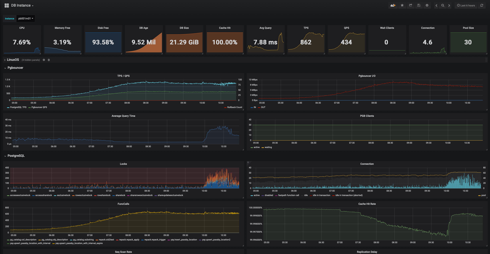
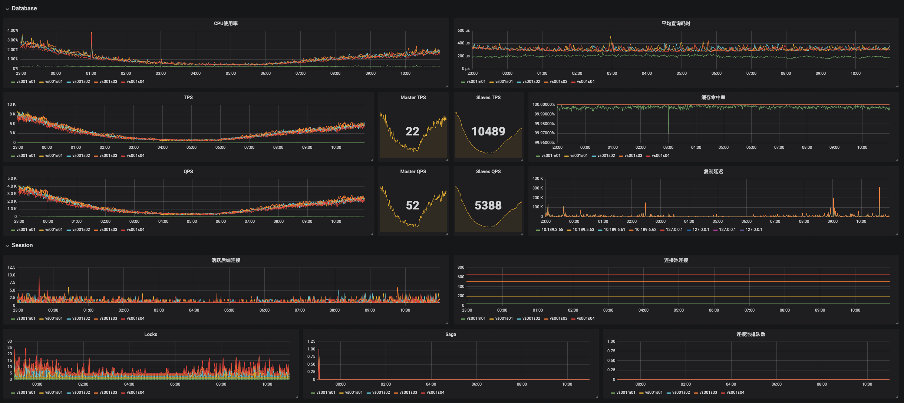

# 快速配置单机基本监控

需求组件：

* 待监控对象：PostgreSQL
* 时序数据库：[Prometheus](https://prometheus.io/docs/introduction/overview/)
* 监控展现：[Grafana](http://docs.grafana.org)
* 指标抓取：[Node Exporter](https://github.com/prometheus/node_exporter) + PostgreSQL Exporter + Pgbouncer Exporter

其中，PostgreSQL默认端口5432，Prometheus默认端口9090，Grafana默认端口3000。

对外需要暴露Prometheus与Grafana。


## Prometheus配置

Prometheus是Go编写的纯二进制文件，直接下载，放入PATH中使用即可。

下载地址：https://prometheus.io/download/

* Linux：[prometheus-2.5.0.darwin-amd64.tar.gz](https://github.com/prometheus/prometheus/releases/download/v2.5.0/prometheus-2.5.0.darwin-amd64.tar.gz)
* Mac：[prometheus-2.5.0.darwin-amd64.tar.gz](https://github.com/prometheus/prometheus/releases/download/v2.5.0/prometheus-2.5.0.darwin-amd64.tar.gz)


编译安装：

```bash
mkdir -p $GOPATH/src/github.com/prometheus
cd $GOPATH/src/github.com/prometheus
git clone https://github.com/prometheus/prometheus.git
cd prometheus
make build
```

编写配置文件：`prometheus.yml`

```yaml
global:
  scrape_interval:     15s
```

启动服务：

```bashba s
./prometheus --config.file=prometheus.yml
```

访问本机9090端口：http://localhost:9090，可以看到prometheus的后台。


## Grafana

#### 下载与安装

下载地址：https://grafana.com/grafana/download?platform=linux

```bash
# Linux Binary
wget https://s3-us-west-2.amazonaws.com/grafana-releases/release/grafana-5.3.2.linux-amd64.tar.gz 
tar -zxvf grafana-5.3.2.linux-amd64.tar.gz 

# CentOS
wget https://s3-us-west-2.amazonaws.com/grafana-releases/release/grafana-5.3.2-1.x86_64.rpm 
sudo yum localinstall grafana-5.3.2-1.x86_64.rpm 

# Mac
brew install grafana
```

#### 配置与启动

配置文档：http://docs.grafana.org/installation/configuration/ ，现在可以全部使用默认参数。

```bash
# init.d
sudo service grafana-server start

# systemctl
systemctl start grafana-server

# brew (MacOS)
brew services start grafana
```

访问本机：http://localhost:3000/login，默认用户名与密码都是 `admin`。

选择`Add DataSource`添加prometheus数据源。


## Node Exporter

Node Exporter可以用于抓取节点上的各类统计信息，是Prometheus官方维护的Exporter。

下载地址：https://prometheus.io/download/

源代码地址：https://github.com/prometheus/node_exporter

Node Exporter默认暴露端口为9100，直接以root用户不带参数启动二进制即可。

暴露指标的URL由参数`--web.listen-address,--web.telemetry-path`指定。

```bash
node_exporter --web.listen-address=":9100" --web.telemetry-path="/debug/metrics"
```

访问本机9100，获取本机的指标

```bash
curl localhost:9100/debug/metrics
```


## PostgreSQL Exporter

PostgreSQL Exporter是一个第三方编写的Exporter，允许自定义查询。

下载地址：https://github.com/wrouesnel/postgres_exporter/releases

也可以直接编译：

```bash
go get github.com/wrouesnel/postgres_exporter
cd ${GOPATH-$HOME/go}/src/github.com/wrouesnel/postgres_exporter
go run mage.go binary
```

该Exporter有一些配置项，可以通过参数，也可以通过环境变量传入。

必须的参数是PostgreSQL的URL，通过环境变量`DATA_SOURCE_URI`传入。

```bash
DATA_SOURCE_URI="postgresql://:5432/data?sslmode=disable&host=/tmp" \
    ./postgres_exporter \
    --web.listen-address=:9187 \
    --web.telemetry-path=/debug/metrics
```

PostgreSQL Exporter的默认端口为9187，使用curl获取数据库暴露的指标

```bash
curl localhost:9187/debug/metrics
```


## 配置Prometheus抓取Exporter的指标

Prometheus主要采用PULL的方式拉取数据，因此还要配置Prometheus的拉取对象。这里我们先使用最简单的手工配置方法，将9100与9187两个端口的Exporter配置为拉取目标。

Exporter本质上就是一个普通的Web服务，Prometheus干的事情，其实就是去请求这些HTTP服务。

```yaml
global:
  scrape_interval:     15s
  evaluation_interval: 15s

scrape_configs:
  - job_name: 'db'
    scrape_interval: 15s
    metrics_path: '/debug/metrics'
    static_configs:
      - targets: ['localhost:9100','localhost:9185']
```

使用`SIGHUP`通知Prometheus重载配置，从http://localhost:9090/targets可以看到拉取目标已经添加到Prometheus中了。在http://localhost:9090/graph可以使用表达式求值，查看拉取到的指标。譬如，这里键入`pg_stat_database_numbackends`，就可以查看当前各数据库活跃后端连接数；而键入`node_memory_free_bytes_total`，就可以查阅机器空闲内存的情况。这些指标分别来自`postgres_exporter`与`node_exporter`，确认所有指标已经进入prometheus后，就可以用这些指标来配置监控了。

## 配置Grafana使用Prometheus数据源

进入Grafana的默认界面（http://localhost:3000）。在Grafana的数据源管理中，添加新的Prometheus数据源。Prometheus的默认URL为：http://localhost:9090。其他参数都是可选的，Save & Test保存数据源。

然后就可以创建Dashboard，开始配置可视化的监控了，Grafana的配置。





## 抓取自定义指标

PostgresExporter默认会从以下系统视图中收集指标

* `pg_stat_bgwriter`

* `pg_stat_database`
* `pg_stat_database_conflicts`
* `pg_locks`
* `pg_stat_replication`
* `pg_stat_activity`

这六个视图能够涵盖主要的PostgreSQL活动，但对于精密监控而言还远远不够。好在PostgreExporter提供了一种扩展机制，能够允许我们通过配置文件的形式执行自定义查询。


```yaml
# Generic metrics
pg:
  query: "SELECT pg_is_in_recovery()::integer       as in_recovery,
            (CASE WHEN pg_is_in_recovery() THEN pg_last_wal_replay_lsn() ELSE pg_current_wal_lsn() END) - '0/0' as lsn,
            (CASE WHEN pg_is_in_recovery() THEN extract(EPOCH FROM now() - pg_last_xact_replay_timestamp())::FLOAT ELSE NULL END) as lag,
            extract(EPOCH FROM now() - pg_postmaster_start_time())::FLOAT as uptime;" 
  metrics:
    - is_in_recovery:
        usage: "GAUGE"
        description: "True if recovery is still in progress. 0 for master, 1 for slave"
    - lsn:
        usage: "GAUGE"
        description: "Log sequence offset, bigint"
    - lag:
        usage: "GAUGE"
        description: "Replication lag behind master in seconds (view of slave)"
    - uptime:
        usage: "GAUGE"
        description: "Uptime since postmaster start"

# Database size & age
pg_database:
  query: "SELECT pg_database.datname,
                 pg_database_size(pg_database.datname) as size,
                 age(datfrozenxid) as age,
                 datfrozenxid::text::FLOAT as datfrozenxid
            FROM pg_database" 
  metrics:
    - datname:
        usage: "LABEL"
        description: "Name of the database"
    - size:
        usage: "GAUGE"
        description: "Disk space used by the database"
    - age:
        usage: "GAUGE"
        description: "Age of that database: age(datfrozenxid)"
    - datfrozenxid:
        usage: "GAUGE"
        description: "All xid before this is frozen"

# Database stats
pg_stat_database:
  query: "SELECT datname, numbackends,
                 xact_commit, xact_rollback, xact_commit + xact_rollback as xact_total,
                 blks_read, blks_hit, blks_read + blks_hit as blks_total,
                 tup_returned, tup_fetched, tup_inserted, tup_updated, tup_deleted, tup_inserted + tup_updated + tup_deleted as tup_modified,
                 conflicts, temp_files, temp_bytes, deadlocks, blk_read_time, blk_write_time, stats_reset
          FROM pg_stat_database;" 
  metrics:
    - datname:
        usage: "LABEL"
        description: "Name of the database"
    - numbackends:
        usage: "GAUGE"
        description: "Number of backends currently connected to this database"
    - xact_commit:
        usage: "COUNTER"
        description: "Number of transactions in this database that have been committed"
    - xact_rollback:
        usage: "COUNTER"
        description: "Number of transactions in this database that have been rolled back"
    - xact_total:
        usage: "COUNTER"
        description: "Number of transactions in this database that occurs (xact_commit + xact_rollback)"
    - blks_read:
        usage: "COUNTER"
        description: "Number of disk blocks read from disk in this database"
    - blks_hit:
        usage: "COUNTER"
        description: "Number of times disk blocks were found already in PostgreSQL buffer cache"
    - blks_total:
        usage: "COUNTER"
        description: "Number of blocks been accessed (blks_read + blks_hit)"
    - tup_returned:
        usage: "COUNTER"
        description: "Number of rows returned by queries in this database"
    - tup_fetched:
        usage: "COUNTER"
        description: "Number of rows fetched by queries in this database"
    - tup_inserted:
        usage: "COUNTER"
        description: "Number of rows inserted by queries in this database"
    - tup_updated:
        usage: "COUNTER"
        description: "Number of rows updated by queries in this database"
    - tup_deleted:
        usage: "COUNTER"
        description: "Number of rows deleted by queries in this database"
    - tup_modified:
        usage: "COUNTER"
        description: "Number of rows modified(insert,update,delete) by queries in this database"
    - conflicts:
        usage: "COUNTER"
        description: "Number of queries canceled due to conflicts with recovery in this database. (slave only)"
    - temp_files:
        usage: "COUNTER"
        description: "Number of temporary files created by queries in this database"
    - temp_bytes:
        usage: "COUNTER"
        description: "Temporary file byte count"
    - deadlocks:
        usage: "COUNTER"
        description: "Number of deadlocks detected in this database"
    - blk_read_time:
        usage: "COUNTER"
        description: "Time spent reading data file blocks by backends in this database, in milliseconds"
    - blk_write_time:
        usage: "COUNTER"
        description: "Time spent writing data file blocks by backends in this database, in milliseconds"
    - stats_reset:
        usage: "COUNTER"
        description: "Time at which these statistics were last reset"

# Database conflict stats
pg_stat_database_conflicts:
  query: "SELECT datname, confl_tablespace, confl_lock, confl_snapshot, confl_bufferpin, confl_deadlock FROM pg_stat_database_conflicts;" 
  metrics:
    - datname:
        usage: "LABEL"
        description: "Name of the database"
    - confl_tablespace:
        usage: "COUNTER"
        description: "Number of queries in this database that have been canceled due to dropped tablespaces"
    - confl_lock:
        usage: "COUNTER"
        description: "Number of queries in this database that have been canceled due to lock timeouts"
    - confl_snapshot:
        usage: "COUNTER"
        description: "Number of queries in this database that have been canceled due to old snapshots"
    - confl_bufferpin:
        usage: "COUNTER"
        description: "Number of queries in this database that have been canceled due to pinned buffers"
    - confl_deadlock:
        usage: "COUNTER"
        description: "Number of queries in this database that have been canceled due to deadlocks"

# Locks
pg_locks:
  query: "SELECT pg_database.datname,tmp.mode,COALESCE(count,0) as count
			FROM
				(
				  VALUES ('accesssharelock'),
				         ('rowsharelock'),
				         ('rowexclusivelock'),
				         ('shareupdateexclusivelock'),
				         ('sharelock'),
				         ('sharerowexclusivelock'),
				         ('exclusivelock'),
				         ('accessexclusivelock')
				) AS tmp(mode) CROSS JOIN pg_database
			LEFT JOIN
			  (SELECT database, lower(mode) AS mode,count(*) AS count
			  FROM pg_locks WHERE database IS NOT NULL
			  GROUP BY database, lower(mode)
			) AS tmp2
			ON tmp.mode=tmp2.mode and pg_database.oid = tmp2.database ORDER BY 1;" 
  metrics:
    - datname:
        usage: "LABEL"
        description: "Name of the database"
    - mode:
        usage: "LABEL"
        description: "Type of lock"
    - count:
        usage: "COUNTER"
        description: "Number of locks of corresponding mode"


# Database background writer
pg_stat_bgwriter:
  query: "SELECT checkpoints_timed, checkpoints_req, checkpoint_write_time, checkpoint_sync_time,
                 buffers_checkpoint, buffers_clean, buffers_backend,
                 maxwritten_clean, buffers_backend_fsync, buffers_alloc, stats_reset
            FROM pg_stat_bgwriter;" 
  metrics:
    - checkpoints_timed:
        usage: "COUNTER"
        description: "Number of scheduled checkpoints that have been performed"
    - checkpoints_req:
        usage: "COUNTER"
        description: "Number of requested checkpoints that have been performed"
    - checkpoint_write_time:
        usage: "COUNTER"
        description: "Total amount of time that has been spent in the portion of checkpoint processing where files are written to disk, in milliseconds"
    - checkpoint_sync_time:
        usage: "COUNTER"
        description: "Total amount of time that has been spent in the portion of checkpoint processing where files are synchronized to disk, in milliseconds"
    - buffers_checkpoint:
        usage: "COUNTER"
        description: "Number of buffers written during checkpoints"
    - buffers_clean:
        usage: "COUNTER"
        description: "Number of buffers written by the background writer"
    - buffers_backend:
        usage: "COUNTER"
        description: "Number of buffers written directly by a backend"
    - maxwritten_clean:
        usage: "COUNTER"
        description: "Number of times the background writer stopped a cleaning scan because it had written too many buffers"
    - buffers_backend_fsync:
        usage: "COUNTER"
        description: "Number of times a backend had to execute its own fsync call (normally the background writer handles those even when the backend does its own write)"
    - buffers_alloc:
        usage: "COUNTER"
        description: "Number of buffers allocated"
    - stats_reset:
        usage: "COUNTER"
        description: "Time at which these statistics were last reset"

# WAL generate speed
pg_stat_wal:
  query: "SELECT last_5_min_size_bytes,
            (SELECT COALESCE(sum(size),0) FROM pg_catalog.pg_ls_waldir()) AS total_size_bytes
            FROM (SELECT COALESCE(sum(size),0) AS last_5_min_size_bytes FROM pg_catalog.pg_ls_waldir() WHERE modification > CURRENT_TIMESTAMP - '5 minutes'::interval) x;"
  metrics:
    - last_5min_size_bytes:
        usage: "GAUGE"
        description: "Current size in bytes of the last 5 minutes of WAL generation. Includes recycled WALs."
    - total_size_bytes:
        usage: "GAUGE"
        description: "Current size in bytes of the WAL directory"


# Database conflict stats
pg_stat_activity:
  query: "SELECT
                pg_database.datname,
                tmp.state,
                COALESCE(count,0) as count,
                COALESCE(max_tx_duration,0) as max_tx_duration
            FROM
                (
                    VALUES ('active'),
                            ('idle'),
                            ('idle in transaction'),
                            ('idle in transaction (aborted)'),
                            ('fastpath function call'),
                            ('disabled')
                ) AS tmp(state) CROSS JOIN pg_database
            LEFT JOIN
            (
                SELECT
                    datname,
                    state,
                    count(*) AS count,
                    MAX(extract(EPOCH FROM now() - xact_start))::float AS max_tx_duration
                FROM pg_stat_activity GROUP BY datname,state) AS tmp2
                ON tmp.state = tmp2.state AND pg_database.datname = tmp2.datname" 
  metrics:
    - datname:
        usage: "LABEL"
        description: "Number of scheduled checkpoints that have been performed"
    - state:
        usage: "LABEL"
        description: "Number of requested checkpoints that have been performed"
    - count:
        usage: "GAUGE"
        description: "Total amount of time that has been spent in the portion of checkpoint processing where files are written to disk, in milliseconds"
    - max_tx_duration:
        usage: "GAUGE"
        description: "Total amount of time that has been spent in the portion of checkpoint processing where files are synchronized to disk, in milliseconds"


# Database background writer
pg_stat_replication:
  query: "SELECT client_addr,application_name,state,
                (CASE WHEN pg_is_in_recovery() THEN pg_last_wal_replay_lsn() ELSE pg_current_wal_lsn() END) - '0/0' as lsn,
                sent_lsn - '0/0' as sent_lsn, write_lsn - '0/0' as write_lsn, flush_lsn- '0/0' as flush_lsn, replay_lsn- '0/0' as replay_lsn,
                extract(EPOCH FROM write_lag) as write_lag, extract(EPOCH FROM flush_lag) as flush_lag, extract(EPOCH FROM replay_lag) as replay_lag, 
                CASE WHEN pg_is_in_recovery() THEN NULL ELSE pg_wal_lsn_diff(pg_current_wal_lsn(), replay_lsn)::FLOAT END AS lsn_diff, sync_priority
			FROM pg_stat_replication;" 
  metrics:
    - client_addr:
        usage: "LABEL"
        description: "Number of scheduled checkpoints that have been performed"
    - application_name:
        usage: "LABEL"
        description: "Number of requested checkpoints that have been performed"
    - state:
        usage: "LABEL"
        description: "Total amount of time that has been spent in the portion of checkpoint processing where files are written to disk, in milliseconds"
    - lsn:
        usage: "COUNTER"
        description: "pg_current_wal_lsn() on master  & pg_last_wal_replay_lsn() on slave"
    - sent_lsn:
        usage: "COUNTER"
        description: "Last transaction log position sent on this connection"
    - write_lsn:
        usage: "COUNTER"
        description: "Last transaction log position written to disk by this standby server"
    - flush_lsn:
        usage: "COUNTER"
        description: "Last transaction log position flushed to disk by this standby server"
    - replay_lsn:
        usage: "COUNTER"
        description: "Last transaction log position replayed into the database on this standby server"
    - write_lag:
        usage: "COUNTER"
        description: "Latest ACK lsn diff with write (sync-remote-write lag)"
    - flush_lag:
        usage: "COUNTER"
        description: "Latest ACK lsn diff with flush (sync-remote-flush lag)"
    - replay_lag:
        usage: "COUNTER"
        description: "Latest ACK lsn diff with replay (sync-remote-apply lag)"
    - lsn_diff:
        usage: "COUNTER"
        description: "Lag in bytes between master and slave"
    - sync_priority:
        usage: "COUNTER"
        description: "Priority of this standby server for being chosen as the synchronous standby"


pg_stat_user_tables:
  query: "SELECT schemaname, relname, schemaname||'.'|| relname AS fullname,
            reltuples, relpages, pg_total_relation_size(relid) as relsize, relage,
            seq_scan, seq_tup_read, idx_scan, idx_tup_fetch, n_tup_ins, n_tup_upd, n_tup_del, (n_tup_ins + n_tup_upd + n_tup_del) as n_tup_mod,
            n_tup_hot_upd, n_live_tup, n_dead_tup, n_mod_since_analyze, last_vacuum, last_autovacuum, last_analyze, last_autoanalyze, vacuum_count, autovacuum_count,
            analyze_count, autoanalyze_count
        FROM pg_stat_user_tables psut, LATERAL (SELECT reltuples,relpages,age(relfrozenxid) as relage FROM pg_class pc WHERE pc.oid = psut.relid) p;"
  metrics:
    - schemaname:
        usage: "LABEL"
        description: "Name of this table schemaname.relname"
    - relname:
        usage: "LABEL"
        description: "Name of this table"         
    - fullname:
        usage: "LABEL"
        description: "schemaname.relname"
    - reltuples:
        usage: "COUNTER"
        description: "Number of estimate rel tuples"
    - relpages:
        usage: "COUNTER"
        description: "Number of relation main branch pages"
    - relsize:
        usage: "COUNTER"
        description: "pg_total_relation_size(relid) in bytes"
    - relage:
        usage: "COUNTER"
        description: "age(pg_class.relfrozenxid)"        
    - seq_scan:
        usage: "COUNTER"
        description: "Number of sequential scans initiated on this table"
    - seq_tup_read:
        usage: "COUNTER"
        description: "Number of live rows fetched by sequential scans"
    - idx_scan:
        usage: "COUNTER"
        description: "Number of index scans initiated on this table"
    - idx_tup_fetch:
        usage: "COUNTER"
        description: "Number of live rows fetched by index scans"
    - n_tup_ins:
        usage: "COUNTER"
        description: "Number of rows inserted"
    - n_tup_upd:
        usage: "COUNTER"
        description: "Number of rows updated"
    - n_tup_del:
        usage: "COUNTER"
        description: "Number of rows deleted"
    - n_tup_hot_upd:
        usage: "COUNTER"
        description: "Number of rows HOT updated (i.e., with no separate index update required)"
    - n_live_tup:
        usage: "GAUGE"
        description: "Estimated number of live rows"
    - n_dead_tup:
        usage: "GAUGE"
        description: "Estimated number of dead rows"
    - n_mod_since_analyze:
        usage: "GAUGE"
        description: "Estimated number of rows changed since last analyze"
    - last_vacuum:
        usage: "GAUGE"
        description: "Last time at which this table was manually vacuumed (not counting VACUUM FULL)"
    - last_autovacuum:
        usage: "GAUGE"
        description: "Last time at which this table was vacuumed by the autovacuum daemon"
    - last_analyze:
        usage: "GAUGE"
        description: "Last time at which this table was manually analyzed"
    - last_autoanalyze:
        usage: "GAUGE"
        description: "Last time at which this table was analyzed by the autovacuum daemon"
    - vacuum_count:
        usage: "COUNTER"
        description: "Number of times this table has been manually vacuumed (not counting VACUUM FULL)"
    - autovacuum_count:
        usage: "COUNTER"
        description: "Number of times this table has been vacuumed by the autovacuum daemon"
    - analyze_count:
        usage: "COUNTER"
        description: "Number of times this table has been manually analyzed"
    - autoanalyze_count:
        usage: "COUNTER"
        description: "Number of times this table has been analyzed by the autovacuum daemon"

pg_stat_user_indexes:
    query: "SELECT schemaname, indexrelname, schemaname||'.'|| indexrelname AS fullname,
                reltuples, relpages, pg_total_relation_size(relid) as relsize,
                idx_scan, idx_tup_read, idx_tup_fetch
                FROM pg_stat_user_indexes psui, LATERAL (SELECT reltuples,relpages FROM pg_class pc WHERE pc.oid = psui.relid) p
                WHERE idx_scan > 0;"
    metrics:
        - schemaname:
            usage: "LABEL"
            description: "Name of this index schemaname.indexrelname"
        - indexrelname:
            usage: "LABEL"
            description: "Name of this index"            
        - fullname:
            usage: "LABEL"
            description: "Name of this index schemaname.indexrelname"
        - reltuples:
            usage: "COUNTER"
            description: "Number of estimate rel tuples"
        - relpages:
            usage: "COUNTER"
            description: "Number of relation main branch pages"
        - relsize:
            usage: "COUNTER"
            description: "pg_total_relation_size(relid) in bytes"
        - idx_scan:
            usage: "GAUGE"
            description: "Number of index scans initiated on this index"
        - idx_tup_read:
            usage: "GAUGE"
            description: "Number of index entries returned by scans on this index"
        - idx_tup_fetch:
            usage: "GAUGE"
            description: "Number of live table rows fetched by simple index scans using this index"

# User function stats
pg_stat_user_functions:
    query: "SELECT schemaname, funcname, schemaname||'.'|| funcname || '.' || funcid AS fullname,
                calls, total_time, self_time
            FROM pg_stat_user_functions WHERE calls > 0;"
    metrics:
        - schemaname: 
            usage: "LABEL"
            description: "Name of belonged schema"
        - funcname: 
            usage: "LABEL"
            description: "Name of the function"            
        - fullname:
            usage: "LABEL"
            description: "Name of this function schemaname.funcname.funcid"
        - calls:
            usage: "GAUGE"
            description: "Number of times this function has been called"
        - total_time:
            usage: "GAUGE"
            description: "Total time spent in this function and all other functions called by it, in milliseconds"
        - self_time:
            usage: "GAUGE"
            description: "Total time spent in this function itself, not including other functions called by it, in milliseconds"

```

