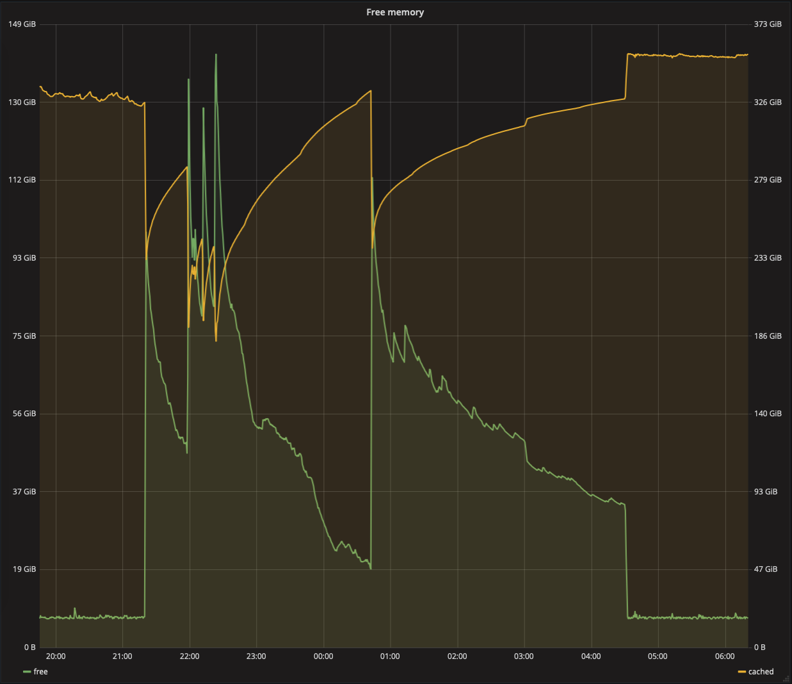

# 丢弃操作系统缓存导致的性能下降


现象：`chat-shard16`出现慢查询，三个尖峰。大约一千个超过一秒的慢查询，该查询通常情况下需要10毫秒左右。

> #### Buffer与Cache
>
> 在Linux内存中，Buffer和Cache是不一样的。所谓**缓存（Cache）**，是指高速设备与低速设备的中间层，而**缓冲区（Buffer）**是用于暂存尚未处理的数据。通常对于PostgreSQL数据库机器而言，操作系统缓存会配置的比较大。例如对于400GB内存的机器而言，可能有300GB以上的内存用于操作系统的文件缓存，而只有8GB用于Buffer。


## 原因分析


操作系统释放了100GB的文件缓存，可以看到，Cache从330~350GB下探至最多230GB处。发生了三次Cache Drop，每次都引发了约100GB的操作系统文件缓存被释放。




因为PostgreSQL存在DoubleCache，因此文件系统的缓存被释放，并不会直接影响PostgreSQL中统计的缓存命中率，该现象影响的是当Cache Miss需要从持久存储中读取页面时所需的时长。如果命中操作系统文件缓存，那么就很快，反之需要访问磁盘，则会慢。


被拖慢的查询是一个实时小型OLAP请求，大致场景是统计某一用户未读的消息数目。一些用户的未读消息特别多，比如有几万条，这样一条查询就需要访问几万条记录，访问几万个块。通常情况下，正常用户的该查询执行时间在3~4毫秒，而头部用户的执行时间在最高可达400毫秒左右。当操作系统文件缓存被DROP之后，典型的查询时间大大变慢，头部用户的平均查询时间上升至700到800ms，甚至有突破1000ms的。


最后查看`dmesg`以及`/var/log/kern`，发现是内存硬件错误：

```bash
hrtimer: interrupt took 5884740 ns
__ratelimit: 14 callbacks suppressed
{3}[Hardware Error]: Hardware error from APEI Generic Hardware Error Source: 4
{3}[Hardware Error]: It has been corrected by h/w and requires no further action
{3}[Hardware Error]: event severity: corrected
{3}[Hardware Error]:  Error 0, type: corrected
{3}[Hardware Error]:  fru_text: A1
{3}[Hardware Error]:   section_type: memory error
{3}[Hardware Error]:   error_status: 0x0000000000000400
{3}[Hardware Error]:   physical_address: 0x0000000037805200
{3}[Hardware Error]:   error_type: 2, single-bit ECC
sbridge: HANDLING MCE MEMORY ERROR
CPU 0: Machine Check Exception: 0 Bank 1: 940000000000009f
TSC 84961aa83ffcb5 ADDR 37805200 MISC 0 PROCESSOR 0:406f1 TIME 1529641374 SOCKET 0 APIC 0
EDAC MC0: CE row 0, channel 0, label "CPU_SrcID#0_Ha#0_Channel#0_DIMM": 0 Unknown error(s): memory read on FATAL area : cpu=0 Err=0000:009f (ch=15), addr = 0x37805200 => socket=0, ha=0, Channel=0(mask=1), rank=0
```

