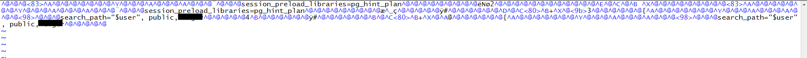

# 故障档案：PG安装Extension导致无法连接

今天遇到一个比较有趣的Case，客户报告说数据库连不上了。报这个错：

```bash
psql: FATAL:  could not load library "/export/servers/pgsql/lib/pg_hint_plan.so": /export/servers/pgsql/lib/pg_hint_plan.so: undefined symbol: RINFO_IS_PUSHED_DOWN
```

当然，这种错误一眼就知道是插件没编译好，报符号找不到。因此数据库后端进程在启动时尝试加载`pg_hint_plan`插件时就GG了，报FATAL错误直接退出。

通常来说这个问题还是比较好解决的，这种额外的扩展通常都是在`shared_preload_libraries`中指定的，只要把这个扩展名称去掉就好了。

## 结果……

客户说是通过`ALTER ROLE|DATABASE SET session_preload_libraries = pg_hint_plan`的方式来启用扩展的。

这两条命令会在使用特定用户，或连接到特定数据库时覆盖系统默认参数，去加载`pg_hint_plan`插件。

```psql
ALTER DATABASE postgres SET session_preload_libraries = pg_hint_plan;
ALTER ROLE postgres SET session_preload_libraries = pg_hint_plan;
```

如果是这样的话，也是可以解决的，通常来说只要有其他的用户或者其他的数据库可以正常登陆，就可以通过`ALTER TABLE`语句把这两行配置给去掉。

但坏事就坏在，所有的用户和数据库都配了这个参数，以至于没有任何一条连接能连到数据库了。

这种情况下，数据库就成了植物人状态，postmaster还活着，但任何新创建的后端服务器进程都会因为扩展失效自杀……。即使`dropdb`这种外部自带的二进制命令也无法工作。


## 于是……

无法建立到数据库的连接，那么常规手段就都失效了……，只能Dirty hack了。

如果我们从二进制层面把用户和数据库级别的配置项给抹掉，那么就可以连接到数据库，把扩展给清理掉了。

DB与Role级别的配置存储在系统目录`pg_db_role_setting`中，这个表有着固定的OID = 2964，存储在数据目录下`global/2964`里。关闭数据库，使用二进制编辑器打开`pg_db_role_setting`对应的文件

```bash
# vim打开后使用 :%!xxd 编辑二进制
# 编辑完成后使用 :%!xxd -r转换回二进制，再用:wq保存
vi ${PGDATA}/global/2964
```



这里，将所有的`pg_hint_plan`字符串都替换成等长的`^@`二进制零字符即可。当然如果不在乎原来的配置，更省事的做法是直接把这个文件截断成零长文件。

重启数据库，终于又能连接上了。


## 复现

这个问题复现起来也非常简单，初始化一个新数据库实例

```bash
initdb -D /pg/test -U postgres && pg_ctl -D /pg/test start
```

然后执行以下语句，就可以体会这种酸爽了。

```sql
psql postgres postgres -c 'ALTER ROLE postgres SET session_preload_libraries = pg_hint_plan;'
```


## 教训……

1. 安装扩展后，一定要先验证扩展本身可以正常工作，再**启用**扩展
2. 凡事留一线，日后好相见：一个紧急备用的纯洁的su，或者一个无污染的可连接数据库，都不至于这么麻烦。

