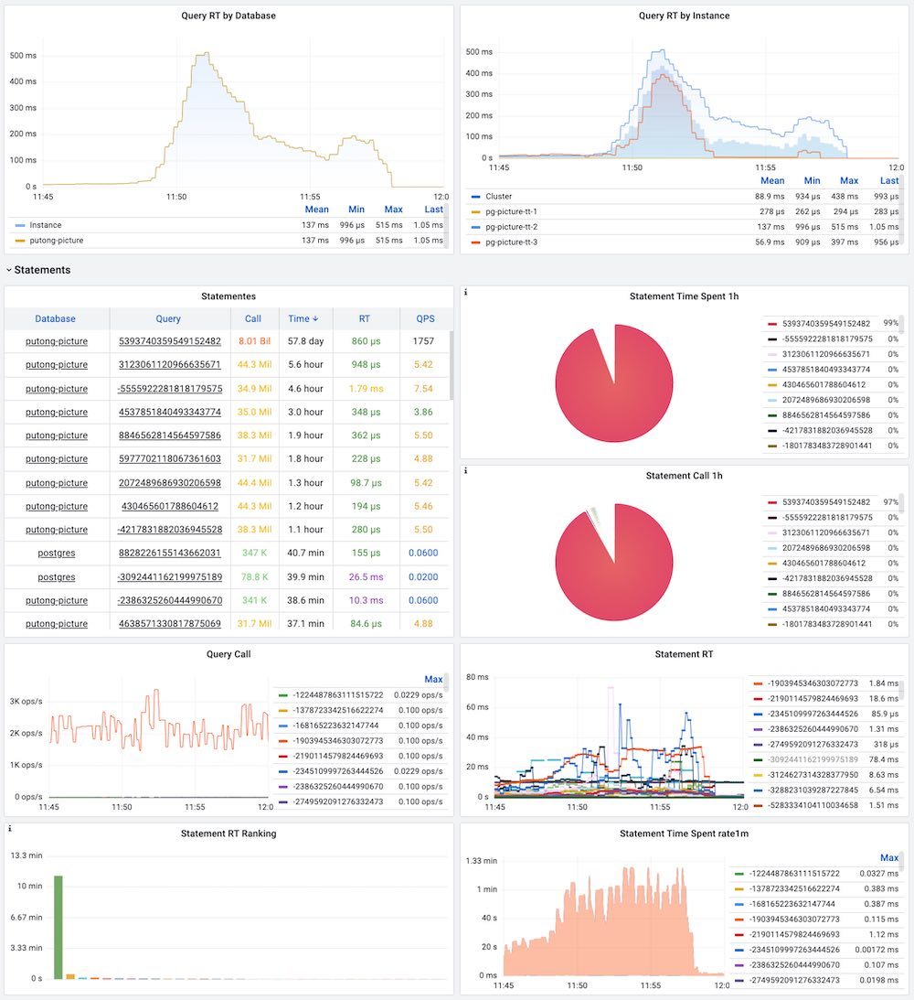

# 故障档案：参数BIGINT溢出

某日，业务有上线，触发数据库报警：CPU使用率高，负载高，连接池排队。

观察监控系统，为典型慢查询雪崩现象。



观察日志，发现大量形如：

```sql
SELECT DISTINCT x.user_id
FROM (
         SELECT up.user_id
         FROM user_pictures up
         WHERE picture_dhash = 17143204889554916181
         LIMIT 10000
     ) x
LIMIT 20 OFFSET 0;
```

的慢查询。

查询很简单，涉及到的表为`user_pictures`，为一张400GB的特大表。其中 `picture_dhash` 是一个 `BIGINT` 类型的字段，上面建有Btree索引，该查询正常可以利用该索引，在毫秒内完成。

```
 id               | bigint                      |
 ....
 picture_dhash    | bigint                      |
 
Indexes:
    "user_pictures_pkey" PRIMARY KEY, btree (id)
    "ser_pictures_new_picture_dhash_idx" btree (picture_dhash)
```

分析执行计划

```bash
                                 QUERY PLAN
 Limit  (cost=103347.47..103347.57 rows=20 width=4)
   ->  Unique  (cost=103347.47..103397.47 rows=10000 width=4)
         ->  Sort  (cost=103347.47..103372.47 rows=10000 width=4)
               Sort Key: up.user_id
               ->  Limit  (cost=0.00..102583.09 rows=10000 width=4)
                     ->  Seq Scan on user_pictures up  (cost=0.00..80011966.64 rows=7799723 width=4)
                           Filter: ((picture_dhash)::numeric = '17143204889554916181'::numeric)
```

发现执行了全表扫描，导致实际执行该查询平均耗时约为500ms，成为特慢查询，引起数据库雪崩。回滚该线上变更后问题恢复。

## 问题分析

那么问题出现在哪里呢？关键是内层查询的执行计划。选择一条正常工作的查询进行分析：

```bash
 Limit  (cost=0.58..1.71 rows=1 width=4)
   ->  Index Scan using ser_pictures_new_picture_dhash_idx on user_pictures up  (cost=0.58..64.25 rows=56 width=4)
         Index Cond: (picture_dhash = '9223372036854775807'::bigint)
```

例如，这里使用 值为 `9223372036854775807` 的条件，查询就可以正常工作。

这里的区别在于问题查询的执行计划中，执行的是 NUMERIC 与 NUMERIC的比较。虽然`picture_dhash bigint`有索引，但是`picture_dhash::NUMERIC`并没有索引，因此只能进行全表扫描。

```bash
Filter: ((picture_dhash)::numeric = '17143204889554916181'::numeric)
```

那么为什么这个查询会变为 `NUMERIC` 比较而不是正常的`BIGINT`比较呢？ 仔细一看，`17143204889554916181` 超过了`INT64MAX = 9223372036854775807`，超出了BIGINT的表示范围！所以被提升为没有上限的`NUMERIC`类型。

我们可以设计一个简单的实验来验证这一点，只要使用分别使用`2^63`与`2^63-1`作为参数，观察执行计划的变化即可。

```bash
# explain SELECT up.user_id FROM user_pictures up 
          WHERE picture_dhash = 9223372036854775808 LIMIT 1;
                                    QUERY PLAN
-----------------------------------------------------------------------------------
 Limit  (cost=0.00..10.26 rows=1 width=4)
   ->  Seq Scan on user_pictures up  (cost=0.00..80011966.64 rows=7799723 width=4)
         Filter: ((picture_dhash)::numeric = '9223372036854775808'::numeric)

explain SELECT up.user_id FROM user_pictures up 
          WHERE picture_dhash = 9223372036854775807 LIMIT 1;
                                    QUERY PLAN
-----------------------------------------------------------------------------------
 Limit  (cost=0.58..1.71 rows=1 width=4)
   ->  Index Scan using ser_pictures_new_picture_dhash_idx on user_pictures up  (cost=0.58..64.25 rows=56 width=4)
         Index Cond: (picture_dhash = '9223372036854775807'::bigint)
(3 rows)
```

可以看到，`INT64MAX = 2^63-1`内的参数可以正常工作，而超出该值的参数执行计划发生劣化。 

于是问题就很清楚了。查询时传入的 `BIGINT` 参数值超过了 `BIGINT` 的表示范围，导致参数被自动提升为 `NUMERIC`，而优化器无法针对`NUMERIC`比较使用`btree(picture_dhash)`索引，导致全表扫描，查询劣化为慢查询，最终导致实例雪崩。

## 更进一步

我们可以更深入一些：

1. 为什么业务会传入超出BIGINT范围的参数值？
2. 为什么PostgreSQL针对BIGINT溢出没有“报错”，而是“提升”？
3. 如何规避此类问题

第一个问题，猜测业务应该是在Go代码中使用了`uint64` 生成并存储数据。因为传入的问题参数范围全部落在`2^63`至 `2^64` 内。

第二个问题，SQL标准不提供无符号整型，超过`INT64MAX`的值到`BIGINT`列中，会溢出为负数。但这里，关键在于`9223372036854775808` 并不是一个合法的BIGINT值，为什么PostgreSQL针对BIGINT溢出没有“报错”，而是“提升”？

那么问题其实出在词法解析的过程中，`9223372036854775808` 是一个字面值，刚好超出`BIGINT`的表示范围，因此根据PostgreSQL的词法解析规则：

> A numeric constant that contains neither a decimal point nor an exponent is initially presumed to be type `integer` if its value fits in type `integer` (32 bits); otherwise it is presumed to be type `bigint` if its value fits in type `bigint` (64 bits); otherwise it is taken to be type `numeric`. Constants that contain decimal points and/or exponents are always initially presumed to be type `numeric`.

该Token被转换为一个`NUMERIC`字面值，参与到下一步的运算中。而 NUMERIC 与 BIGINT的列运算会导致BIGINT侧运算数被提升为`NUMERIC`。因此在Planner生成的执行计划中，会规划出将`picture_dhash`强制转换为`NUMERIC`后参与比较的神操作。


## 如何避免？

一种规避的办法是使用 String Literal Instead of Numeric Literal。例如，以下查询会直接在Analyze阶段报错：

```bash
# explain SELECT up.user_id FROM user_pictures up WHERE picture_dhash = '9223372036854775808' LIMIT 1;
ERROR:  value "9223372036854775808" is out of range for type bigint
LINE 1: ...er_id FROM user_pictures up WHERE picture_dhash = '922337203...
                                                             ^
```

这里，因为传入的参数为字符串字面值，则该值将跨过**词法解析**阶段，在后续的分析规划阶段中，根据上下文推断，将其转换为对应的类型（`BIGINT`），从而触发溢出错误。

当然，最好的解决办法，还是压根就不要在代码中使用`uint64`。尽管少了一半取值空间，但使用`int64`减少的麻烦通常要比这一点有价值的多。
