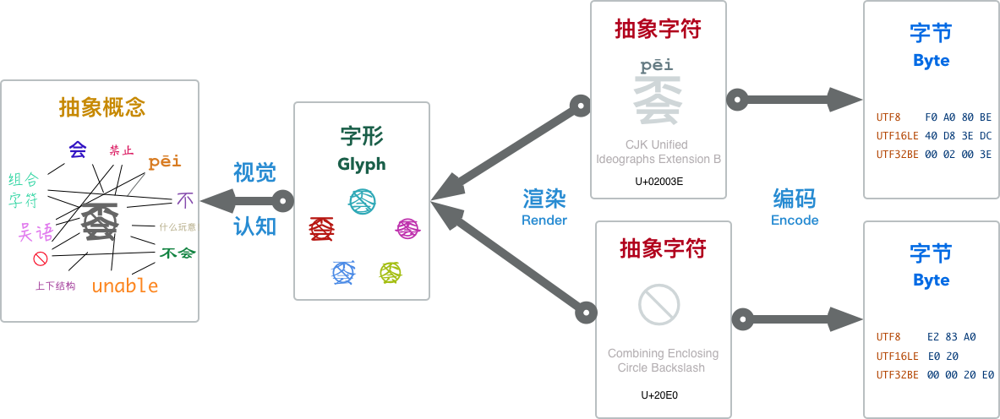
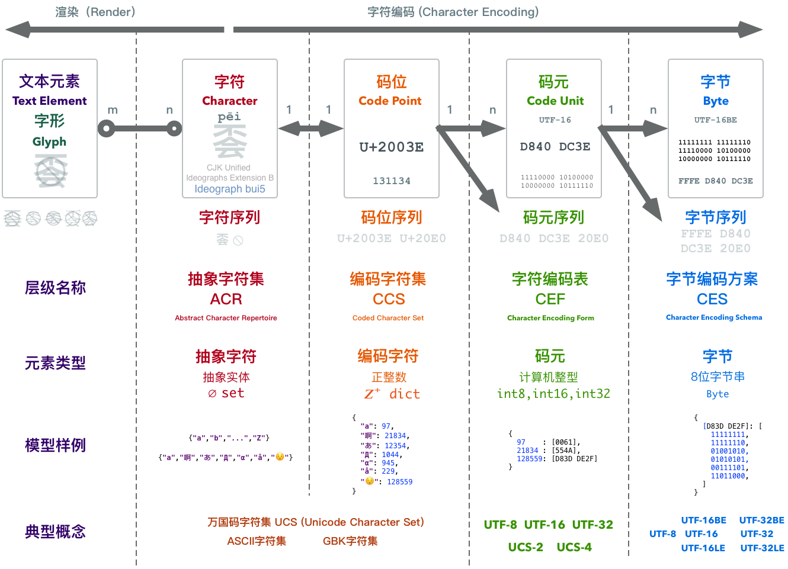
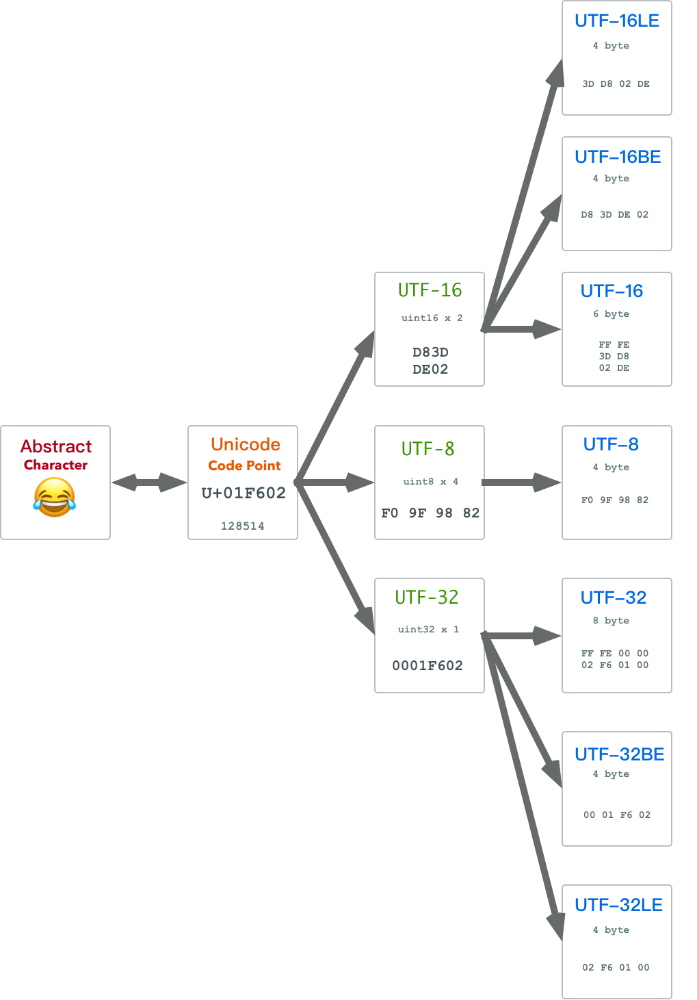

# 理解字符编码

> 2018-07-01 [微信公众号原文](https://mp.weixin.qq.com/s/Yzd64oCjjlk4brERhKBuKA)

​	程序员，是与**Code（代码/编码）**打交道的，而字符编码又是最为基础的编码。	如何**使用二进制数来表示字符**，这个**字符编码**问题并没有看上去那么简单，实际上它的复杂程度远超一般人的想象：输入、比较排序与搜索、反转、换行与分词、大小写、区域设置，控制字符，组合字符与规范化，排序规则，处理不同语言中的特异需求，变长编码，字节序与BOM，Surrogate，历史兼容性，正则表达式兼容性，微妙与严重的安全问题等等等等。

​	如果不了解字符编码的基本原理，即使只是简单常规的字符串比较、排序、随机访问操作，都可能会一不小心栽进大坑中。但根据我的观察，很多工程师与程序员却对字符编码本身几近一无所知，只是对诸如ASCII，Unicode，UTF这些名词有一些模糊的感性认识。因此尝试写这一篇科普文，希望能讲清楚这个问题。


## 0x01 基本概念

> 万物皆数  —— 毕达哥拉斯

为了解释字符编码，我们首先需要理解什么是编码，什么又是字符？

### 编码

​	从程序员的视角来看，我们有着许许多多的**基础**数据类型：整数，浮点数，字符串，指针。程序员将它们视作理所当然的东西，但从数字计算机的物理本质来看，只有一种类型才是真正的基础类型：二进制数。

​	而**编码（Code）**就是这些高级类型与底层二进制表示之间映射转换的桥梁。编码分为两个部分：**编码（encode）**与**解码（decode）**，以无处不在的自然数为例。数字42，这个纯粹抽象的数学概念，在计算机中可能就会表示为`00101010`的二进制位串（假设使用8位整型）。从抽象数字42到二进制数表示`00101010`的这个过程就是**编码**。相应的，当计算机读取到`00101010`这个二进制位串时，它会根据**上下文**将其解释为抽象的数字42，这个过程就是**解码（decode）**。

​	任何‘高级’数据类型与底层二进制表示之间都有着编码与解码的过程，比如单精度浮点数，这种看上去这么基础的类型，也存在着一套相当复杂的编码过程。例如在`float32`中，1.0和-2.0就表示为如下的二进制串：

````
0 01111111 00000000000000000000000 = 1
1 10000000 00000000000000000000000 = −2
````

​	字符串当然也不例外。字符串是如此的重要与基础，以至于几乎所有语言都将其作为内置类型而实现。字符串，它首先是一个**串（String）**，所谓串，就是由同类事物依序构成的序列。对于字符串而言，就是由**字符（Character）**构成的序列。字符串或字符的编码，实际上就是将抽象的字符序列映射为其二进制表示的规则。

​	不过，在讨论字符编码问题之前，我们先来看一看，什么是**字符**？

### 字符

​	字符是指字母、数字、标点、表意文字（如汉字）、符号、或者其他文本形式的书写“**原子**”。它是书面语中最小语义单元的抽象实体。这里说的字符都是**抽象字符（abstract character）**，其确切定义是：用于组织、控制、显示文本数据的信息单元。

​	抽象字符是一种抽象的符号，与具体的形式无关：区分**字符（character）**与**字形（Glyph）**是非常重要的，我们在屏幕上看到的有形的东西是**字形（Glyph）**，它是抽象字符的视觉表示形式。抽象**字符**通过**渲染（Render）**呈现为**字形**，用户界面呈现的**字形**通过人眼被感知，通过人脑被认知，最终又在人的大脑中还原为抽象的实体概念。字形在这个过程中起到了媒介的作用，但决不能将其等价为抽象字符本身。



​	要注意的是，虽然**多数**时候字形与字符是一一对应的，但仍然存在一些多对多的情况：一个字形可能由多个字符组合而成，例如抽象字符`à`（拼音中的第四声a），我们将其视作单个‘字符’，但它既可以真的是一个单独的字符，也可以由字符`a`与去声撇号字符`	̀`组合而成。另一方面，一个字符也可能由多个字形组成，例如很多阿拉伯语印地语中的文字，由很多图元（字形）组成的符号，复杂地像一幅画，实际上却是单个字符。

```python
>>> print u'\u00e9', u'e\u0301',u'e\u0301\u0301\u0301'
é é é́́
```

​	字形的集合构成了**字体（font）**，不过那些都属于**渲染**的内容：渲染是将字符序列映射为字形序列的过程。	那是另一个堪比字符编码的复杂主题，本文不会涉及渲染的部分，而专注于另一侧：**将抽象字符转变为二进制字节序列的过程**，即，**字符编码（Character Encoding）**。

### 思路

​	我们会想，如果有一张表，能将所有的**字符**一一映射到**字节byte(s)**，问题不就解决了吗？实际上对于英文和一些西欧文字而言，这么做是很直观的想法，ASCII就是这样做的：它通过ASCII编码表，使用一个字节中的7位，将128个字符编码为相应的二进制值，一个字符正好对应一个字节（单射而非满射，一半字节没有对应字符）。一步到位，简洁、清晰、高效。

​	计算机科学发源于欧美，因而文本处理的问题，一开始指的就是英文处理的问题。不过计算机是个好东西，世界各族人民都想用。但语言文字是一个极其复杂的问题：学一门语言文字已经相当令人头大，更别提设计一套能够处理世界各国语言文字的编码标准了。从简单的ASCII发展到当代的大一统**Unicode标准**，人们遇到了各种问题，也走过一些弯路。

​	好在计算机科学中，有句俗语：“*计算机科学领域的任何问题都可以通过增加一个间接的中间层来解决*”。字符编码的模型与架构也是随着历史而不断演进的，下面我们就先来概览一下现代编码模型中的体系结构。


## 0x02 模型概览

- 现代编码模型自底向上分为五个层次：
- **抽象字符表（Abstract Character Repertoire, ACR）**
- **编码字符集（Coded Character Set, CCS）**
- **字符编码表（Character Encoding Form, CEF）**
- **字符编码方案（Character Encoding Schema, CES）**
- **传输编码语法（Transfer Encoding Syntax, TES）**

我们所熟悉的诸多名词，都可以归类到这个模型的相应层次之中。例如，**Unicode字符集（UCS）**，ASCII字符集，GBK字符集，这些都属于编码字符集CCS；而常见的UTF8，UTF16，UTF32这些概念，都属于**字符编码表CEF**，不过也有同名的字符编码方案CES。而我们熟悉的`base64`，`URLEncode`这些就属于**传输编码语法TES**。

​	这些概念之间的关系可以用下图表示：



​	可以看到，为了将一个抽象字符转换为二进制，中间其实经过了几次概念的转换。在抽象字符序列与字节序列间还有两种中间形态：码位序列与码元序列。简单来说：

* 所有待编码的抽象字符构成的集合，称为**抽象字符集**。
* 因为我们需要指称集合中的某个具体字符，故为每一个抽象字符指定一个唯一的自然数作为标识，这个被指定的自然数，就称作字符的**码位（Code Point）**。
* 码位与字符集中的抽象字符是一一对应的。抽象字符集中的字符经过**编码**就形成了**编码字符集**。

* **码位**是正整数，但计算机的整数表示范围是有限的，因此需要调和无限的码位与有限的整型之间的矛盾。**字符编码表**将**码位**映射为**码元序列（Code Unit Sequence）**，将整数转变为计算机中的整型。
* 计算机中多字节整型存在大小端字节序的问题，**字符编码方案**指明了字节序问题的解决方案。

Unicode标准为什么不像ASCII那样一步到位，直接将抽象字符映射为二进制表示呢？实际上如果只有一种字符编码方案，譬如UTF-8，那么确实是一步到位的。可惜因为一些历史原因（比如觉得65536个字符绝对够用了…），我们有好几种编码方案。但不论如何，比起各国自己搞的百花齐放的编码方案，Unicode的编码方案已经是非常简洁了。可以说，每一层都是为了解决一些问题而不得已引入的：

* 抽象字符集到编码字符集解决了**唯一标识字符**的问题（字形无法唯一标识字符）；
* 编码字符集到字符编码表解决了**无限的自然数**到**有限的计算机整型**的映射问题（调和无限与有限）；
* 字符编码方案则解决了字节序的问题（解决传输歧义）。

下面让我们来看一下每个层次之间的细节。


## 0x03 字符集

​	字符集，顾名思义就是字符的集合。字符是什么，在第一节中已经解释过了。在现代编码模型中， 有两种层次不同的字符集：**抽象字符集 ACR**与**编码字符集 CCS**。

### 抽象字符集 ACR

​	抽象字符集顾名思义，指的是**抽象字符的集合**。已经有了很多标准的字符集定义，US-ASCII, UCS(Unicode)，GBK这些我们耳熟能详的名字，都是(或至少是)抽象字符集

​	US-ASCII定义了128个抽象字符的集合。GBK挑选了两万多个中日韩汉字和其他一些字符组成字符集，而UCS则尝试去容纳一切的抽象字符。它们都是抽象字符集。

* 抽象字符 英文字母`A`同时属于US-ASCII, UCS, GBK这三个字符集。
* 抽象字符 中文文字`蛤`不属于US-ASCII，属于GBK字符集，也属于UCS字符集。
* 抽象文字 Emoji `😂`不属于US-ASCII与GBK字符集，但属于UCS字符集。

抽象字符集可以使用类似`set`的数据结构来表示：

```python
# ACR
{"a","啊","あ","Д","α","å","😯"}
```

### 编码字符集 CCS

​	集合的一个重要特性，就是**无序性**。集合中的元素都是无序的，所以抽象字符集中的字符都是**无序的**。

​	这就带来一个问题，如何指称字符集中的某个特定字符呢？我们不能抽象字符的字形来指代其实体，原因如前面所说，看上去一样的字形，实际上可能由不同的字符组合而成（如字形`à`就有两种字符组合方式）。对于抽象字符，我们有必要给它们分配唯一对应的ID，用关系型数据库的话来说，字符数据表需要一个主键。这个**码位分配（Code Point Allocation）**的操作就称为**编码（Encode）**。它将抽象字符与一个正整数**关联**起来。

​	如果抽象字符集中的所有字符都有了对应的**码位（Code Point/Code Position）**，这个集合就升级成了映射：类似于从`set`数据结构变成了`dict`。我们称这个映射为**编码字符集 CCS**。

```python
# CCS
{
  "a": 97,
  "啊": 21834,
  "あ": 12354,
  "Д": 1044,
  "α": 945,
  "å": 229,
  "😯": 128559
}
```

​	注意这里的映射是单射，每个抽象字符都有唯一的正整数码位，但并不是所有的正整数都有对应的抽象字符。码位被分为七大类：图形，格式，控制，代理，非字符，保留。像代理（Surrogate, D800-DFFF）区中的码位，单独使用时就不对应任何字符。

​	抽象字符集与编码字符集之间的区别通常是Trivial的，毕竟指定字符的同时通常也会指定一个顺序，为每个字符分配一个数字ID。所以我们通常就将它们统称为**字符集**。字符集解决的问题是，将抽象字符单向映射为自然数。那么既然计算机已经解决了整数编码的问题，是不是直接用字符码位的整型二进制表示就可以了呢？

​	不幸的是，还有另外一个问题。字符集有开放与封闭之分，譬如ASCII字符集定义了128个抽象字符，再也不会增加。它就是一个封闭字符集。而Unicode尝试收纳所有的字符，一直在不断地扩张之中。截止至2016.06，Unicode 9.0.0已经收纳了128,237个字符，并且未来仍然会继续增长，它是一个开放的字符集。开放意味着字符的数量是没有上限的，随时可以添加新的字符，例如Emoji，几乎每年都会有新的表情字符被引入到Unicode字符集中。这就产生了一对内在的矛盾：**无限的自然数与有限的整型值之间的矛盾**。

​	而字符编码表，就是为了解决这个问题的。


## 0x04 字符编码表

​	字符集解决了抽象字符到自然数的映射问题，将自然数表示为二进制就是字符编码的另一个核心问题了。**字符编码表（CEF）**会将一个自然数，转换为**一个或多个**计算机内部的整型数值。这些整型数值称为**码元**。**码元是能用于处理或交换编码文本的最小比特组合**。

​	码元与数据的表示关系紧密，通常计算机处理字符的码元为一字节的整数倍：1字节，2字节，4字节。对应着几种基础的整型：`uint8`, `uint16`, `uint32`，单字节、双字节、四字节整型。整形的计算往往以计算机的字长作为一个基础单元，通常来讲，也就是4字节或8字节。

​	曾经，人们以为使用16位短整型来表示字符就足够了，16位短整型可以表示2的十六次方个状态，也就是65536个字符，看上去已经足够多了。但是程序员们很少从这种事情上吸取教训：光是中国的汉字可能就有十万个，一个旨在兼容全世界字符的编码不能不考虑这一点。因此如果**使用一个整型来表示一个码位**，双字节的短整型`int16`并不足以表示所有字符。另一方面，四字节的int32能表示约41亿个状态，在进入星辰大海宇宙文明的阶段之前，恐怕是不太可能有这么多的字符需要表示的。（实际上到现在也就分配了不到14万个字符）。

​	根据使用码元单位的不同，我们有了三种字符编码表：UTF8，UTF-16，UTF-32。

| 属性\编码 |      UTF8       |      UTF16       |     UTF32      |
| :-------: | :-------------: | :--------------: | :------------: |
| 使用码元  |     `uint8`     |     `uint16`     |    `uint32`    |
| 码元长度  |  1byte = 8bit   |  2byte = 16bit   | 4byte =  32bit |
| 编码长度  | 1码位 = 1~4码元 | 1码位 = 1或2码元 | 1码位 = 1码元  |
| 独门特性  |    兼容ASCII    |   针对BMP优化    |    定长编码    |

### 定长编码与变长编码

​	双字节的整数只能表示65536个状态，对于目前已有的十四万个字符显得捉襟见肘。但另一方面，四字节整数可以表示约42亿个状态。恐怕直到人类进入宇宙深空时都遇不到这么多字符。因此对于码元而言，如果采用四字节，我们可以确保编码是**定长**的：一个（表示字符的）自然数码位始终能用**一个**`uint32`表示。但如果使用`uint8`或`uint16`作为码元，超出单个码元表示范围的字符就需要使用多个码元来表示了。因此是为**变长编码**。因此，UTF-32是定长编码，而UTF-8和UTF-16是变长编码。

​	设计编码时，**容错**是最为重要的考量之一：计算机并不是绝对可靠的，诸如比特反转，数据坏块等问题是很有可能遇到的。字符编码的一个基本要求就是**自同步（self-synchronization ）**。对于变长编码而言，这个问题尤为重要。应用程序必须能够从二进制数据中解析出字符的边界，才可以正确解码字符。如果如果文本数据中出现了一些细微的错漏，导致边界解析错误，我们希望错误的影响仅仅局限于那个字符，而不是后续所有的文本边界都失去了同步，变成乱码无法解析。

​	为了保证能够从编码的二进制中自然而然的凸显出字符边界，所有的变长编码方案都应当确保编码之间不会出现**重叠（Overlap）**：譬如一个双码元的字符，其第二个码元本身不应当是另一个字符的表示，否则在出现错误时，程序无法分辨出它到底是一个单独的字符，还是某个双码元字符的一部分，就达不到自同步的要求。我们在UTF-8和UTF-16中可以看到，它们的编码表都是针对这一于要求而设计的。

​	下面让我们来看一下三种具体的编码表：UTF-32, UTF-16, UTF-8。

### UTF32

​	最为简单的编码方案，就是使用一个四字节标准整型`int32`表示一个字符，也就是采用四字节32位无符号整数作为码元，即，UTF-32。很多时候计算机内部处理字符时，确实是这么做的。例如在C语言和Go语言中，很多API都是使用`int`来接收单个字符的。

​	UTF-32最突出的特性是**定长编码**，一个码位始终编码为一个码元，因此具有随机访问与实现简单的优势：第n个字符，就是数组中的第n个码元，使用简单，实现更简单。当然这样的编码方式有个缺陷：特别浪费存储。虽然总共有十几万个字符，但即使是中文，最常用的字符通常码位也落在65535以内，可以使用两个字节来表示。而对于纯英文文本而言，只要一个字节来表示一个字符就足够了。因此使用UTF32可能导致二至四倍的存储消耗，都是真金白银啊。当然在内存与磁盘容量没有限制的时候，用UTF32可能是最为省心的做法。

### UTF16

​	UTF16是一种变长编码，使用双字节16位无符号整型作为码元。位于U+0000-U+FFFF之间的码位使用单个16位码元表示，而在U+10000-U+10FFFF之间的码位则使用两个16位的码元表示。这种由两个码元组成的码元对儿，称为**代理对（Surrogate Paris）**。

​	UTF16是针对**基本多语言平面（Basic Multilingual Plane, BMP）**优化的，也就是码位位于U+FFFF以内可以用单个16位码元表示的部分。Anyway，对于落在BMP内的高频常用字符而言，UTF-16可以视作定长编码，也就有着与UTF32一样随机访问的好处，但节省了一倍的存储空间。

​	UTF-16源于早期的Unicode标准，那时候人们认为65536个码位足以表达所有字符了。结果汉字一种文字就足够打爆它了……。**代理（Surrogate）**就是针对此打的补丁。它通过预留一部分码位作为特殊标记，将UTF-16改造成了变长编码。很多诞生于那一时期的编程语言与操作系统都受此影响（Java，Windows等）

​	对于需要权衡性能与存储的应用，UTF-16是一种选择。尤其是当所处理的字符集仅限于BMP时，完全可以假装它是一种定长编码。需要注意的是UTF-16本质上是变长的，因此当出现超出BMP的字符时，如果以定长编码的方式来计算处理，很可能会出现错误，甚至崩溃。这也是为什么很多应用无法正确处理Emoji的原因。

### UTF8

​	UTF8是一种完完全全的变长编码，它使用单字节8位无符号整数作为码元。0xFF以内的码位使用单字节编码，且与ASCII保持完全一致；U+0100-U+07FF之间的码位使用两个字节；U+0800到U+FFFF之间的码位使用三字节，超出U+FFFF的码位使用四字节，后续还可以继续扩展到最多用7个字节来表示一个字符。

​	UTF8最大的优点，一是面向字节编码，二是兼容ASCII，三是能够自我同步。众所周知，只有多字节的类型才会存在大小端字节序的问题，如果码元本身就是单个字节，就压根不存在字节序的问题了。而兼容性，或者说ASCII透明性，使得历史上海量使用ASCII编码的程序与文件无需任何变动就能继续在UTF-8编码下继续工作（ASCII范围内）。最后，自我同步机制使得UTF-8具有良好的容错性。

​	这些特性这使得UTF-8非常适合用于信息的传输与交换。互联网上大多数文本文件的编码都是UTF-8。而Go、Python3也采用了UTF-8作为其默认编码。

​	当然，UTF-8也是有代价的。对于中文而言，UTF-8通常使用三个字节进行编码。比起双字节编码而言带来了50%的额外存储开销。与此同时，变长编码无法进行随机访问字符，也使得处理相比“定长编码”更为复杂，也会有更高的计算开销。对于正确性不甚在乎，但对性能有严苛要求的中文文字处理应用可能不会喜欢UTF-8。

​	UTF-8的一个巨大优势就在于，它没有字节序的问题。而UTF-16与UTF-32就不得不操心大端字节在前还是小端字节在前的问题了。这个问题通常在**字符编码方案（Character Encoding Schema）**中通过BOM来解决。



### 字符编码方案

​	字符编码表 CEF解决了如何将**自然数码位**编码为**码元序列**的问题，无论使用哪种码元，计算机中都有相应的整型。但我们可以说编码问题就解决了吗？还不行，假设一个字符按照UTF16拆成了若干个码元组成的码元序列，因为每个码元都是一个`uint16`，实际上各由两个字节组成。因此将码元序列化为字节序列的时候，就会遇到一些问题：每个码元究竟是高位字节在前还是低位字节在前呢？这就是大小端字节序问题。

​	对于网络交换和本地处理，大小端序各有优劣，因此不同的系统往往也会采用不同的大小端序。为了标明二进制文件的大小端序，人们引入了**字节序标记（Byte Order Mark, BOM）**的概念。BOM是放置于编码字节序列开始处的一段特殊字节序列，用于表示文本序列的大小端序。

​	字符编码方案，实质上就是带有字节序列化方案的字符编码表。即：CES = 解决端序问题的CEF。对于大小端序标识方法的不同选择，产生了几种不同的字符编码方案：

- UTF-8：没有端序问题。
- UTF-16LE：小端序UTF-16，不带BOM
- UTF-16BE：大端序UTF-16，不带BOM
- UTF-16：通过BOM指定端序
- UTF-32LE：小端序UTF-32，不带BOM
- UTF-32BE：大端序UTF-32，不带BOM
- UTF-32：通过BOM指定端序

UTF-8因为已经采用字节作为码元了，所以实际上不存在字节序的问题。其他两种UTF，都有三个相应地字符编码方案：一个大端版本，一个小端版本，还有一个随机应变大小端带 BOM的版本。

​	当然要注意，在当前上下文中的UTF-8，UTF-16，UTF-32其实是CES层次的概念，即带有字节序列化方案的CEF，这会与CEF层次的同名概念产生混淆。因此，当我们在说UTF-8，UTF-16，UTF-32时，一定要注意区分它是CEF还是CES。例如，作为一种编码方案的UTF-16产生的字节序列是会带有BOM的，而作为一种编码表的UTF-16产生的码元序列则是没有BOM这个概念的。


## 0x05 UTF-8

​	介绍完了现代编码模型，让我们深入看一下一个具体的编码方案：UTF-8。	UTF-8将Unicode码位映射成1~4个字节，满足如下规则：

| **标量值**                   | 字节1      | 字节2      | 字节3      | 字节4      |
| ---------------------------- | ---------- | ---------- | ---------- | ---------- |
| `00000000 0xxxxxxx`          | `0xxxxxxx` |            |            |            |
| `00000yyy yyxxxxxx`          | `110yyyyy` | `10xxxxxx` |            |            |
| `zzzzyyyy yyxxxxxx`          | `1110zzzz` | `10yyyyyy` | `10xxxxxx` |            |
| `000uuuuu zzzzyyyy yyxxxxxx` | `11110uuu` | `10uuzzzz` | `10yyyyyy` | `10xxxxxx` |

其实比起死记硬背，UTF-8的编码规则可以通过几个约束自然而然地推断出来：

1. 与ASCII编码保持兼容，因此有第一行的规则。
2. 需要有自我同步机制，因此需要在首字节中保有当前字符的长度信息。
3. 需要容错机制，码元之间不允许发生重叠，这意味着字节2,3,4,…不能出现字节1可能出现的码元。

`0, 10, 110, 1110, 11110, …`这些是不会发生冲突的字节前缀，`0`前缀被ASCII兼容规则对应的码元用掉了。次优的`10`前缀就分配给后缀字节作为前缀，表示自己是某个字符的外挂部分。相应地，`110,1110,11110`这几个前缀就用于首字节中的长度标记，例如`110`前缀的首字节就表示当前字符还有一个额外的外挂字节，而`1110`前缀的首字节就表示还有两个额外的外挂字节。因此，UTF-8的编码规则其实非常简单。下面是使用Go语言编写的函数，展示了将一个码位编码为UTF-8字节序列的逻辑：

```go
func UTF8Encode(i uint32) (b []byte) {
	switch {
	case i <= 0xFF: 	/* 1 byte */
		b = append(b, byte(i))
	case i <= 0x7FF: 	/* 2 byte */
		b = append(b, 0xC0|byte(i>>6))
		b = append(b, 0x80|byte(i)&0x3F)
	case i <= 0xFFFF: 	/* 3 byte*/
		b = append(b, 0xE0|byte(i>>12))
		b = append(b, 0x80|byte(i>>6)&0x3F)
		b = append(b, 0x80|byte(i)&0x3F)
	default: 			/* 4 byte*/
		b = append(b, 0xF0|byte(i>>18))
		b = append(b, 0x80|byte(i>>12)&0x3F)
		b = append(b, 0x80|byte(i>>6)&0x3F)
		b = append(b, 0x80|byte(i)&0x3F)
	}
	return
}
```


## 0x06 编程语言中的字符编码

​	讲完了现代编码模型，让我们来看两个现实编程语言中的例子：Go和Python2。这两者都是非常简单实用的语言。但在字符编码的模型设计上却是两个典型：一个正例一个反例。

### Go

​	Go语言的缔造者之一，Ken Thompson，同时也是UTF-8的发明人（同时也是C语言，Go语言，Unix的缔造者），因此Go对于字符编码的实现堪称典范。Go的语法与C和Python类似，非常简单。它也是一门比较新的语言，抛开了一些历史包袱，直接使用了UTF-8作为默认编码。

​	UTF-8编码在Go语言中有着特殊的位置，无论是源代码的文本编码，还是字符串的内部编码都是UTF-8。Go绕开前辈语言们踩过的坑，使用了UTF8作为默认编码是一个非常明智的选择。相比之下，Java，Javascript都使用 UCS-2/UTF16作为内部编码，早期还有随机访问的优势，可当Unicode增长超出BMP之后，这一优势也荡然无存了。相比之下，字节序，Surrogate , 空间冗余带来的麻烦却仍让人头大无比。

​	Go语言中有三种重要的基本文本类型： `byte`, `rune`,`string`，分别是字节，字符，与字符串。其中：

* 字节`byte`实际上是`uint8`的别名，`[]byte`表示字节序列。
* 字符`rune`实质上是`int32`的别名，表示一个Unicode的**码位**。`[]rune`表示码位序列
* 字符串`string`实质上是UTF-8编码的二进制字节数组（底层是字节数组），加上一个长度字段。

而相应的编码与解码操作为：

* **编码**：使用`string(rune_array)`将**字符数组**转换为UTF-8编码的字符串。
* **解码**：使用`for i,r := range str`语法迭代字符串中的字符，实际上是依次将二进制UTF-8字节序列还原为码位序列。

更详细的内容可以参阅文档，我也写过一篇博文详细解释了Go语言中的文本类型。

### Python2

​	如果说Go可以作为字符编码处理实现的典范，那么Python2则可以当做一个最典型的反例了。Python2使用ASCII作为默认编码以及默认源文件编码，因此如果不理解字符编码的相关知识，以及Python2的一些设计，在处理非ASCII编码很容易出现一些错误。实际上只要看到Python3与Python2在字符编码处理上的差异有多大就大概有数了。Python2用的人还是不少，所以这里的坑其实很多，但其实最严重的问题是：

* Python2的默认编码方案的非常不合理。
* Python2的字符串类型与字符串字面值很容易让人混淆。

**第一个问题是**，Python2的默认编码方案的非常不合理：

-  Python2使用`'xxx'`作为**字节串字面值**，其类型为`<str>`，但`<str>`本质上是**字节串**而不是**字符串**。
- Python2使用`u'xxx'`作为**字符串字面值**的语法，其类型为`<unicode>`，`<unicode>`是真正意义上的**字符串**，每一个字符都属于UCS。

与此同时，Python2解释器的默认编码方案(CES)是US-ASCII 。作为对照，Java，C#，Javascript等语言内部的默认编码方案都是UTF-16，Go语言的内部默认编码方案使用UTF-8。默认使用US-ASCII的python2简直是骨骼清奇，当然，这也有一部分历史原因在里头。Python3就乖乖地改成UTF-8了。

**第二个问题**：python的默认'字符串类型`<str>`与其叫字符串，不如叫字节串，用下标去访问的每一个元素都是一个字节。而`<unicode>`类型才是真正意义上的字符串，用下标去访问的每一个元素都是一个字符(虽然底下可能每个字符长度不同)。字符串`<unicode>` 与 字节串`<str> `的关系为：

* 字符串`<unicode>` 通过 字符编码方案编码得到字节串`<str> `
* 字节串`<str>` 通过 字符编码方案解码得到字符串`<unicode> `

字节串就字节串，为啥要起个类型名叫`<str>`呢？另外，字面值语法用一对什么前缀都没有的引号表示str，这样的设计非常反直觉。因此让很多人掉进了坑里。当然，`<str>`与`<unicode>`这样的类型设计以及两者的关系设计本身是无可厚非的。该黑的应该是这两个类型起的**名字**和**字面值表示方法**。至于怎么改进是好的，Python3已经给出答案。在理解了字符编码模型之后，什么样的操作才是正确的操作，读者应该已经心里有数了。
