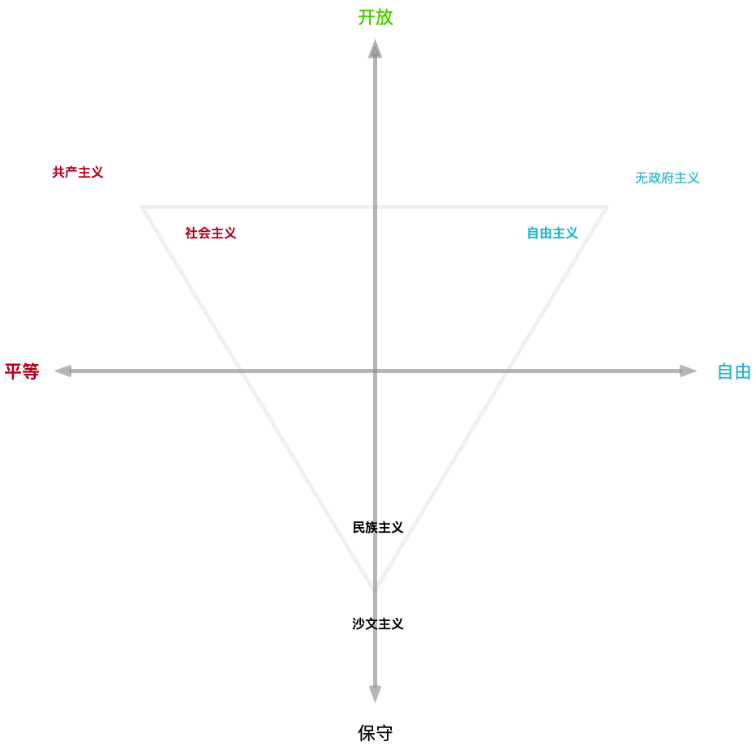

# 互联网之殇

此前我曾写过一篇文章，聊了聊对于互联网本身的认识与感想，传送门：《[认识互联网](understand-the-internet.md)》。不过在最后一节“未来的冲击”中有意识地省略了很多东西。很多人都有”波斯信使综合征“，不喜欢听坏消息。不过很快就没得说了，所以我也无所谓了。今天就来聊一聊，互联网将面临的挫折。

## 命运

> 这是一个最好的时代，也是一个最坏的时代；
>
> 这是一个智慧的年代，这是一个愚蠢的年代；
>
> 这是一个信任的时期，这是一个怀疑的时期；
>
> 这是一个光明的季节，这是一个黑暗的季节；
>
> 这是希望之春，这是失望之冬；
>
> 人们面前应有尽有，人们面前一无所有；
>
> 人们正踏上天堂之路，人们正走向地狱之门。
>
> —— 狄更斯，《双城记》

​	让我们先从宏大叙事开始。

​	互联网的长远发展是无比光明的，因为这是一种新兴的社会组织形式，具有无可比拟的巨大优势。

​	以阿里巴巴为例，为什么一家做toB交易中介平台起家的网站，能够发展成为今天这样一个囊括人们衣食住行吃喝拉撒科教文卫理财支付缴税办事无所不包的巨无霸？究其原因，就是因为互联网是一种先进的组织形式，阿里的组织能力产生了溢出。它能以更小的组织规模完成同样的任务，并且有着更高的组织规模上限。因此阿里不仅能游刃有余地控制自己的主业，更能将其触手伸到各行各业中，凭借组织优势带来的低成本与高效率，横扫传统行业中的竞争者，进而成为“新经济”的核心。

​	传统上来讲，组织成本往往与组织规模呈平方增长关系，因此组织能力限制了组织的规模。规模超出组织能力，就会存在失控的风险。因此，细胞核能控制的细胞大小是有限的，企业的规模也是有限的。传统的官僚组织通过树状结构，降低了组织成本随组织规模增长的数量级（例如，从O(n^2)到O(nlogn)），使得人类能够从原始部落迈入封建王朝与帝国时代。而互联网将再次改变组织成本的增长函数。

​	互联网公司作为这种新型组织形式的宿主，具有天生的扩张性。只要自己的组织能力有所富余，就会毫不犹豫地把手伸向别的领域，而且在没有干预的情况下通常无往不利：支付宝就是比银行转账好用，网购上门就是比商场购物方便。只要可以，它就会砸烂一切旧事物的藩篱。不过，触动利益比触动灵魂还难，很快，互联网公司就会与旧日霸主 —— 民族国家发生碰撞与冲突。

​	因此，未来的历史，就是一个新事物战胜旧事物的过程，而互联网面临的挫折，则源于旧事物对新事物的反扑倒算。不过最后的结果仍未可知，毕竟互联网公司只是互联网这种组织形式的载体，最终统治世界的并不一定是MegaCorp，传统民族国家也有可能通过打压互联网的方式先一步完成互联网化的自我改造，将民族国家的组织边界延续到下一个世代中。

## 背景

> 人类从历史学到的唯一教训，就是人类没有从历史中吸取任何教训。
>
> —— 黑格尔

ColdWar2.0已经到来。很多人认为CW是中美两个民族国家之间的冲突，我认为事情没有这么简单，这是一个斗争中有合作，合作中有斗争的剧本。要理解这个剧本，首先需要对所有的角色有有所了解。中国政府，中国**地方政府**，美国政府，资本，制造业，互联网公司，全球化精英，中国中产，美国中产，中国底层，美国底层，欧盟，第三世界国家等等，这些都是**不同的利益实体**，有着各自的诉求与行为逻辑。

**民族国家（Nation）**建立在民族认同的基础上，而认同本质上是信任问题。当信任作为一种感觉出现在有着“我群意识”的共同体成员的脑海，必定是在遇见“他者”之时。因此，最原初的族群性意识实际上就是对“他者”的不信任，民族主义时代也是建构“他者”的时代。因而维持民族认同，最有效的办法就是树立一个敌人。孟子曰：无敌国外患者国恒亡，作为民族国家，宣布一个“他者”宿敌，能够有效提高内部凝聚力与政治影响力。

​	树敌在本国人民对政府信任度下降的时候尤为必要。对美国而言，苏联曾经是这个“他者”，“恐怖主义”也曾是这个“他者”，现在终于轮到了中国。这是无可避免的，也是妥协不了的。这也意味着，改革开放40年以来的主要外部环境条件发生了变化，竞争将成为中美两国未来至少二十年的主旋律。

​	不过一个民族国家的“他者”，不一定非得是另一个民族国家。也可以是一个团体，一个阶级。互联网诞生出了一个全新的文化阶层，逐步开始掌握话语权，这些科技新贵的出现对所有民族国家政府的存在构成了威胁。不过，政府对于国内的互联网公司态度却是非常矛盾的。如果放任自己国内的新兴阶层与互联网企业做大，那么自己的执政基础与组织动员能力就会被逐渐侵蚀。但打压也有很多问题：科技公司是新经济与创新的源动力，打压国内的互联网公司等于打压自己的经济科技文化竞争力，使得自己在与其他民族国家竞争时落于下风。如果另一国的互联网公司做大占据主动权，抢占了科技制高点，又会对自己形成碾压态势，因此这里的博弈从两雄争霸，变成了三国演义。

​	总结一下：压制各自国内的互联网公司很可能成为双方的共识。双方政府在冷战中都会对国内获得更大的权力，并收编，清除，压制这些影响统治的不稳定因素，避免在即将到来的经济危机中让新兴阶层摘了桃子。

## 影响

> 草蛇灰线，夏虫语冰

那么在CW的大背景下，互联网会有怎样的命运呢？当然，中美各有国情在此。单就国内而言情况不容乐观。

对于互联网公司而言，首当其冲的就是估值泡沫的崩溃。过去十年中，互联网承载了太多的希望与幻想。投资人对其趋之若鹜，以至于什么大数据ARVRAI区块链阿猫阿狗写个PPT就能骗钱。同时在宽松的大背景下，互联网公司也成为了超发货币的蓄水池，和房子一样，变成了一种储值工具。

​	IT和金融作为唯二两个**平均**年薪超十万的行业，是新时代的造富机器。这几年来站在风口上，不少程序员都飘了起来。某种意义上来讲，IT是一个幸福的行业，程序员可以两眼不闻窗外事，一心只加通宵班，很多人还保留着学生时代的善良与单纯。但这个社会却是现实而残酷的。程序员被资本吹起的泡沫包裹着，忙着当奋斗者，闷声发大财，因此既没有时间，也没有兴趣去了解这个社会背后的运行逻辑。当历史的车轮发生转向时，那些没系安全带的人，很容易被甩出去。

​	很多程序员觉得自己高薪理所应当，殊不知这基本上与个人能力无关，只是时代赋予的红利。均值回归是具有必然性的，时代所给予的，也终将会被时代所收回。当泡沫破裂时，降薪裁员失业也会向这些人招手。没有人能幸免，总盘子小了，总有人愿意底薪加班来抢位置，即使技术再高超位置再高也难免受到影响。同时，受互联网高薪诱惑而改专业改行的新人已经开始大面积涌入，此消彼长，雪上加霜。

​	此外，很多程序员对自己的未来有着不切实际的乐观预期，总以为高薪会持续，加薪不会停，裁员远的很。因此即使在房价以及如此畸高的今天，依然毅然决然地加大杠杆买房，背上了二三十年的负债。鹤仙人曰：“做生意是要有本钱的，借钱是要还的，投资是要承担风险的，做坏事是要付出代价的”。恐怕用不了两年这些人就要后悔了，由俭入奢易，由奢入俭难，在吃饭面前，房子算什么刚需呢？

## 原因

> 加强互联网内容建设，建立网络**综合治理**体系，营造**清朗**的网络空间。落实**意识形态工作责任制**，加强**阵地建设**和管理，注意区分政治原则问题、思想认识问题、学术观点问题，旗帜鲜明反对和抵制各种错误观点。
>
> —— 《十九大报告》

那么为什么互联网💊呢？最主要的理由有四条：

1. CW引发意识形态分歧回归，文化阵地管制加强。
2. 互联网具有社会动员能力与舆论影响力，不可控。
3. CW引发技术制裁，芯片禁运，物质基础不复存在。
4. CW引发经济危机，互联网科技提升效率与政府维稳的KPI相悖。

第一点，意识形态其实就是现代的宗教，一种更先进，更广泛的精神组织形式。目前的主流意识形态其实只有三种：自由主义，社会主义，以及民族主义。这三者可以从保守-开放，平等-自由两个维度进行区分，如下图所示。

​	改革开放以来，我们秉持的原则叫做“不争论”，反正只要往开放这个维度走，左倾右倾倾都不争论。意识形态的冲突，可以与宗教冲突相类比。互联网公司所处的意识形态，必然是在开放-自由的第一象限，而民族国家政府通常需要站民族主义。在CW背景下，我朝不出意外会走第三象限，可以说与互联网的立场是针锋相对了。

​	因此在守住文化阵地的大背景下，互联网首当其冲的将会是与文化相关的部分：社交网络，自媒体，直播，文娱影视，游戏。这些都会被视作“自由主义大毒草”予以根除，或者保留形式，改换内容。而使用的理由不外乎：影响未成年人身心健康，娱乐至死歪风邪气，造谣传谣，寻性滋事。

​	第二点是互联网的社会动员能力，动员能力是民族国家的核心权能之一。然而，互联网在某些方面已经展现出了强大的社会动员能力与组织能力。互联网时代，人们根据兴趣形成了各式各样的小圈子，而各种圈子里的意见领袖往往也有着不容小觑的号召力与影响力。譬如现在有一些流量明星，几千万的粉丝自发的形成了分工严密，组织有序的粉丝团，刷榜，撕黑屏，管控爱豆负面舆论，这些明星有着很大的影响力能量。另一方面，诸如抖音，今日头条这样日活过亿的应用，能够通过控制用户每日阅读的内容，潜移默化地进行洗脑与意识形态渗透。最后，互联网具有很强的舆论监督能力，各类负面新闻曝出来后相关责任人往往会在舆论压力下被问责处理，舆论监督效果显著，这也让一些领导干部感到焦头烂额。

​	对于这一类具有社会动员能力与舆论属性的互联网企业，一部分会被收编国有，进行社会主义改造，比如头条这种极具洗脑价值的好工具，其他的都会被消失。操作方式也很简单，找点人上去发点反动的东西，直接依法办掉即可。更为通用的做法就是从数据安全与用户隐私角度入手，因为没有哪个互联网公司的屁股是干净的，严格立法选择执法，一查一个准。

​	第三条是CW导致的技术封锁与产品禁运。互联网有两条腿，一条是硬件主要也就是芯片，基本都靠进口；另一条腿是软件，基本都靠开源，Github和StackOverflow目测提供了国内互联网公司90%以上的技术生产力。一旦发生禁运封锁与断网，那基本上就得陷入瘫痪了，中兴便是一例。华为也悬，譬如其手机确实不错，芯片说是自研，但产业全球化的今天，谁能真的全部自己搞了呢，都自己搞的话，还能有现在的竞争力吗？

**自力更生**的道路可能也走不通。中国人勤劳勇敢逆来顺受适应力强有纪律性，很好，很适合搞工程与应用技术，所以我朝工业天下第一，基建天下无敌。但另一个角度来讲，对需要独立思考，自由探索的科研工作，就没那么擅长了。以很多人津津乐道的独立自主勒紧裤腰带搞的两弹一星为例，当年的两弹元勋，那可都是从美帝留学回来的。最近几十年技术看上去有了很大进步，其实也就是老美说的市场换技术，技不如人要承认，知耻后勇努力学习，真要闭门造车，那就是自绝于世界。最后，这些东西还是挺消耗外汇储备的，这可是用来买石油买粮食的命根子。

​	最后一条与互联网的科技属性相关，互联网科技公司的核心价值在于提高效率，解放生产力。不过在中国，最不缺的就是生产力。对于政府而言，GDP是一个很重要的KPI，但实际上**稳定**才是最重要的KPI：“稳定压倒一切”。什么都要带个稳：”稳中有进，稳中向好，稳中有变，稳中求进“，上访事件是要直接在绩效总分上扣分的。而稳定与失业率紧密挂钩。外卖消灭小餐馆，支付宝消灭收银员，网购消灭零售店和超市，约炮软件取代媒婆，OA系统消灭各类白领职员，AI还想着要消灭艺术家和程序员。通常来说，互联网消灭的就业岗位要比提供的多的多，这也是其先进性所在。但互联网将多数的低端岗位转化为了少数高端岗位，其实拉大了整个社会的贫富差距。提高效率解放生产力虽然是好事，但这并不是帕累托改进，对于那些工作岗位被夺走的人而言却并不是一件好事。失业，贫富差距，不公，这些都是社会动荡的根源。说一段不算远的历史：98年大下岗，东北出现了一种“刨锛”党，晚上出来拿着榔头挑人后脑勺砸，蔓延到了全国，一时人心惶惶，有兴趣可以了解一下。

​	我们的基本矛盾已经从“人们日益增长的物质文化需要同落后的社会生产之间的矛盾”，变成了“人民日益增长的美好生活需要和不平衡不充分的发展之间的矛盾”。在即将到来的失业大潮中，让发明者一人吃好，和让十个人吃饱，老大哥会怎么选，那是不言而喻的。中国人还是很善良的，只要有口饭吃就不会铤而走险。因此话说回来，这些提高效率，‘创造价值“的互联网公司，科技新贵，命运又会怎么样呢？一旦发生经济危机产生大失业，”保就业“就会排上最高优先级。指导思想就是：能用Excel的，咱就不用数据库，能用手工账本记账的，咱就不用Excel，以创造尽可能多的就业岗位为目标。高科技，尤其是提高效率，解放生产力的高科技，可能只有政府内部，以及公安军队政法委等强力部门会保留。其他的，自生自灭就好了。毕竟大萧条的时候，只要有口饭吃人就愿意干，人力成本会被压低到一个不可思议的地步，高科技都没市场了。

​	因此，综上所述，国内互联网企业的命运不外乎两种，抱上大腿被收编国有化，或公私合营由党委控制，譬如国营滴滴，国营支付宝，国营天猫，国营头条联播等等……；要么就是各种花式死法，理由可以是保护未成年人身心健康，不符合社会主义道德与价值观，审核把关不严，娱乐至死影响社会风气，逃税补税，泄露用户隐私，滥用数据，信息安全不到位等等。

## 结语

> 面朝大海，春暖花开
>
> —— 海子

真是令人绝望啊，但人还是要活着的，不是吗？

作为一个渺小的个体，我们无力改变时代的潮流，但可以去主动认识了解时代大势，顺势而为。**不要失业**，不要负债，现金为王，克制欲望，谨言慎行，强身健体，多看新闻联播，多看当代史，保持平常心。

我何其幸哉，赶上了这一波时代的浪潮；又何其不幸，即将见证一个时代的落幕。作为一名软件工程师，我对整个行业过去的成就与未来的愿景感到激动与骄傲，也对眼前的挫折与不远的寒冬感到焦虑与颤栗。不过还是要乐观一点，也许十年，也许二十年，也许三十年，我们终有一天会在春暖花开的日子里面朝大海，江湖再见。

贾雨村言，博君一笑，切勿当真，不负责任。