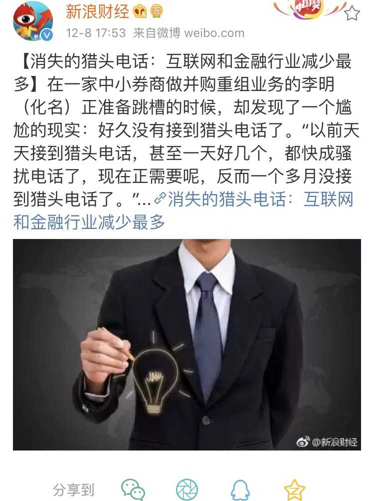
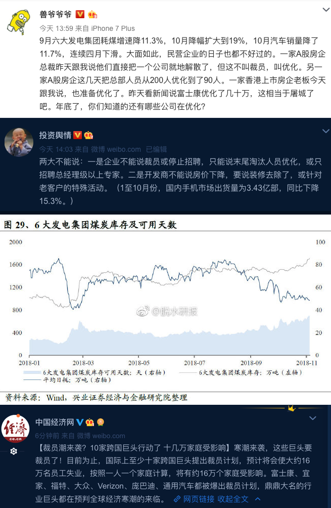
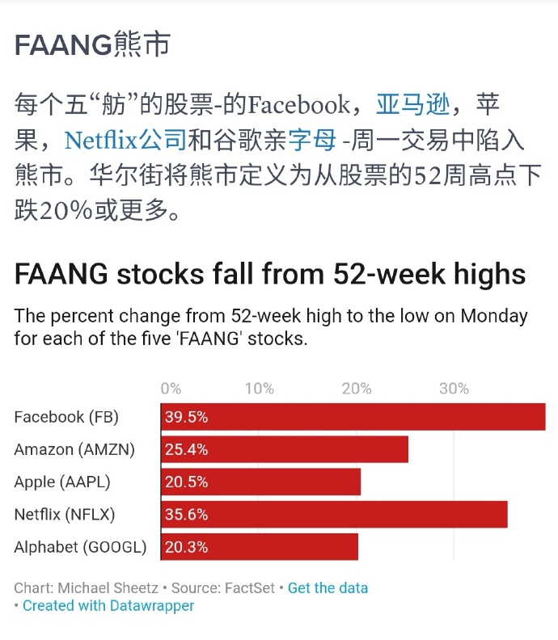

# 互联网之冬

> 这是最好的时代，也是最坏的时代；
>
> 这是智慧的年代，这是愚蠢的年代；
>
> 这是信任的时期，这是怀疑的时期；
>
> 这是光明的季节，这是黑暗的季节；
>
> 这是希望之春，这是失望之冬；
>
> 人们面前应有尽有，人们面前一无所有；
>
> 人们正踏上天堂之路，人们正走向地狱之门。
>
> —— 狄更斯，《双城记》

## 互联网之冬

​	让我们先从宏大叙事开始。

​	互联网的长远发展是无比光明的，因为这是一种新兴的社会组织形式，具有无可比拟的巨大优势。

​	以阿里巴巴为例，为什么一家做toB交易中介平台起家的网站，能够发展成为今天这样一个囊括人们衣食住行吃喝拉撒科教文卫理财支付缴税办事无所不包的巨无霸？究其原因，就是因为互联网是一种先进的组织形式，阿里的组织能力产生了溢出。它能以更小的组织规模完成同样的任务，并且有着更高的组织规模上限。因而阿里不仅能游刃有余地控制自己的主业，更能将其触手伸展到各行各业中，凭借组织优势带来的低成本与高效率，横扫传统行业中的竞争者，进而成为“新经济”的核心。

​	传统上来讲，组织成本往往与组织规模呈平方增长关系，因此组织能力限制了组织的规模。规模超出组织能力，就会存在失控的风险。因此，细胞核能控制的细胞大小是有限的，企业的规模也是有限的。传统的官僚组织通过树状结构，降低了组织成本随组织规模增长的数量级（例如，从O(n^2)到O(nlogn)），使得人类能够从原始部落迈入封建王朝与帝国时代。而互联网将再次改变组织成本的增长函数。

​	互联网公司作为这种新型组织形式的宿主，具有天生的扩张性。只要自己的组织能力有所富余，就会毫不犹豫地把手伸向别的领域，而且在没有干预的情况下通常无往不利：支付宝就是比银行转账好用，网购上门就是比商场购物方便。只要可以，它就会砸烂一切旧事物的藩篱。不过，触动利益比触动灵魂还难，很快，互联网公司就会与旧日霸主 —— 民族国家发生碰撞与冲突。

​	因此，未来的历史，就是一个新事物战胜旧事物的过程，而互联网面临的挫折，则源于旧事物对新事物的反扑倒算。不过最后的结果仍未可知，毕竟互联网公司只是互联网这种组织形式的载体，最终统治世界的并不一定是MegaCorp，传统民族国家也有可能通过打压互联网的方式先一步完成互联网化的自我改造，将民族国家的组织边界延续到下一个世代中。

## 背景

> 人类从历史学到的唯一教训，就是人类没有从历史中吸取任何教训。
>
> —— 黑格尔

ColdWar2.0已经到来。很多人认为CW是中美两个民族国家之间的冲突，我认为事情没有这么简单，这是一个斗争中有合作，合作中有斗争的剧本。要理解这个剧本，首先需要对所有的角色有有所了解。中国政府，中国**地方政府**，美国政府，资本，制造业，互联网公司，全球化精英，中国中产，美国中产，中国底层，美国底层，欧盟，第三世界国家等等，这些都是**不同的利益实体**，有着各自的诉求与行为逻辑。

**民族国家（Nation）**建立在民族认同的基础上，而认同本质上是信任问题。当信任作为一种感觉出现在有着“我群意识”的共同体成员的脑海，必定是在遇见“他者”之时。因此，最原初的族群性意识实际上就是对“他者”的不信任，民族主义时代也是建构“他者”的时代。因而维持民族认同，最有效的办法就是树立一个敌人。孟子曰：无敌国外患者国恒亡，作为民族国家，宣布一个“他者”宿敌，能够有效提高内部凝聚力与政治影响力。

​	树敌在本国人民对政府信任度下降的时候尤为必要。对美国而言，苏联曾经是这个“他者”，“恐怖主义”也曾是这个“他者”，现在终于轮到了中国。这是无可避免的，也是妥协不了的。这也意味着，改革开放40年以来的主要外部环境条件发生了变化，竞争将成为中美两国未来至少二十年的主旋律。也许经贸上的交流还能维持，但技术制裁与封锁是逃不掉的。

​	不过，互联网的出现为新时代的冷战引入的新的变量。一个民族国家的“他者”，不一定非得是另一个民族国家。也可以是一个团体，一个阶级。互联网诞生出了一个全新的文化阶层，逐步开始掌握话语权，这些科技新贵的出现对所有民族国家政府的存在构成了威胁。不过，政府对于国内的互联网公司态度却是非常矛盾的（例如，美国政府与Google，Apple的关系）。如果放任自己国内的新兴阶层与互联网企业做大，那么自己的执政基础与组织动员能力就会被逐渐侵蚀。但打压也有很多问题：科技公司是新经济与创新的源动力，打压国内的互联网公司等于打压自己的经济科技文化竞争力，使得自己在与其他民族国家竞争时落于下风。如果另一国的互联网公司做大占据主动权，抢占了科技制高点，又会对自己形成碾压态势，因此这里的博弈从两雄争霸，变成了三国演义。

​	因此，压制各自国内的互联网公司很可能成为两国政府的共识。冷战在某种意义上对双方的**政府**不一定是坏事，两者都能通过冷战获得更大的权力。藉此收编，清除，压制国内不稳定因素，避免在即将到来的经济危机中让新兴阶层摘了桃子。当然这对于其他利益实体而言，并不是一件好事。

## 影响

> 草蛇灰线，夏虫语冰

​	那么在CW的大背景下，互联网公司又会有怎样的命运呢？当然，中美各有国情在此。单就国内而言，未来恐怕不容乐观。

​	对于互联网公司而言，首当其冲的就是估值泡沫的崩溃。过去十年中，互联网承载了太多的希望与幻想。资本在即将到来的经史诗级济危机面前开始恐慌，热切的期望能够在危机爆发前能砸出来新一轮科技革命来续命。投资人对互联网公司、科技公司趋之若鹜，以至于各式各样的BuzzWord层出不穷：大数据、云计算、AR、VR、AI、区块链、量子计算，阿猫阿狗写个PPT就能骗钱。量子计算方兴未艾，AI垂死挣扎，区块链尸骨未寒，VR已不见踪影。只有移动互联网（2C）和云计算（2B）算是真金白银的落地生根了起来，其他绝大多数都成为了浮云泡影，各类创业以烧钱骗钱骗补贴，真正活下来的百不存一。但在宽松的大背景下，互联网公司成了超发货币的蓄水池，和房子一样，变成了一种储值工具，股价如同坐火箭一般窜到了天上，恰如08，13，16年的房子一般，让人疯狂。因此再怎么不靠谱的项目，也阻挡不了投资人的热情，毕竟“梦想还是要有的，万一成功了呢？” 

​	作为结果，IT成为了继金融之后，成为了第二个**行业平均**年薪超十万的行业，变成了新时代的造富机器。风口浪尖上的这几年，让很多程序员的心都飘了起来。从某种意义上来说，IT是一个幸福的行业，程序员可以两眼不闻窗外事，一心只加通宵班，很多人还保留着学生时代的善良与单纯。但这个社会却是现实而残酷的。程序员被资本吹起的泡沫包裹着，生活在幸福的梦幻天堂中，忙着当奋斗者，闷声发大财，因此既没有时间，也没有兴趣去了解这个社会的现状，规则，逻辑与未来。在行业上升期，这不是一个问题，但当历史的车轮发生转向时，那些没系安全带的人，就很容易被甩飞出去。

​	很多程序员觉得自己的高薪理所应当，殊不知这**基本上**与个人能力无关，只是时代赋予的红利。均值回归是具有必然性的，时代所给予的，也终将会被时代所收回。相当一部分工程师对自己的未来有着不切实际的乐观预期，总以为高薪会持续，加薪不会停，裁员远的很。当泡沫破裂时，降薪裁员失业也当然会降临到这些人的头上。而且，由俭入奢易，由奢入俭难。贫穷并不可怕，可怕的是心理预期的跳崖式下滑。

 另一方面，这样的灾难并不是可以单纯通过努力修炼，提高技术水平避免的。当总就业岗位收缩时，总会有人愿意以底薪加班来抢位置，能吃饱就行，这会将行业整体的人力成本压缩到一个不可思议的地步。位置再高，技术再强，也难免受到影响。在需求缩减的同时，供给却在飞速增长。受互联网高薪诱惑而改专业改行的新人已经开始大面积涌入，此消彼长，雪上加霜。

​	中国互联网人的平均年龄约28岁，当今互联网的中坚力量基本上都是80后与90后，这些人有一个特点，即诞生于改革开放之后，成长在冷战结束后以和平与发展作为主旋律的世界里，接受着去政治化的教育。与前人比，80后90后往往过着物资充裕的幸福和平生活，但这也易使他们其将这些视作理所当然，成为所谓的“三季人”，只能使用过去一段时间的经验去回归预测未来，却无法从先前的历史中汲取任何教训，忽略历史在宏观尺度上的螺旋与轮回。

​	例如在房价以及如此畸高的今天，普通行业中也基本上只有IT与金融才有条件成规模地去加大杠杆买房了。六个钱包攒够首付，并背上二三十年的负债，以满足所谓的“刚需”。我不懂的是这些人为什么对未来这么有信心呢？鹤仙人曰：“做生意是要有本钱的，借钱是要还的，投资是要承担风险的，做坏事是要付出代价的”。在吃饭与生存面前，房子又算什么刚需呢？

​	人生就是一场康波，一场堪比大萧条的经济危机近在咫尺，历史又一次到了转折的时刻：一切资产将重新估值，而暴力更是会否定一切交易的结果。我们每个人都不过是利维坦身里的一个细胞而已，在巨兽相互搏杀吞噬时无比脆弱。既可能因为外部的冲击而化为齑粉，也可能在疗伤过程中凋亡成养分。 贵为十几万华为程序员的财神爷，在这样的顶层博弈冲击中也不过是一枚棋子或筹码罢了，更罔论置身其中的普通人耶？制裁，技术封锁，禁运，很多人都不知道这些意味着什么，一些人在迷之自信中高喊着厉害了我的国，却对70年代的中国，朝鲜，俄罗斯，伊朗，委内瑞拉，土耳其的命运视而不见。很多人喜欢嘲讽朝鲜，却不知道在东欧剧变前，朝鲜又是怎样的一个地方：

​	再多说就要玩火了，回到互联网上来。互联网从长期来看，前景一定是无比光明的。但在现阶段而言，可能会面临很大的挫折。冬天还远未到来，现在，不过是重阳而已，秋意渐凉，但我们已经能从空气中嗅到一丝不安的痕迹：

**图：部分公司裁员消息**

**图：知乎裁员**

**图：HR谈招聘**

**图：消失的猎头**

**图：工业用电量**

**图：FAANG进入熊市**

**图：游戏行业进入全行业屠版期**

## 结语

> 面朝大海，春暖花开
>
> —— 海子

会有点绝望吧？但人还是要活着的，不是吗？

凡事预则立，不预则废。作为一个渺小的个体，我们无力改变时代的潮流，但可以去主动认识了解时代大势，顺势而为。**不要失业**，不要负债，现金为王，克制欲望，谨言慎行，强身健体，多看新闻联播，多看当代史，保持平常心。

我何其幸哉，赶上了这一波时代的浪潮；又何其不幸，即将见证一个时代的落幕。作为一名软件工程师，我对整个行业过去的成就与未来的愿景感到激动与骄傲，也对眼前的挫折与不远的寒冬感到焦虑与颤栗。不过还是要乐观一点，也许十年，也许二十年，也许三十年，我们终有一天会在春暖花开的日子里面朝大海，江湖再见。

假语村言，博君一笑，切勿当真，不负责任。