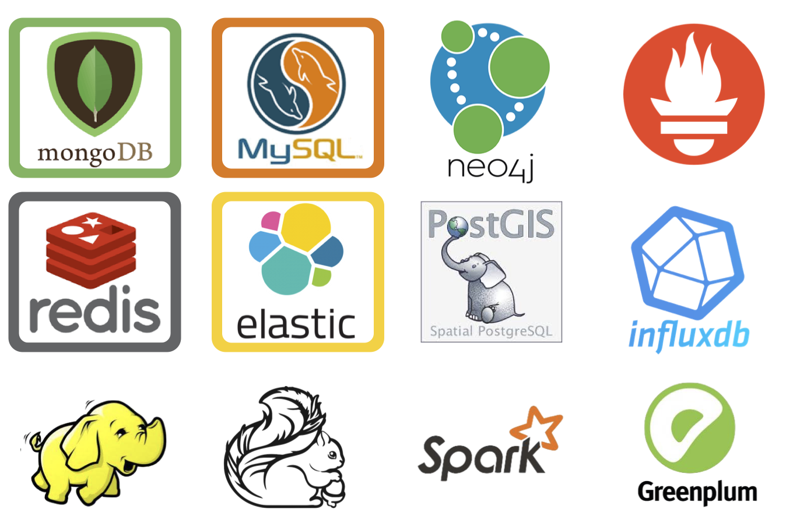

# PG好处都有啥

> 2018-06-10 [微信公众号原文](https://mp.weixin.qq.com/s/W_FbtZXqaa-rlZyDc4xB-A)

PostgreSQL的Slogan是“**世界上最先进的开源关系型数据库**”，但我觉得这口号不够响亮，而且一看就是在怼MySQL那个“**世界上最流行的开源关系型数据库**”的口号，有碰瓷之嫌。要我说最能生动体现PG特色的口号应该是：**一专多长的全栈数据库**，一招鲜吃遍天嘛。

## 全栈数据库

成熟的应用可能会用到许许多多的数据组件（功能）：缓存，OLTP，OLAP/批处理/数据仓库，流处理/消息队列，搜索索引，NoSQL/文档数据库，地理数据库，空间数据库，时序数据库，图数据库。传统的架构选型呢，可能会组合使用多种组件，典型的如：Redis + MySQL + Greenplum/Hadoop + Kafuka/Flink + ElasticSearch，一套组合拳基本能应付大多数需求了。不过比较令人头大的就是异构系统集成了：大量的代码都是重复繁琐的胶水代码，干着把数据从A组件搬运到B组件的事情。

在这里，MySQL就只能扮演OLTP关系型数据库的角色，但如果是PostgreSQL，就可以身兼多职，One handle them all，比如：

* **OLTP**：事务处理是PostgreSQL的本行

* **OLAP**：citus分布式插件，ANSI SQL兼容，窗口函数，CTE，CUBE等高级分析功能，任意语言写UDF

* **流处理**：PipelineDB扩展，Notify-Listen，物化视图，规则系统，灵活的存储过程与函数编写

* **时序数据**：timescaledb时序数据库插件，分区表，BRIN索引

* **空间数据**：PostGIS扩展（杀手锏），内建的几何类型支持，GiST索引。

* **搜索索引**：全文搜索索引足以应对简单场景；丰富的索引类型，支持函数索引，条件索引

* **NoSQL**：JSON，JSONB，XML，HStore原生支持，至NoSQL数据库的外部数据包装器

* **数据仓库**：能平滑迁移至同属Pg生态的GreenPlum，DeepGreen，HAWK等，使用FDW进行ETL

* **图数据**：递归查询

* **缓存**：物化视图

> 以Extension作六器，礼天地四方。
>
> 以Greenplum礼天，
>
> 以Postgres-XL礼地，
>
> 以Citus礼东方，
>
> 以TimescaleDB礼南方，
>
> 以PipelineDB礼西方，
>
> 以PostGIS礼北方。
>
>  —— 《周礼.PG》

​	在探探的旧版架构中，整个系统就是围绕PostgreSQL设计的。几百万日活，几百万全局DB-TPS，几百TB数据的规模下，数据组件只用了PostgreSQL。独立的数仓，消息队列和缓存都是后来才引入的。而且这只是验证过的规模量级，进一步压榨PG是完全可行的。

​	因此，在一个很可观的规模内，PostgreSQL都可以扮演多面手的角色，一个组件当多种组件使。**虽然在某些领域它可能比不上专用组件**，至少都做的都还不赖。**而单一数据组件选型可以极大地削减项目额外复杂度，这意味着能节省很多成本。它让十个人才能搞定的事，变成一个人就能搞定的事。**

​	为了不需要的规模而设计是白费功夫，实际上这属于过早优化的一种形式。只有当没有单个软件能满足你的所有需求时，才会存在**分拆**与**集成**的利弊权衡。集成多种异构技术是相当棘手的工作，如果真有那么一样技术可以满足你所有的需求，那么使用该技术就是最佳选择，而不是试图用多个组件来重新实现它。

​	当业务规模增长到一定量级时，可能不得不使用基于微服务/总线的架构，将数据库的功能分拆为多个组件。但PostgreSQL的存在极大地推后了这个权衡到来的阈值，而且分拆之后依然能继续发挥重要作用。

## 运维友好

当然除了功能强大之外，Pg的另外一个重要的优势就是**运维友好**。有很多非常实用的特性：

- DDL能放入事务中，删表，TRUNCATE，创建函数，索引，都可以放在事务里原子生效，或者回滚。

  这就能进行很多骚操作，比如在一个事务里通过RENAME，完成两张表的王车易位。

- 能够并发地创建、删除索引，添加非空字段，重整索引与表（不锁表）。

  这意味着可以随时在线上不停机进行重大的模式变更，按需对索引进行优化。

- 复制方式多样：段复制，流复制，触发器复制，逻辑复制，插件复制等等。

  这使得不停服务迁移数据变得相当容易：复制，改读，改写三步走，线上迁移稳如狗。

- 提交方式多样：异步提交，同步提交，法定人数同步提交。

  这意味着Pg允许在C和A之间做出权衡与选择，例如交易库使用同步提交，普通库使用异步提交。

- 系统视图非常完备，做监控系统相当简单。

- FDW的存在让ETL变得无比简单，一行SQL就能解决。

  FDW可以方便地让一个实例访问其他实例的数据或元数据。在跨分区操作，数据库监控指标收集，数据迁移等场景中妙用无穷。同时还可以对接很多异构数据系统。

## 生态健康

​	PostgreSQL的生态也很健康，社区相当活跃。

​	相比MySQL，PostgreSQL的一个巨大的优势就是协议友好。PG采用类似BSD/MIT的PostgreSQL协议，差不多理解为只要别打着Pg的旗号出去招摇撞骗，随便你怎么搞，换皮出去卖都行。君不见多少国产数据库，或者不少“自研数据库”实际都是Pg的换皮或二次开发产品。

​		当然，也有很多衍生产品会回馈主干，比如`timescaledb`, `pipelinedb`, `citus` 这些基于PG的“数据库”，最后都变成了原生PG的插件。很多时候你想实现个什么功能，一搜就能找到对应的插件或实现。开源嘛，还是要讲一些情怀的。

​	Pg的代码质量相当之高，注释写的非常清晰。C的代码读起来有种Go的感觉，代码都可以当文档看了。能从中学到很多东西。相比之下，其他数据库，比如MongoDB，看一眼我就放弃了读下去的兴趣。

​	而MySQL呢，社区版采用的是GPL协议，这其实挺蛋疼的。要不是GPL传染，怎么会有这么多基于MySQL改的数据库开源出来呢？而且MySQL还在乌龟壳的手里，让自己的蛋蛋攥在别人手中可不是什么明智的选择，更何况是业界毒瘤呢？Facebook修改React协议的风波就算是一个前车之鉴了。

## 问题

当然，要说有什么缺点或者遗憾，那还是有几个的：

- 因为使用了MVCC，数据库需要定期VACUUM，需要定期维护表和索引避免性能下降。
- 没有很好的开源**集群**监控方案（或者太丑！），需要自己做。
- 慢查询日志和普通日志是混在一起的，需要自己解析处理。
- 官方Pg没有很好用的列存储，对数据分析而言算一个小遗憾。

当然都是些无关痛痒的小毛小病，不过真正的问题可能和技术无关……

​	说到底，MySQL确实是**最流行**的开源关系型数据库，没办法，写Java的，写PHP的，很多人最开始用的都是MySQL…，所以Pg招人相对困难是一个事实，很多时候只能自己培养。不过看DB Engines上的流行度趋势，未来还是很光明的。

## 其他

​        学PostgreSQL是一件很有趣的事，它让我意识到数据库的功能远远不止增删改查。我学着SQL Server与MySQL迈进数据库的大门。但却是PostgreSQL真正向我展示了数据库的奇妙世界。

​	之所以写本文，是因为在知乎上的老坟又被挖了出来，让笔者回想起当年邂逅PostgreSQL时的青葱岁月。（https://www.zhihu.com/question/20010554/answer/94999834 ）当然，现在我干了专职的PG DBA，忍不住再给这老坟补几铲。“王婆卖瓜，自卖自夸”，夸一夸PG也是应该的。嘿嘿嘿……

全栈工程师就该用全栈数据库嘛。

​	我自己比较选型过MySQL和PostgreSQL，难得地在阿里这种MySQL的世界中有过选择的自由。我认为单从技术因素上来讲，PG是完爆MySQL的。尽管阻力很大，最后还是把PostgreSQL用了起来，推了起来。我用它做过很多项目，解决了很多需求（小到算统计报表，大到给公司创收个小目标）。大多数需求PG单挑就搞定了，少部分也会再用些MQ和NoSQL（Redis，MongoDB，Cassandra/HBase）。Pg实在是让人爱不释手。

​	

最后实在是对Pg爱不释手，以至于专职去研究PG了。

在我的第一份工作中就深刻尝到了甜头，使用PostgreSQL，一个人的开发效率能顶一个小团队：

- 后端懒得写怎么办，[PostGraphQL](https://link.zhihu.com/?target=https%3A//github.com/graphile/postgraphile)直接从数据库模式定义生成GraphQL API，自动监听DDL变更，生成相应的CRUD方法与存储过程包装，对于后台开发再方便不过，类似的工具还有PostgREST与pgrest。对于中小数据量的应用都还堪用，省了一大半后端开发的活。

- 需要用到Redis的功能，直接上Pg，模拟普通功能不在话下，缓存也省了。Pub/Sub使用Notify/Listen/Trigger实现，用来广播配置变更，做一些控制非常方便。

- 需要做分析，窗口函数，复杂JOIN，CUBE，GROUPING，自定义聚合，自定义语言，爽到飞起。如果觉得规模大了想scale out可以上[citus](https://link.zhihu.com/?target=https%3A//www.citusdata.com/)扩展（或者换greenplum）；比起数仓可能少个列存比较遗憾，但其他该有的都有了。

- 用到地理相关的功能，PostGIS堪称神器，千行代码才能实现的复杂地理需求，[一行SQL轻松高效解决](https://link.zhihu.com/?target=https%3A//github.com/Vonng/pg/blob/master/case/knn.md)。

- 存储时序数据，[timescaledb](https://link.zhihu.com/?target=http%3A//www.timescale.com/)扩展虽然比不上专用时序数据库，但百万记录每秒的入库速率还是有的。用它解决过硬件传感器日志存储，监控系统Metrics存储的需求。

- 一些流计算的相关功能，可以用[PipelineDB](https://link.zhihu.com/?target=https%3A//github.com/Vonng/hbase_fdw)直接定义流式视图实现：UV，PV，用户画像实时呈现。

- PostgreSQL的[FDW](https://link.zhihu.com/?target=https%3A//wiki.postgresql.org/wiki/Foreign_data_wrappers)是一种强大的机制，允许接入各种各样的数据源，以统一的SQL接口访问。它妙用无穷：

- - `file_fdw`这种自带的扩展，可以将任意程序的输出接入数据表。最简单的应用就是[监控系统信息](https://link.zhihu.com/?target=https%3A//github.com/Vonng/pg/blob/master/fdw/file_fdw-intro.md)。
  - 管理多个PostgreSQL实例时，可以在一个元数据库中用自带的`postgres_fdw`导入所有远程数据库的数据字典。统一访问所有数据库实例的元数据，一行SQL拉取所有数据库的实时指标，监控系统做起来不要太爽。
  - 之前做过的一件事就是用[hbase_fdw](https://link.zhihu.com/?target=https%3A//github.com/Vonng/hbase_fdw)和MongoFDW，将HBase中的历史批量数据，MongoDB中的当日实时数据包装为PostgreSQL数据表，一个视图就简简单单地实现了融合批处理与流处理的Lambda架构。
  - 使用`redis_fdw`进行缓存更新推送；使用`mongo_fdw`完成从mongo到pg的数据迁移；使用`mysql_fdw`读取MySQL数据并存入数仓；实现跨数据库，甚至跨数据组件的JOIN；使用一行SQL就能完成原本多少行代码才能实现的复杂ETL，这是一件多么美妙的事情。

- 各种丰富的类型与方法支持：例如[JSON](https://link.zhihu.com/?target=http%3A//www.postgres.cn/docs/9.6/datatype-json.html)，从数据库直接生成前端所需的JSON响应，轻松而惬意。范围类型，优雅地解决很多原本需要程序处理的边角情况。其他的例如数组，多维数组，自定义类型，枚举，网络地址，UUID，ISBN。很多开箱即用的数据结构让程序员省去了多少造轮子的功夫。

- 丰富的索引类型：通用的Btree索引；大幅优化顺序访问的Brin索引；等值查询的Hash索引；GIN倒排索引；GIST通用搜索树，高效支持地理查询，KNN查询；Bitmap同时利用多个独立索引；Bloom高效过滤索引；能大幅减小索引大小的**条件索引**；能优雅替代冗余字段的**函数索引**。而MySQL就只有那么可怜的几种索引。

- 稳定可靠，正确高效。MVCC轻松实现快照隔离，MySQL的RR隔离等级实现[不完善](https://link.zhihu.com/?target=https%3A//github.com/ept/hermitage)，无法避免PMP与G-single异常。而且基于锁与回滚段的实现会有各种坑；PostgreSQL通过SSI能实现高性能的可序列化。

- 复制强大：WAL段复制，流复制（v9出现，同步、半同步、异步），逻辑复制（v10出现：订阅/发布），触发器复制，第三方复制，各种复制一应俱全。

- 运维友好：可以将DDL放在事务中执行（可回滚），创建索引不锁表，添加新列（不带默认值）不锁表，清理/备份不锁表。各种系统视图，监控功能都很完善。

- 扩展众多、功能丰富、可定制程度极强。在PostgreSQL中可以使用任意的语言编写函数：Python，Go，Javascript，Java，Shell等等。与其说Pg是数据库，不如说它是一个开发平台。我就试过很多没什么卵用但很好玩的东西：**数据库里（in-db）**的爬虫/ [推荐系统](https://link.zhihu.com/?target=https%3A//github.com/Vonng/pg/blob/master/case/pg-recsys.md) / 神经网络 / Web服务器等等。有着各种功能强悍或脑洞清奇的第三方插件：[https://pgxn.org](https://link.zhihu.com/?target=https%3A//pgxn.org/)。

- PostgreSQL的License友好，BSD随便玩，君不见多少数据库都是PG的换皮产品。MySQL有GPL传染，还要被Oracle捏着蛋蛋。

