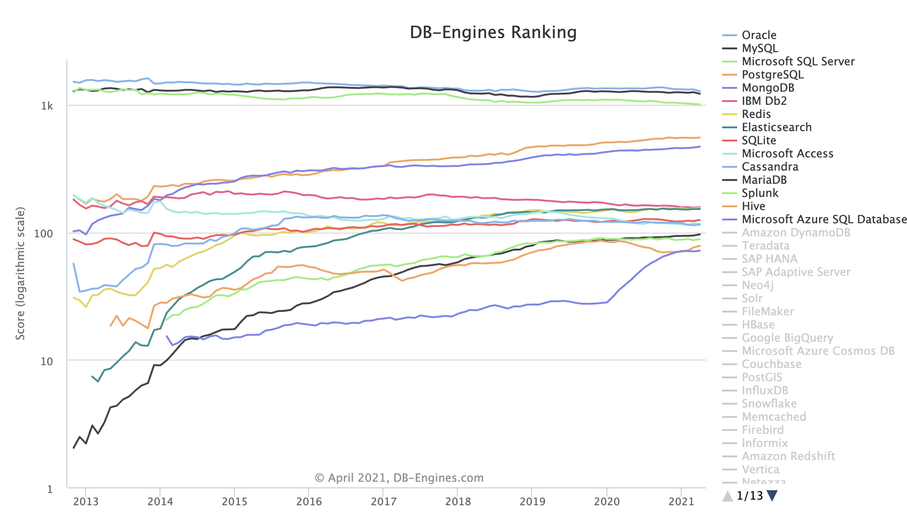
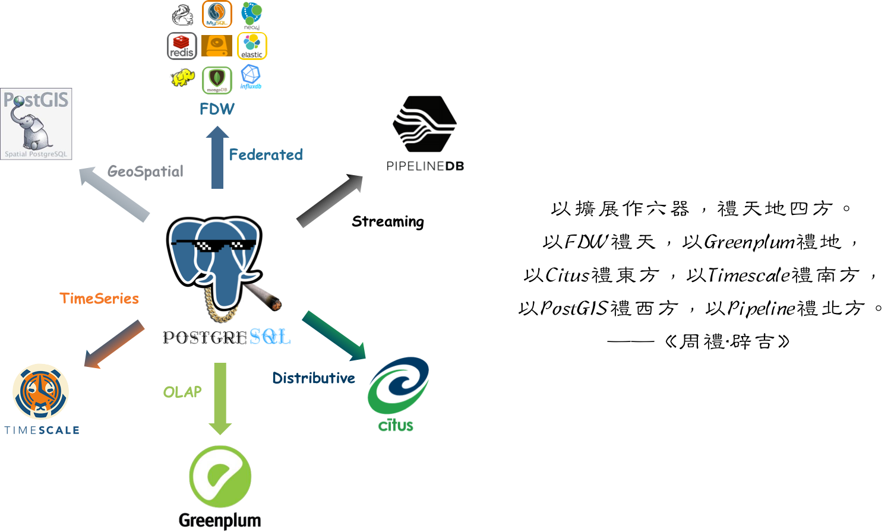
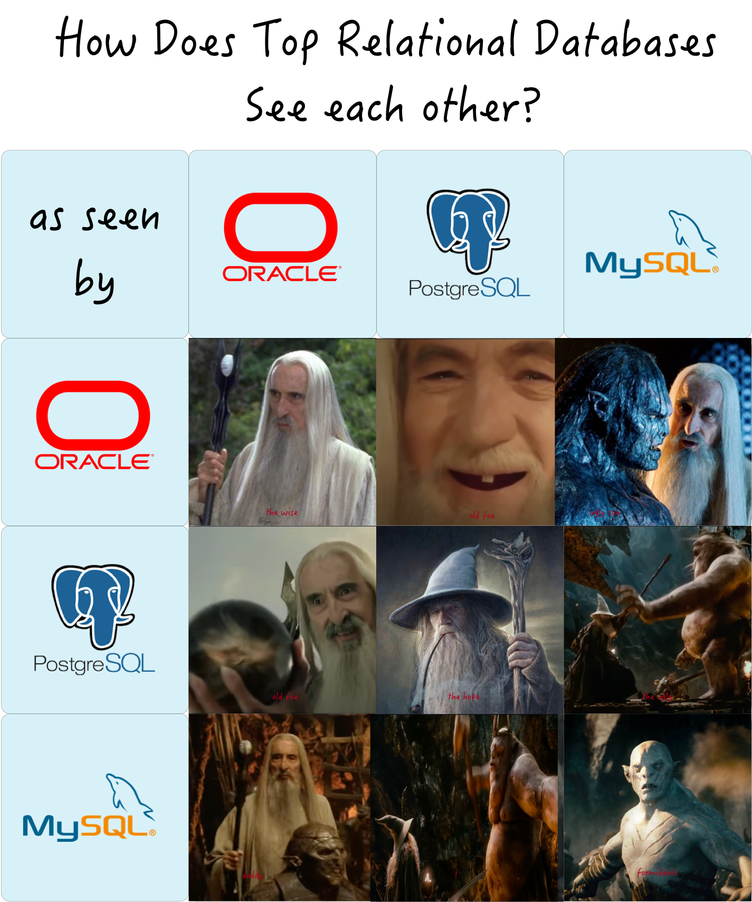
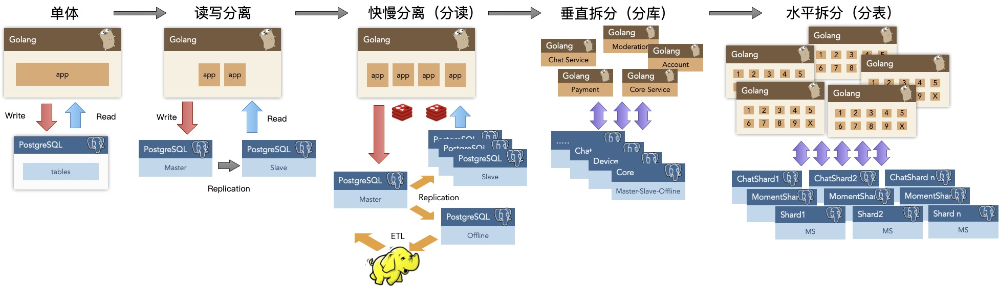

# 为什么PostgreSQL前途无量

最近做的事儿都围绕着PostgreSQL生态，因为我一直觉得这是一个前途无量的方向。

为什么这么说？因为数据库是信息系统的核心组件，关系型数据库是数据库中的绝对主力，而PostgreSQL是世界上最先进的开源关系型数据库。占据天时地利，何愁大业不成？

做一件事最重要的就是认清形势，时来天地皆同力，运去英雄不自由。

## 天下大势

今天下三分，然Oracle ｜ MySQL ｜ SQL Server 疲敝，日薄西山。PostgreSQL紧随其后，如日中天。前四的数据库中，前三者都在走下坡路，唯有PG增长势头不减，此消彼长，前途无量。

> 数据库流行度趋势：https://db-engines.com/en/ranking_trend 
>
> （注意这是**对数**坐标系）

在唯二两个头部开源关系型数据库 MySQL & PgSQL 中，MySQL (2nd) 虽占上风，但其生态位却在逐渐被PostgreSQL (4th) 和非关系型的文档数据库MongoDB (5th) 抢占。按照现在的势头，几年后PostgreSQL的流行度即将跻身前三，与Oracle、MySQL分庭抗礼。

## 竞争关系

关系型数据库的生态位高度重叠，其关系可以视作零和博弈。与PostgreSQL形成直接竞争关系的，就是**Oracle**与**MySQL**。

Oracle流行度位居第一，是老牌商业数据库，有着深厚的历史技术积淀，功能丰富，支持完善。稳坐数据库头把交椅，广受不差钱的企业组织喜爱。但Oracle费用昂贵，且以讼棍行径成为知名的业界毒瘤。排名第三的SQL Server属于相对独立的微软生态，性质上与Oracle类似，都属于商业数据库。商业数据库整体受开源数据库冲击，流行度处于缓慢衰减的状态。

MySQL流行度位居第二，但树大招风，处于前有狼后有虎，上有野爹下有逆子的不利境地：在严谨的事务处理和数据分析上，MySQL被同为开源关系型数据库的PgSQL甩开几条街；而在糙猛快的敏捷方法论上，MySQL又不如新兴NoSQL。同时，MySQL上有养父Oracle的压制，中有MariaDB分家，下有诸如TiDB，OB之类的兼容性新数据库分羹，因而也止步不前。

唯有PostgreSQL迎头赶上，保持着近乎指数增长的势头。如果说几年前PG的势还是Potential，那么现在Potential已经开始兑现为Impact，开始对竞品构成强力挑战。

而在这场你死我活的斗争中，PostgreSQL占据了三个“**势**”：

1. 开源软件普及发展，蚕食商业软件市场

   在去IOE与开源浪潮的大背景下，凭借开源生态对商业软件（Oracle）形成压制。

2. 满足用户日益增长的数据处理功能需求

   凭借地理空间数据的事实标准PostGIS处理立于不败之地，凭借对标Oracle的极为丰富的功能，对MySQL形成技术压制。

3. 市场份额均值回归的势

   国内PG市场份额因历史原因，远低于世界平均水平，本身蕴含着巨大势能。

Oracle作为老牌商业软件，**才**毋庸质疑，同时作为业界毒瘤，“**德**”也不必多说，故曰：“**有才无德**”。MySQL有开源之功德，但它一来采用了GPL协议，比起使用无私宽松BSD协议的PgSQL还是差不少意思，二来认贼作父，被Oracle收购，三来才疏学浅，功能简陋，故曰“**才浅德薄**”。

德不配位，必有灾殃。唯有PostgreSQL，既占据了开源崛起之天时，又把握住功能强劲之地利，还有着宽松BSD协议之人和。正所谓：藏器于身，因时而动。不鸣则已，一鸣惊人。德才兼备，攻守之势易矣！

## 德才兼备

### PostgreSQL的德

**PG的“德”在于开源**。什么叫“德”，合乎于“道”的表现就是德。而这条“道”就是**开源**。

PG本身就是祖师爷级开源软件，是开源世界中的一颗明珠，是全世界开发者群策群力的成功典范。而且更重要的是它采用无私的BSD协议：除了打着PG的名号招摇撞骗外，基本可以说是百无禁忌：比如换皮改造为国产数据库出售。PG可谓无数数据库厂商们的衣食父母。子孙满堂，活人无数，功德无量。

> 数据库谱系图，若列出所有PgSQL衍生版，估计可以撑爆这张图

### PostgreSQL的才

**PG的“才”在于一专多长**。PostgreSQL是一专多长的全栈数据库，天生就是HTAP，超融合数据库，一个打十个。基本单一组件便足以覆盖中小型企业绝大多数的数据库需求：OLTP，OLAP，时序数据库，空间GIS，全文检索，JSON/XML，图数据库，缓存，等等等等。

PostgreSQL在一个很可观的规模内都可以独立扮演多面手的角色，一个组件当多种组件使。**而单一数据组件选型可以极大地削减项目额外复杂度，这意味着能节省很多成本。它让十个人才能搞定的事，变成一个人就能搞定的事。** 如果真有那么一样技术可以满足你所有的需求，那么使用该技术就是最佳选择，而不是试图用多个组件来重新实现它。

> 参考阅读：[**PG好处都有啥**](/zh/blog/2018/06/10/pg好处都有啥/)

## 开源之德

开源是有大功**德**的。互联网的历史就是开源软件的历史，IT行业之所以有今天的繁荣，人们能享受到如此多的免费信息服务，核心原因之一就是开源软件。开源是一种真正成功的，由开发者构成的communism（译成**社区主义**会更贴切）：软件这种IT业的核心生产资料变为全世界开发者公有，人人为我，我为人人。

一个开源程序员干活时，其劳动背后其实可能蕴含有数以万计的顶尖开发者的智慧结晶。互联网程序员贵，因为从效果上来讲，其实程序员不是一个工人，而是一个指挥软件和机器来干活的包工头。	程序员自己就是核心生产资料，服务器很容易取得（相比其他行业的科研设备与实验环境），软件来自公有社区，一个或几个高级的软件工程师可以很轻松的利用**开源生态**快速解决领域问题。

通过开源，所有社区开发者形成合力，极大降低了重复造轮子的内耗。使得整个行业的技术水平以匪夷所思的速度向前迈进。开源的势头就像滚雪球，时至今日已经势不可挡。基本上除了一些特殊场景和路径依赖，软件开发中闭门造车搞自力更生几乎成了一个大笑话。

所以说，搞数据库也好，做软件也罢，**要搞技术就要搞开源的技术**，闭源的东西生命力太弱，没意思。开源之德，也是PgSQL与MySQL对Oracle的最大底气所在。

## 生态之争

开源的核心就在于**生态（ECO）**，每一个开源技术都有自己的小生态。所谓生态就是各种主体及其环境通过密集相互作用构成的一个系统，而开源软件的生态模式大致可以描述为由以下三个步骤组成的正反馈循环：

* 开源软件开发者给开源软件做贡献
* 开源软件本身免费，吸引更多用户
* 用户使用开源软件，产生需求，创造更多开源软件相关岗位

开源生态的繁荣有赖于这个闭环，而生态系统的规模（用户/开发者数量）与复杂度（用户/开发者质量）直接决定了这个软件的生命力，所以每一个开源软件都有天命去扩大自己的规模。而软件的规模通常取决于软件所占据的**生态位**，如果不同的软件的生态位重叠，就会发生竞争。在开源关系型数据库的生态位中，PgSQL与MySQL就是最直接的竞争者。

## 流行 vs 先进

MySQL的口号是“**世界上最流行的开源关系型数据库**”，而PostgreSQL的Slogan则是“**世界上最先进的开源关系型数据库**”，一看这就是一对老冤家了。这两个口号很好的反映出了两种产品的特质：PostgreSQL是功能丰富，一致性优先，高大上的严谨的学院派数据库；MySQL是功能粗陋，可用性优先，糙猛快的“工程派”数据库。

MySQL的主要用户群体集中在互联网公司，互联网公司的典型特点是什么？追逐潮流**糙猛快**，**糙**说的是互联网公司业务场景简单（CRUD居多）；数据重要性不高，不像传统行业（例如银行）那样在意数据的一致性（正确性）；可用性优先（相比停服务更能容忍数据丢乱错，而一些传统行业宁可停止服务也不能让账目出错）。 **猛**说的则是互联网行业数据量大，它们需要的就是水泥槽罐车，而不是高铁和载人飞船。 **快**说的则是互联网行业需求变化多端，出活周期短，要求响应时间快，大量需求的就是开箱即用的软件全家桶（如LAMP）和简单培训一下就能干活的CRUD Boy。于是糙猛快的互联网公司和糙猛快的MySQL一拍即合。

而PgSQL的用户则更偏向于传统行业，**传统行业之所以称为传统行业，就是因为它们已经走过了野蛮生长的阶段**，有着成熟的业务模型与深厚的底蕴积淀。它们需要的是正确的结果，稳定的表现，丰富的功能，对数据进行**分析加工提炼**的能力。所以在传统行业中，往往是Oracle、SQL Server、PostgreSQL的天下。特别是在地理相关的场景中更是有着不可替代的地位。与此同时，不少互联网公司的业务也开始成熟沉淀，已经一只脚迈入“传统行业”了，越来越多的互联网公司脱离了糙猛快的低级循环，将目光投向PostgreSQL 。

## 谁更正确？

最了解一个人的的往往是他的竞争对手，PostgreSQL与MySQL的口号都很精准地戳中了对手的痛点。PgSQL“最先进”的潜台词就是MySQL太落后，而MySQL”最流行“就是说PgSQL不流行。用户少但先进，用户多但落后。哪一个更”好“？这种价值判断的问题不好回答。

但我认为时间站在 **先进** 技术的一边：因为先进与落后是技术的核心度量，是因，而流行与否则是果；流行不流行是内因（技术是否先进）和外因（历史路径依赖）共同对时间积分的**结果**。当下的因会反映为未来的果：流行的东西因为落后而过气，而先进的东西会因为先进变得流行。

虽然很多流行的东西都是垃圾，但流行并不一定代表着落后。如果只是缺少一些功能，MySQL还不至于被称为“落后”。问题在于MySQL已经糙到连**事务**这种关系型数据库的基本功能都有缺陷，那就不是落后不落后能概括的问题，而是合格不合格的问题了。

### ACID

> ​	一些作者声称，支持通用的两阶段提交代价太大，会带来性能与可用性的问题。让程序员来处理过度使用事务导致的性能问题，总比缺少事务编程好得多。
>
> ​	——James Corbett等，Spanner：Google的全球分布式数据库（2012）

在我看来， MySQL的哲学可以称之为：“好死不如赖活着”，以及，“我死后哪管洪水滔天”。 其“可用性”体现在各种“容错”上，例如允许呆瓜程序员写出的错误的SQL查询也能跑起来。最离谱的例子就是MySQL竟然允许**部分成功**的事务提交，这就违背了关系型数据库的基本约束：**原子性与数据一致性**。

> 图：MySQL竟然允许部分成功的事务提交

这里在一个事务中插入了两条记录，第一条成功，第二条因为约束失败。根据事务的原子性，整个事务要么整个成功，要么整个失败（最终一条都没有插入）。结果MySQL的默认表现竟然是允许部分成功的事务提交，也就是事务没有**原子性**，**没有原子性就没有一致性**，如果这个事务是一笔转账（先扣再加），因为某些原因失败，那这里的帐就做不平了。这种数据库如果用来记账恐怕是一笔糊涂账，所以说什么“金融级MySQL”恐怕就是一个笑话。

当然，滑稽的是还有一些MySQL用户将其称为“**特性**”，说这体现了MySQL的容错性。实际上，此类“特殊容错”需求在SQL标准中完全可以通过SAVEPOINT机制实现。PgSQL对此的实现就堪称典范，psql客户端允许通过`ON_ERROR_ROLLBACK`选项，隐式地在每条语句后创建`SAVEPOINT`，并在语句失败后自动`ROLLBACK TO SAVEPOINT`，以标准SQL的方式，以客户端可选项的形式，在不破坏事物ACID的情况下，同样实现这种看上去便利实则**苟且**的功能。相比之下，MySQL的这种所谓“特性”是以直接在服务端默认牺牲事务ACID为代价的（这意味着用户使用JDBC，psycopg等应用驱动也照样受此影响）。

如果是互联网业务，注册个新用户丢个头像、丢个评论可能不是什么大事。数据那么多，丢几条，错几条又算个什么？别说是数据，业务本身很可能都处于朝不保夕的状态，所以糙又如何？万一成功了，前人拉的屎反正也是后人来擦。所以一些互联网公司通常并不在乎这些。

PostgreSQL所谓“严格的约束与语法“可能对新人来说“不近人情”，例如，一批数据中如果有几条脏数据，MySQL可能会照单全收，而PG则会严格拒绝。尽管苟且妥协看上去很省事，但在其他地方卖下了雷：因为逻辑炸弹深夜加班排查擦屁股的工程师，和不得不天天清洗脏数据的数据分析师肯定对此有很大怨念。从长期看，要想成功，**做正确的事**最重要。

> 一个成功的技术，现实的优先级必须高于公关，你可以糊弄别人，但糊弄不了自然规律。
>
> ——罗杰斯委员会报告（1986）

MySQL的流行度并没有和PgSQL相差太远，然而其功能比起PostgreSQL和Oracle却是差距不小。Oracle与PostgreSQL算诞生于同一时期，再怎么斗，立场与阵营不同，也有点惺惺相惜的老对手的意思：都是扎实修炼了半个世纪内功，厚积薄发的老法师。而MySQL就像心浮气躁耍刀弄枪的二十来岁毛头小伙子，凭着一把蛮力，借着互联网野蛮生长的黄金二十年趁势而起，占山为王。

时代所赋予的红利，也会随时代过去而退潮。在这个变革的时代中，没有先进的功能打底，“流行”也恐怕也难以长久。

## 发展前景

从个人**职业发展**前景的角度看，很多数程序员学习一门技术的原因都是为了提高自己的技术竞争力（从而更好占坑赚钱）。PostgreSQL是各种关系型数据库中性价比最高的选择：它不仅可以用来做传统的CRUD OLTP业务，**数据分析**更是它的拿手好戏。各种特色功能更是提供了切入多种行业以的契机：基于PostGIS的地理时空数据处理分析，基于Timescale的时序金融物联网数据处理分析，基于Pipeline存储过程触发器的流式处理，基于倒排索引全文检索的搜索引擎，FDW对接统一各式各样的外部数据源。可以说，它是真正一专多长的全栈数据库，用它可以实现的功能要比单纯的OLTP数据库要丰富得多，更是为CRUD码农提供了转型和深入的进阶道路。

从**企业用户**的角度来看，PostgreSQL在一个很可观的规模内都可以独立扮演多面手的角色，一个组件当多种组件使。**而单一数据组件选型可以极大地削减项目额外复杂度，这意味着能节省很多成本。它让十个人才能搞定的事，变成一个人就能搞定的事。** 当然这不是说PG要一个打十个把其他数据库的饭碗都掀翻，专业组件在专业领域的实力是毋庸置疑的。但切莫忘记，**为了不需要的规模而设计是白费功夫**，实际上这属于过早优化的一种形式。如果真有那么一样技术可以满足你所有的需求，那么使用该技术就是最佳选择，而不是试图用多个组件来重新实现它。

以探探为例，在250WTPS与200TB数据的量级下，**单一PostgreSQL选型**依然能稳如狗地支撑业务。能在很可观的规模内做到一专多长，除了本职的OLTP，Pg还在相当长的时间里兼任了缓存，OLAP，批处理，甚至消息队列的角色。当然神龟虽寿，犹有竟时。最终这些兼职功能还是要逐渐**分拆**出去由专用组件负责，但那已经是近千万日活时的事了。

从**商业生态**的角度看，PostgreSQL也有巨大的优势。一来PG**技术先进**，可称为 “开源版Oracle”。原生的PG基本可以对Oracle的功能做到八九成兼容，EDB更是有96% Oracle兼容的专业PG发行版。因此在抢占去O腾退出的市场中，PostgreSQL及其衍生版本的技术优势是压倒性的。二来PG协议友善，采用了宽松的BSD协议。因此各种数据库厂商，云厂商出品的“自研数据库”，以及很多“云数据库”大体都是基于PgSQL改造的。例如最近HW基于PostgreSQL搞openGaussDB就是一个很明智的选择。不要误会，PG的协议确实允许这样做，而且这样做也确实让PostgreSQL的生态更加繁荣壮大。卖PostgreSQL衍生版是一个很成熟的市场：传统企业不差钱且愿意为此付费买单。开源天才之火有商业利益之油浇灌，因而源源不断地释放出旺盛的生命力。

### vs MySQL

作为老对手，MySQL的处境就有些尴尬了。

从个人职业发展上来看，学MySQL主要就是干CRUD。学好增删改查成为一个合格的码农是没问题的，然而谁又愿意一直“数据矿工”的活呢？数据分析才是数据产业链上的暴利肥差。以MySQL孱弱的分析能力，很难支持CURD程序员升级转型发展。此外，PostgreSQL的市场需求摆在那里，但现在却面临供不应求的状况（以至于现在大量良莠不齐的PG培训机构如雨后春笋般冒了出来），MySQL的人确实比PgSQL的人好招，这是不假的。但反过来说MySQL界的内卷程度也要大的多，供不应求方才体现稀缺性，人太多了技能也就贬值了。

从企业用户的角度来看，MySQL就是专用于OLTP的单一功能组件，往往需要ES, Redis, Mongo等其他等等一起配合才能满足完整的数据存储需求，而PG基本就不会有这个问题。此外，MySQL和PgSQL都是开源数据库，都“免费”。免费的Oracle和免费的MySQL用户会选择哪个呢？

从商业生态来看，MySQL面临的最大问题是 **叫好不叫座**。叫好当然是因为越流行则声音越大，尤其主要的用户互联网企业本身就占据话语权高地。**不叫座**当然也是因为互联网公司本身对于这类软件付费的意愿是极弱的：怎么算都是养几个MySQL DBA直接用开源的更合算。此外，因为MySQL的GPL协议要求衍生软件也要开源，软件厂商基于MySQL研发的动机也不强，基本都是采用 兼容“MySQL” 协议来分MySQL的市场蛋糕，而不是基于MySQL的代码进行开发与回馈，让人对其生态健康程度产生怀疑。

当然MySQL最大的问题就在于：它的**生态位**越来越狭窄。论严谨的事务处理与数据分析，PostgreSQL甩开它几条街；论糙猛快，快速出原型，NoSQL全家桶又要比MySQL方便太多。论商业发财，上面有Oracle干爹压着；论开源生态，又不断出现MySQL兼容的新生代产品来尝试替代主体。可以说MySQL处在一种吃老本的位置上，只是凭籍历史积分存量维持着现状的地位。时间是否会站在MySQL这一边，我们拭目以待。

### vs NewSQL

最近市场上当然也有一些很亮眼的NewSQL产品，例如TiDB，Cockroachdb，Yugabytedb等等。何如？我认为它们都是很好的产品，有一些不错的技术亮点，都是对开源技术的贡献。但是它们可能同样面临**叫好不叫座**的困局。

NewSQL的大体特征是：主打“**分布式**”的概念，通过“分布式”解决**水平扩展性**与**容灾高可用**两个问题，并因分布式的内在局限性会牺牲许多**功能**，只能提供较为简单有限的查询支持。分布式数据库在高可用容灾方面与传统主从复制并没有质的区别，因此其特征主要可以概括为“**以量换质**”。

然而对很多企业而言，牺牲功能换取**扩展性**很可能是一个**伪需求**或**弱需求**。在我接触过的为数不少的用户中，绝大多数场景下的的数据量和负载水平完全落在单机Postgres的处理范围内（目前弄过的记录是单库15TB，单集群40万TPS）。从数据量上来讲，绝大多数企业终其生命周期的数据量也超不过这个瓶颈；至于性能就更不重要了，过早优化是万恶之源，很多企业的DB性能余量足够让他们把所有业务逻辑用存储过程编写然后高高兴兴的跑在数据库里。

NewSQL的祖师爷Google Spanner就是为了解决海量数据扩展性的问题，但又有多少企业能有Google的业务数据量？恐怕还是只有典型的互联网公司，或者某些大企业的部分业务会有这种量级的数据存储需求。所以和MySQL一样，NewSQL的问题就回到了**谁来买单**这个根本问题上。恐怕到最后只能还是由投资人和国资委来买吧。

但最起码，NewSQL的这种尝试始终是值得赞扬的。

### vs 云数据库

> “**我想直率地说：多年来，我们就像个傻子一样，他们拿着我们开发的东西大赚了一笔**”。
>
> —— Ofer Bengal ， Redis Labs 首席执行官  

另一个值得关注的“竞争者”是所谓云数据库，包括两种，一种是放在云上托管的开源数据库。例如 RDS for PostgreSQL，另一种是自研的新一代云数据库。

针对前者，主要的问题是“**云厂商吸血**”。如果云厂商**售卖**开源软件，实际上会导致就会导致开源软件的相关岗位和利润向云厂商集中，而云厂商是否允许自己的程序员给开源项目做贡献，做多少贡献，其实是很难说的。负责人的大厂通常是会回馈社区，回馈生态的，但这取决于它们的自觉。开源软件还是应当将命运握在自己手中，防止云厂商过分做大形成垄断。相比少量垄断巨头，多数分散的小团体能提供更高的生态多样性，更有利于生态健康发展。

Gartner称2022年75%的数据库将部署至云平台，这个牛逼吹的太大了。（但也有圆的办法，毕竟用一台机器就可以轻松创建几亿个sqlite文件数据库，这算不算？）。因为云计算解决不了一个根本性的问题 —— 信任。实际上在商业活动中，技术牛逼不牛逼是很次要的因素，Trust才是最关键的。数据是很多企业的生命线，云厂商又不是真正的中立第三方，谁能保证数据不会被其偷窥，盗窃，泄漏，甚至直接被卡脖子关停（如各路云厂商锤Parler）？TDE之类的透明加密解决方案也属于鸡肋，充分的恶心了自己，但也防不住真正的有心人。也许要等真正实用的高效全同态加密技术成熟才能解决信任与安全这个问题吧。

另一个根本性的问题在于**成本**：就目前云厂商的定价策略，云数据库只有在小微规模下有优势。例如一台D740 64核|400G内存|3TB PCI-E SSD的高配机型四年综合成本撑死了十几万块。然而我能找到最大的规格RDS（比这差很多，32核|128GB）一年的价格就这个数了。只要数据量节点数稍微上那么点规模，雇个DBA自建就合算太多了。

云数据库的主要优势还是在于**管控**，说白了就是用起来方便，点点鼠标。日常运维功能已经覆盖的比较全面，也有一些基础的监控支持。总之下限是摆在那里，如果找不到靠谱的数据库人才，用云数据库起码不至于出太多幺蛾子。 不过这些管控软件虽好，基本都是闭源的，而且与供应商深度绑定。

> 如果你想找一个**开源**的PostgreSQL监控管控一条龙解决方案，不妨试试Pigsty。

后一种云数据库以AWS Aurora为代表，也包括一系列类似产品如阿里云PolarDB，腾讯云CynosDB。基本都是采用PostgreSQL与MySQL作为Base和协议层，基于云基础设施（共享存储，S3，RDMA）进行定制化，对**扩容速度**与**性能**进行了优化。这类产品在技术上肯定是有新颖性和创造性的。但灵魂问题就是，这类产品相比直接使用原生PostgreSQL的收益到底在哪里呢？能看到立竿见影的好处就是集群扩容会快很多（从几小时级到5分钟），不过相比高昂的费用与供应商锁定的问题，实在是挠不到痛点和痒点。

总的来说，云数据库对原生PostgreSQL 构成的威胁是有限的。也不用太担心云厂商的问题，云厂商总的来说还开源软件生态的一份子，对社区和生态是有贡献的。赚钱嘛，不磕碜，大家都有钱赚了，才有余力去搞公益，对不对？

## PG的问题

当然PgSQL有没有自己的问题？当然也有  —— **流行度**。

流行度关乎着着用户规模，信任水平，成熟案例数量，有效需求反馈量，开发者数量等等。尽管按目前的流行度发展趋势，PG将在几年后超过MySQL，所以从长期来看，我觉得这并不是问题。但作为PostgreSQL社区的一员，我觉得很有必要去进一步做一些事情，Secure this success，并加快这一进度。而要想让一样技术更加流行，效果最好的方式就是：**降低门槛**。

所以，我做了一个开源软件[Pigsty](https://pigsty.cc)，要把PostgreSQL部署、监控、管理、使用的门槛从天花板砸到地板，它有三个核心目标：

* 做最顶尖最专业的开源PostgreSQL 监控系统（类tidashboard）
* 做门槛最低最好用的开源PostgreSQL管控方案（类tiup）
* 做开箱即用的与数据分析&可视化集成开发环境（类minikube）

当然这里细节限于篇幅就不展开了，详情留待下篇分说。

