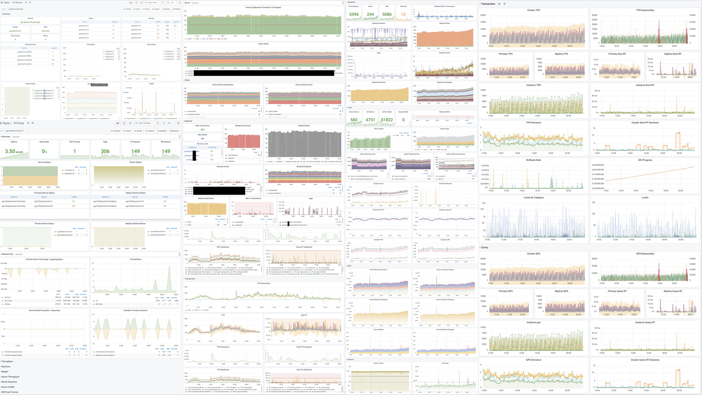
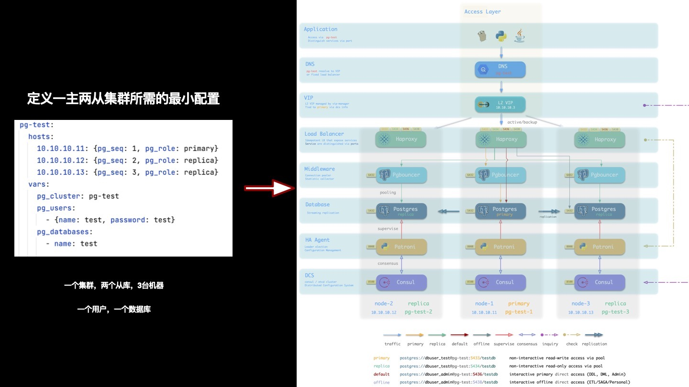
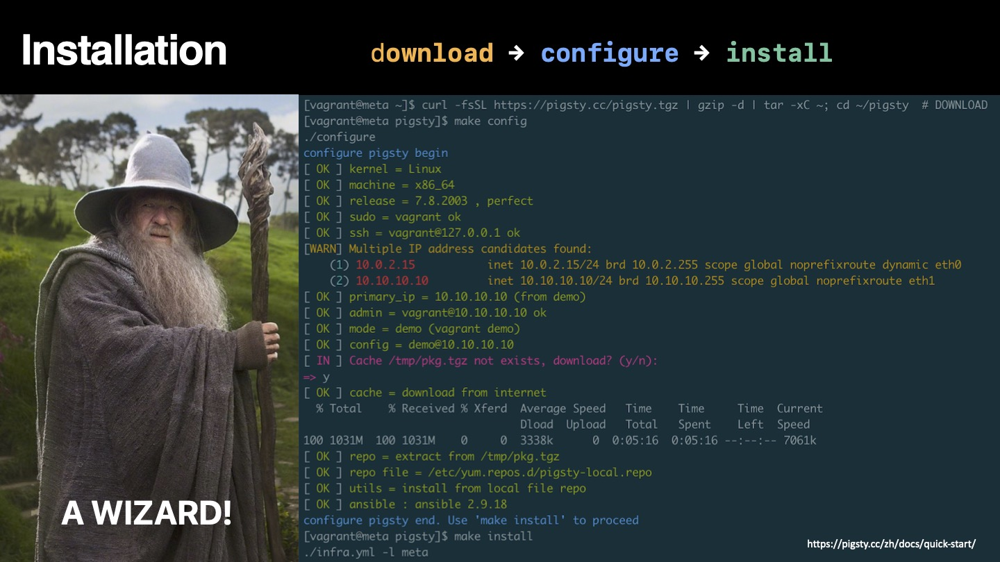
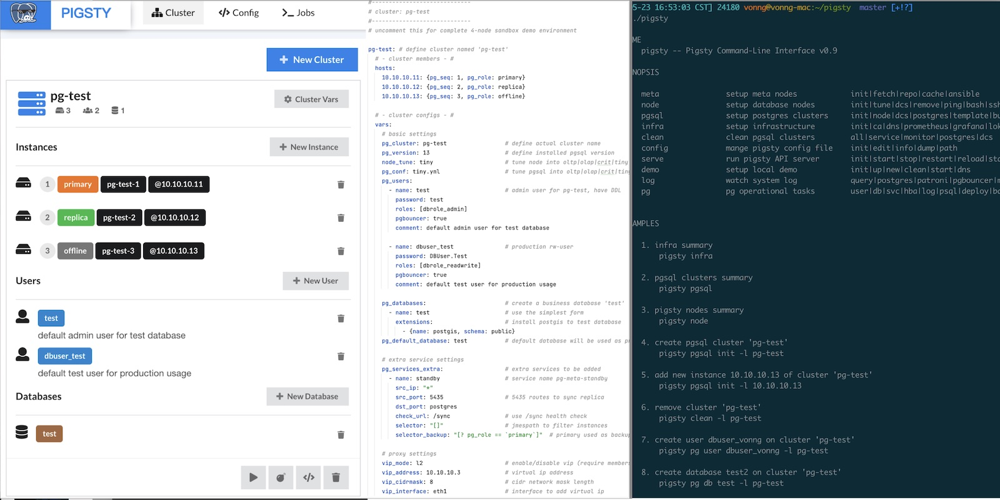
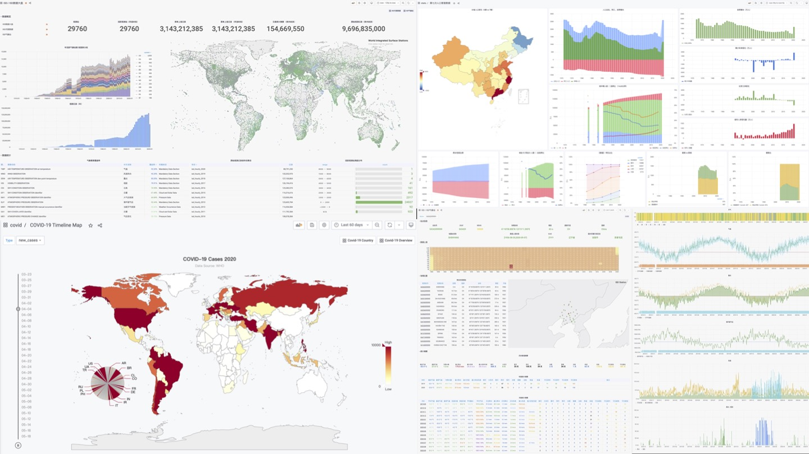
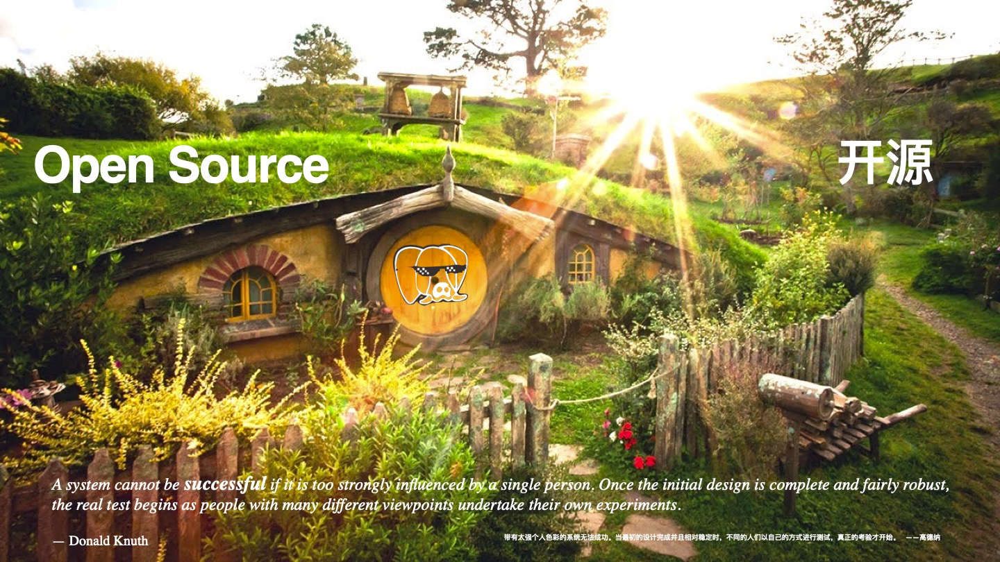

# 开箱即用的PG发行版：Pigsty

> 介绍了开源的PostgreSQL全家桶解决方案 —— Pigsty。

## 什么是Pigsty

**Pigsty是开箱即用的生产级开源PostgreSQL发行版**。

所谓**发行版（Distribution）**，指的是由数据库内核及其一组软件包组成的数据库整体解决方案。例如，Linux是一个**操作系统内核**，而RedHat，Debian，SUSE则是基于此内核的**操作系统发行版**。PostgreSQL是一个**数据库内核**，而**Pigsty**，BigSQL，Percona，各种云RDS，换皮数据库则是基于此内核的**数据库发行版**。

Pigsty区别于其他数据库发行版的五个核心特性为：

* **全面专业**的**监控系统** 
* **稳定可靠**的**部署方案**  
* **简单省心的用户界面**
* **灵活开放**的**扩展机制** 
* **免费友好**的**开源协议**

这五个特性，使得Pigsty真正成为**开箱即用**的PostgreSQL发行版。

### 谁会感兴趣？

Pigsty面向的用户群体包括：DBA，架构师，OPS，软件厂商、云厂商、业务研发、内核研发、数据研发；对数据分析与数据可视化感兴趣的人；学生，新手程序员，有兴趣尝试数据库的用户。

对于DBA，架构师等专业用户，Pigsty提供了独一无二的**专业级**PostgreSQL监控系统，为数据库管理提供不可替代的价值点。与此同时，Pigsty还带有一个**稳定可靠**，久经考验的生产级PostgreSQL部署方案，可在生产环境中自动部署带有监控报警，日志采集，服务发现，连接池，负载均衡，VIP，以及高可用的PostgreSQL数据库集群。

对于研发人员（业务研发、内核研发、数据研发），学生，新手程序员，有兴趣尝试数据库的用户，Pigsty提供了门槛极低，**一键拉起，一键安装**的**本地沙箱**。本地沙箱除机器规格外与生产环境完全一致，包含完整的功能：带有开箱即用的数据库实例与监控系统。可用于学习，开发，测试，数据分析等场景。

此外，Pigsty提供了一种称为“Datalet”的灵活扩展机制 。对数据分析与数据可视化感兴趣的人可能会惊讶地发现，Pigsty还可以作为数据分析与可视化的集成开发环境。Pigsty集成了PostgreSQL与常用的数据分析插件，并带有Grafana和内嵌的Echarts支持，允许用户编写，测试，分发数据小应用（Datalet）。如：“Pigsty监控系统的额外扩展面板包”，“Redis监控系统”，“PG日志分析系统”，“应用监控”，“数据目录浏览器”等。

最后，Pigsty采用了免费友好的Apache License 2.0，可以免费用于商业目的。**只要遵守Apache 2 License的显著声明条款，也欢迎云厂商与软件厂商集成与二次研发商用**。

 

## 全面专业的监控系统

> You can’t manage what you don’t measure.
>
> — Peter F.Drucker

Pigsty提供**专业级**监控系统，面向专业用户提供不可替代的价值点。

以医疗器械类比，**普通监控系统**类似于心率计、血氧计，普通人无需学习也可以上手。它可以给出患者生命体征核心指标：起码用户可以知道人是不是要死了，但对于看病治病无能为力。例如，各种云厂商软件厂商提供的监控系统大抵属于此类：十几个核心指标，告诉你数据库是不是还活着，让人大致有个数，仅此而已。

**专业级**监控系统则类似于CT，核磁共振仪，可以检测出对象内部的全部细节，专业的医师可以根据CT/MRI报告快速定位疾病与隐患：有病治病，没病健体。Pigsty可以深入审视每一个数据库中的每一张表，每一个索引，每一个查询，提供巨细无遗的全面指标（1155类），并通过几千个仪表盘将其转换为**洞察**：将故障扼杀在萌芽状态，并为性能优化提供**实时反馈**。

Pigsty监控系统基于业内最佳实践，采用Prometheus、Grafana作为监控基础设施。开源开放，定制便利，可复用，可移植，没有厂商锁定。可与各类已有数据库实例集成。

## 稳定可靠的部署方案

> *A complex system that works is invariably found to have evolved from a simple system that works.* 
>
> —John Gall, *Systemantics* (1975) 

数据库是管理数据的软件，管控系统是管理数据库的软件。

Pigsty内置了一套以Ansible为核心的数据库管控方案。并基于此封装了命令行工具与图形界面。它集成了数据库管理中的核心功能：包括数据库集群的创建，销毁，扩缩容；用户、数据库、服务的创建等。Pigsty采纳“Infra as Code”的设计哲学使用了声明式配置，通过大量可选的配置选项对数据库与运行环境进行描述与定制，并通过幂等的预置剧本自动创建所需的数据库集群，提供近似私有云般的使用体验。

Pigsty创建的数据库集群是**分布式**、**高可用**的数据库集群。Pigsty创建的数据库基于DCS、Patroni、Haproxy实现了高可用。数据库集群中的每个数据库实例在**使用**上都是**幂等**的，任意实例都可以通过内建负载均衡组件提供完整的读写服务，提供分布式数据库的使用体验。数据库集群可以自动进行故障检测与主从切换，普通故障能在几秒到几十秒内自愈，且期间只读流量不受影响。故障时。集群中只要有任意实例存活，就可以对外提供完整的服务。

Pigsty的架构方案经过审慎的设计与评估，着眼于以最小复杂度实现所需功能。该方案经过长时间，大规模的生产环境验证，已经被互联网/B/G/M/F多个行业内的组织所使用。

## 简单省心的用户界面

Pigsty旨在降低PostgreSQL的使用门槛，因此在易用性上做了大量工作。

### 安装部署

> *Someone told me that each equation I included in the book would halve the sales.*
>
> — Stephen Hawking

Pigsty的部署分为三步：下载源码，配置环境，执行安装，均可通过一行命令完成。遵循经典的软件安装模式，并提供了配置向导。您需要准备的只是一台CentOS7.8机器及其root权限。管理新节点时，Pigsty基于Ansible通过ssh发起管理，无需安装Agent，即使是新手也可以轻松完成部署。

Pigsty既可以在生产环境中管理成百上千个高规格的生产节点，也可以独立运行于本地1核1GB虚拟机中，作为开箱即用的数据库实例使用。在本地计算机上使用时，Pigsty提供基于Vagrant与Virtualbox的**沙箱**。可以一键拉起与生产环境一致的数据库环境，用于学习，开发，测试数据分析，数据可视化等场景。

### 用户接口

> *Clearly, we must break away from the sequential and not limit the computers. We must state definitions and provide for priorities and descriptions of data. We must state relation‐ ships, not procedures.*                        
>
> —Grace Murray Hopper, *Management and the Computer of the Future* (1962) 

Pigsty吸纳了Kubernetes架构设计中的精髓，采用声明式的配置方式与幂等的操作剧本。用户只需要描述“自己想要什么样的数据库”，而无需关心Pigsty如何去创建它，修改它。Pigsty会根据用户的配置文件清单，在几分钟内从裸机节点上创造出所需的数据库集群。

在管理与使用上，Pigsty提供了不同层次的用户界面，以满足不同用户的需求。新手用户可以使用一键拉起的本地沙箱与图形用户界面，而开发者则可以选择使用`pigsty-cli`命令行工具与配置文件的方式进行管理。经验丰富的DBA、运维与架构师则可以直接通过Ansible原语对执行的任务进行精细控制。

## 灵活开放的扩展机制

PostgreSQL的 **可扩展性（Extensible）** 一直为人所称道，各种各样的扩展插件让PostgreSQL成为了最先进的开源关系型数据库。Pigsty亦尊重这一价值，提供了一种名为“Datalet”的扩展机制，允许用户和开发者对Pigsty进行进一步的定制，将其用到“意想不到”的地方，例如：数据分析与可视化。

当我们拥有监控系统与管控方案后，也就拥有了开箱即用的可视化平台Grafana与功能强大的数据库PostgreSQL。这样的组合拥有强大的威力 —— 特别是对于数据密集型应用而言。用户可以在无需编写前后端代码的情况下，进行数据分析与数据可视化，制作带有丰富交互的数据应用原型，甚至应用本身。

Pigsty集成了Echarts，以及常用地图底图等，可以方便地实现高级可视化需求。比起Julia，Matlab，R这样的传统科学计算语言/绘图库而言，PG + Grafana + Echarts的组合允许您以极低的成本制作出**可分享**，**可交付**，**标准化**的数据应用或可视化作品。

Pigsty监控系统本身就是Datalet的典范：所有Pigsty高级专题监控面板都会以Datalet的方式发布。Pigsty也自带了一些有趣的Datalet案例：Redis监控系统，新冠疫情数据分析，七普人口数据分析，PG日志挖掘等。后续还会添加更多的开箱即用的Datalet，不断扩充Pigsty的功能与应用场景。

## 免费友好的开源协议

> *Once open source gets good enough, competing with it would be insane.*
>
> Larry Ellison —— Oracle CEO

在软件行业，开源是一种大趋势，互联网的历史就是开源软件的历史，IT行业之所以有今天的繁荣，人们能享受到如此多的免费信息服务，核心原因之一就是开源软件。开源是一种真正成功的，由开发者构成的communism（译成**社区主义**会更贴切）：软件这种IT业的核心生产资料变为全世界开发者公有，人人为我，我为人人。

一个开源程序员工作时，其劳动背后其实可能蕴含有数以万计的顶尖开发者的智慧结晶。通过开源，所有社区开发者形成合力，极大降低了重复造轮子的内耗。使得整个行业的技术水平以匪夷所思的速度向前迈进。开源的势头就像滚雪球，时至今日已经势不可挡。除了一些特殊场景和路径依赖，软件开发中闭门造车搞自力更生已经成了一个大笑话。

依托开源，回馈开源。Pigsty采用了友好的Apache License 2.0，**可以免费用于商业目的**。**只要遵守Apache 2 License的显著声明条款，也欢迎云厂商与软件厂商集成与二次研发商用**。

## 关于Pigsty

> *A system cannot be successful if it is too strongly influenced by a single person. Once the initial design is complete and fairly robust, the real test begins as people with many different viewpoints undertake their own experiments*. 
> — Donald Knuth 

Pigsty围绕开源数据库PostgreSQL而构建，PostgreSQL是世界上**最先进的开源关系型数据库**，而Pigsty的目标就是：做**最好用的开源PostgreSQL发行版**。

在最开始时，Pigsty并没有这么宏大的目标。因为在市面上找不到任何满足我自己需求的监控系统，因此我只好自己动手，丰衣足食，给自己做了一个监控系统。没有想到它的效果出乎意料的好，有不少外部组织PG用户希望能用上。紧接着，监控系统的部署与交付成了一个问题，于是又将数据库部署管控的部分加了进去；在生产环境应用后，研发希望能在本地也有用于测试的沙箱环境，于是又有了本地沙箱；有用户反馈ansible不太好用，于是就有了封装命令的`pigsty-cli`命令行工具；有用户希望可以通过UI编辑配置文件，于是就有了Pigsty GUI。就这样，需求越来越多，功能也越来越丰富，Pigsty也在长时间的打磨中变得更加完善，已经远远超出了最初的预期。

做这件事本身也是一种挑战，做一个发行版有点类似于做一个RedHat，做一个SUSE，做一个“RDS产品”。通常只有一定规模的专业公司与团队才会去尝试。但我就是想试试，一个人可不可以？实际上除了慢一点，也没什么不可以。一个人在产品经理、开发者，终端用户的角色之间转换是很有趣的体验，而“Eat dog food”最大的好处就是，你自己既是开发者也是用户，你了解自己需要什么，也不会在自己的需求上偷懒。

不过，正如高德纳所说：“带有太强个人色彩的系统无法成功”。 要想让Pigsty成为一个具有旺盛生命力的项目，就必须开源，让更多的人用起来。“当最初的设计完成并足够稳定后，各式各样的用户以自己的方式去使用它时，真正的挑战才刚刚开始”。

Pigsty很好的解决了我自己的问题与需求，现在我希望它可以帮助到更多的人，并让PostgreSQL的生态更加繁荣，更加多彩。

