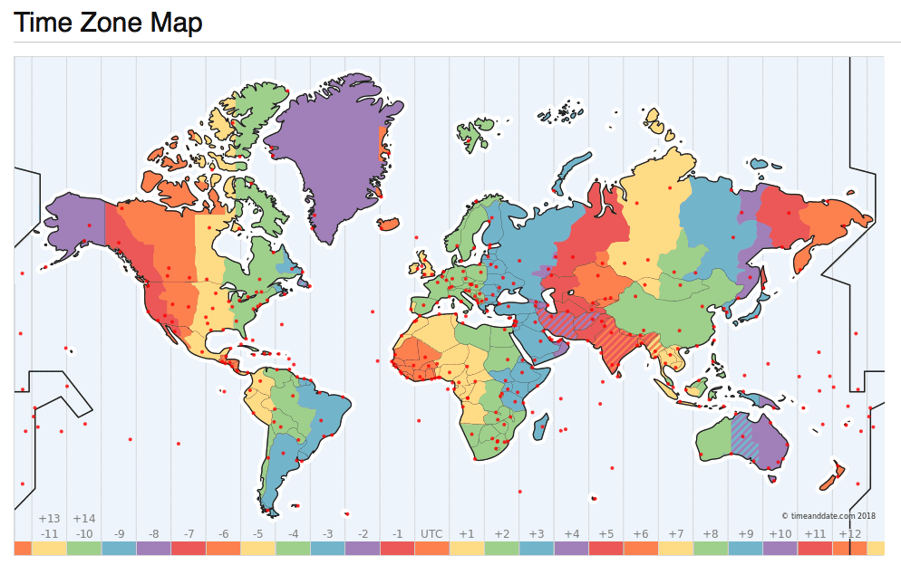

# 时间时区那些事


[TOC]

时间是个很玄妙的东西，看不见也摸不着。我们都能意识到时间的存在，但要给它下个定义，很多人也说不上来。本文当然不是为了探讨哲学问题，但对时间的正确理解，对正确处理工作生活中的时间问题很有帮助（例如，计算机中的时间表示与时间处理，数据库，编程语言中对于时间的处理）。


## 0x01 秒与计时

时间的单位是秒，但秒的定义并不是一成不变的。它有一个天文学定义，也有一个物理学定义。

### 世界时（UT1）

在最开始，**秒的定义来源于日**。秒被定义为平均太阳日的1/86400。而太阳日，则是由天文学现象定义的：两次连续**正午**时分的**间隔**被定义为一个**太阳日**；一天有86400秒，一秒等于86400分之一天，Perfect！以这一标准形成的时间标准，就称为**世界时（Univeral Time, UT1）**，或不严谨的说，**格林威治标准时（Greenwich Mean Time, GMT）**，下面就用GMT来指代它了。
​	
这个定义很直观，但有一个问题：它是基于天文学现象的，即地球与太阳的周期性运动。不论是用地球的公转还是自转来定义秒，都有一个很尴尬的地方：虽然地球自转与公转的变化速度很慢，但并不是恒常的，譬如：地球的自转越来越慢，而地月位置也导致了每天的时长其实都不完全相同。这意味着作为物理基本单位的秒，其时长竟然是变化的。在衡量**时间段**的长短上就比较尴尬，几十年的一秒可能和今天的一秒长度已经不是一回事了。

### 原子时（TAI）

为了解决这个问题，在1967年之后，秒的定义变成了：**铯133原子基态的两个超精细能级间跃迁对应辐射的9,192,631,770个周期的持续时间**。秒的定义从天文学定义升级成为了物理学定义，其描述由相对易变的天文现象升级到了更稳定的宇宙中的基本物理事实。现在我们有了真正**精准**的秒啦：一亿年的偏差也不超过一秒。
​	
当然，这么精确的秒除了用来衡量时间间隔，也可以用来计时。从`1958-01-01 00:00:00`开始作为公共时间原点，**国际原子钟**开始了计数，每计数9,192,631,770这么多个原子能级跃迁周期就+1s，这个钟走的非常准，每一秒都很均匀。使用这定义的时间称为**国际原子时（International Atomic Time, TAI）**，下文简称TAI。

### 冲突

在最开始，这两种秒是等价的：一天是86400天文秒，也等于86400物理秒，毕竟物理学这个定义就是特意去凑天文学的定义嘛。所以相应的，**GMT**也与国际原子时**TAI**也保持着同步。然而正如前面所说，天文学现象影响因素太多了，并不是真正的“天行有常”。随着地球自转公转速度变化，天文定义的秒要比物理定义的秒稍微长了那么一点点，这也就意味着GMT要比TAI稍微落后一点点。
​	
那么哪种定义说了算，世界时还是原子时？如果理论与生活实践经验相违背，绝大多数人都不会选择反直觉的方案：假设一种极端场景，两个钟之间的差异日积月累，到最后出现了几分钟甚至几小时的差值：明明日当午，按GMT应当是`12:00:00`，但GMT走慢了，TAI显示的时间已经是晚上六点了，这就违背了直觉。在**表示时刻**这一点上，还是由天文定义说了算，即以GMT为准。
​	
当然，就算是天文定义说了算，也要尊重物理规律，毕竟原子钟走的这么准不是？实际上世界时与原子时之间的差值也就在几秒的量级。那么我们会自然而然地想到，使用国际原子时TAI作为基准，但加上一些**闰秒（leap second）**修正到GMT不就行了？既有高精度，又符合常识。于是就有了新的**协调世界时（Coordinated Universal Time, UTC）**。

### 协调世界时（UTC）

**UTC是调和GMT与TAI的产物：**

* UTC使用精确的国际原子时TAI作为计时基础
* UTC使用国际时GMT作为修正目标

* UTC使用闰秒作为修正手段，

我们通常所说的时间，通常就是指**世界协调时间UTC**，它与世界时GMT的差值在0.9秒内，在要求不严格的实践中，可以近似认为UTC时间与GMT时间是相同的，很多人也把它与GMT混为一谈。

但问题紧接着就来了，按照传统，一天24小时，一小时60分钟，一分钟60秒，日和秒之间有86400的换算关系。以前用日来定义秒，现在秒成了基本单位，就要用秒去定义日。但现在一天不等于86400秒了。无论用哪头定义哪头，都会顾此失彼。唯一的办法，就是打破这种传统：一分钟不一定只有60秒了，它在需要的时候可以有61秒！
​	
这就是**闰秒**机制，UTC以TAI为基准，因此走的也比GMT快。假设UTC和GMT的差异不断变大，在即将超过一秒时，让UTC中的某一分钟变为61秒，续的这一秒就像UTC在等GMT一样，然后误差就追回来了。每次续一秒时，UTC时间都会落后TAI多一秒，截止至今，UTC已经落后TAI三十多秒了。最近的一次闰秒调整是在2016年跨年：

> 国际标准时间UTC将在格林尼治时间2016年12月31日23时59分59秒（北京时间2017年1月1日7时59分59秒）之后，在原子时钟实施一个正闰秒，即增加1秒，然后才会跨入新的一年。

所以说，GMT和UTC还是有区别的，UTC里你能看到`2016-12-31 23:59:60`的时间，但GMT里就不会。


## 0x02 本地时间与时区

刚才讨论的时间都默认了一个前提：位于本初子午线（0度经线）上的时间。我们还需要考虑地球上的其他地方：毕竟美帝艳阳高照时，中国还在午夜呢。
​	
本地时间，顾名思义就是以当地的太阳来计算的时间：正午就是12:00。太阳东升西落，东经120度上的本地时间比起本初子午线上就早了`120° / (360°/24) = 8`个小时。这意味着在北京当地时间12点整时，UTC时间其实是`12-8=4`，早晨4:00。
​	
大家统一用UTC时间好不好呢？可以当然可以，毕竟中国横跨三个时区，也只用了一个北京时间。只要大家习惯就行。但大家都已经习惯了本地正午算12点了，强迫全世界人民用统一的时间其实违背了历史习惯。时区的设置使得长途旅行者能够简单地知道当地人的作息时间：反正差不多都是朝九晚五上班。这就降低了沟通成本。于是就有了时区的概念。当然像新疆这种硬要用北京时间的结果就是，游客乍一看当地人11点12点才上班可能会有些懵。



但在大一统的国家内部，使用统一的时间也有助于降低沟通成本。假如一个新疆人和一个黑龙江人打电话，一个用的乌鲁木齐时间，一个用的北京时间，那就会鸡同鸭讲。都约着12点，结果实际差了两个小时。时区的选用并不完全是按照地理经度而来的，也有很多的其他因素考量（例如行政区划）。
​	
这就引出了时区的概念：**时区是地球上使用同一个本地时间定义的区域**。**时区实际上可以视作从地理区域到时间偏移量的单射**。
​	
但其实有没有那个地理区域都不重要，关键在于**时间偏移量**的概念。UTC/GMT时间本身的偏移量为0，时区的偏移量都是相对于UTC时间而言的。这里，本地时间，UTC时间与时区的关系是：

> 本地时间 = UTC时间 + 本地时区偏移量。

比如UTC、GMT的时区都是`+0`，意味着没有偏移量。中国所处的东八区偏移量就是`+8`。意味着计算当地时间时，要在UTC时间的基础上增加8个小时。

**夏令时（Daylight Saving Time, DST）**，可以视为一种特殊的时区偏移修正。指的是在夏天天亮的较早的时候把时间调快一个小时（实际上不一定是一个小时），从而节省能源（灯火）。我国在86年到92年之间曾短暂使用过夏令时。欧盟从1996年开始使用夏令时，不过欧盟最近的民调显示，84%的民众希望取消夏令时。对程序员而言，夏令时也是一个额外的麻烦事，希望它能尽快被扫入历史的垃圾桶。


## 0x03 时间的表示

那么，时间又如何表示呢？使用TAI的秒数来表示时间当然不会有歧义，但使用不便。习惯上我们将时间分为三个部分：日期，时间，时区，而每个部分都有多种表示方法。对于时间的表示，世界诸国人民各有各的习惯，例如，2006年1月2日，美国人就可能喜欢使用诸如`January 2, 1999`，`1/2/1999`这样的日期表示形式，而中国人也许会用诸如“2006年1月2日”，“2006/01/02”这样的表示形式。发送邮件时，首部中的时间则采用RFC2822中规定的`Sat, 24 Nov 2035 11:45:15 −0500`格式。此外，还有一系列的RFC与标准，用于指定日期与时间的表示格式。

```bash
ANSIC       = "Mon Jan _2 15:04:05 2006"
UnixDate    = "Mon Jan _2 15:04:05 MST 2006"
RubyDate    = "Mon Jan 02 15:04:05 -0700 2006"
RFC822      = "02 Jan 06 15:04 MST"
RFC822Z     = "02 Jan 06 15:04 -0700" // RFC822 with numeric zone
RFC850      = "Monday, 02-Jan-06 15:04:05 MST"
RFC1123     = "Mon, 02 Jan 2006 15:04:05 MST"
RFC1123Z    = "Mon, 02 Jan 2006 15:04:05 -0700" // RFC1123 with numeric zone
RFC3339     = "2006-01-02T15:04:05Z07:00"
RFC3339Nano = "2006-01-02T15:04:05.999999999Z07:00"
```

不过在这里，我们只关注计算机中的日期表示形式与存储方式。而计算机中，时间最经典的表示形式，就是Unix时间戳。

### Unix时间戳

比起UTC/GMT，对于程序员来说，更为熟悉的可能是另一种时间：Unix时间戳。UNIX时间戳是从1970年1月1日（UTC/GMT的午夜，在1972年之前没有闰秒）开始所经过的秒数，注意这里的秒其实是GMT中的秒，也就是**不计闰秒**，毕竟一天等于86400秒已经写死到无数程序的逻辑里去了，想改是不可能改的。
​	
使用GMT秒数的好处是，计算日期的时候根本不用考虑闰秒的问题。毕竟闰年已经很讨厌了，再来一个没有规律的闰秒，绝对会让程序员抓狂。当然这不代表就不需要考虑闰秒的问题了，诸如ntp等时间服务还是需要考虑闰秒的问题的，应用程序有可能会受到影响：比如遇到‘时光倒流’拿到两次`59`秒，或者获取到秒数为`60`的时间值，一些实现简陋的程序可能就直接崩了。当然，也有一种将闰秒均摊到某一天全天的顺滑手段。
​	
Unix时间戳背后的思想很简单，建立一条时间轴，以某一个**纪元点（Epoch）**作为原点，将时间表示为距离原点的**秒数**。Unix时间戳的纪元为GMT时间的`1970-01-01 00:00:00`，32位系统上的时间戳实际上是一个有符号四字节整型，以秒为单位。这意味它能表示的时间范围为：`2^32 / 86400 / 365 = 68`年，差不多从1901年到2038年。
​	
当然，时间戳并不是只有这一种表示方法，但通常这是最为传统稳妥可靠的做法。毕竟不是所有的程序员都能处理好许多和时区、闰秒相关的微妙错误。使用Unix时间戳的好处就是时区已经固定死了是GMT了，存储空间与某些计算处理（比如排序）也相对容易。
​	
在*nix命令行中使用`date +%s`可以获取Unix时间戳。而`date -r @1500000000`则可以反向将Unix时间戳转换为其他时间格式，例如转换为`2017-07-14 10:40:00`可以使用：

```bash
date -d @1500000000 '+%Y-%m-%d %H:%M:%S'	# Linux
date -r 1500000000 '+%Y-%m-%d %H:%M:%S'		# MacOS, BSD
```

在很久以前，当主板上的电池没电之后，系统的时钟就会自动重置成0；还有很多软件的Bug也会导致导致时间戳为0，也就是`1970-01-01`；以至于这个纪元时间很多非程序员都知道了。
​	

## 数据库中的时间存储

通常情况下，Unix时间戳是**传递/存储**时间的最佳方式，它通常在计算机内部以整型的形式存在，内容为距离某个特定纪元的秒数。它极为简单，无歧义，存储占用更紧实，便于比较大小，且在程序员之间存在广泛共识。不过，Epoch+整数偏移量的方式适合在机器上进行存储与交换，但它并不是一种人类可读的格式（也许有些程序员可读）。

PostgreSQL提供了丰富的日期时间数据类型与相关函数，它能以高度灵活的方式自动适配各种格式的时间输入输出，并在内部以高效的整型表示进行存储与计算。在PostgreSQL中，变量`CURRENT_TIMESTAMP`或函数`now()`会返回当前事务开始时的本地时间戳，返回的类型是`TIMESTAMP WITH TIME ZONE`，这是一个PostgreSQL扩展，会在时间戳上带有额外的时区信息。SQL标准所规定的类型为`TIMESTAMP`，在PostgreSQL中使用8字节的长整型实现。可以使用SQL语法`AT TIME ZONE zone`或内置函数`timezone(zone,ts)`将带有时区的`TIMESTAMP`转换为不带时区的标准版本。

通常（我认为的）最佳实践是，只要应用稍具规模或涉及到任何国际化的功能，存储时间就应当使用`TIMESTAMP`类型并存储GMT时间，当然，PostgreSQL Wiki中[推荐的方式](https://wiki.postgresql.org/wiki/Don%27t_Do_This#When_should_you.3F_8)是使用PostgreSQL自己的`TimestampTZ`扩展类型，带时区的时间戳是12字节，而不带时区的则为8字节，在固定使用GMT时区的情况下，个人还是更倾向于使用不带时区的`TIMESTAMP`类型。

```sql
-- 获取本地事务开始时的时间戳
vonng=# SELECT now(), CURRENT_TIMESTAMP;
              now              |       current_timestamp
-------------------------------+-------------------------------
 2018-12-11 21:50:15.317141+08 | 2018-12-11 21:50:15.317141+08

-- now()/CURRENT_TIMESTAMP返回的是带有时区信息的时间戳
 vonng=# SELECT pg_typeof(now()),pg_typeof(CURRENT_TIMESTAMP);
        pg_typeof         |        pg_typeof
--------------------------+--------------------------
 timestamp with time zone | timestamp with time zone
 

-- 将本地时区+8时间转换为UTC时间，转化得到的是TIMESTAMP
-- 注意不要使用从TIMESTAMPTZ到TIMESTAMP的强制类型转换，会直接截断时区信息。
 vonng=# SELECT now() AT TIME ZONE 'UTC';
          timezone
----------------------------
 2018-12-11 13:50:25.790108

-- 再将UTC时间转换为太平洋时间
vonng=# SELECT (now() AT TIME ZONE 'UTC') AT TIME ZONE 'PST';
           timezone
-------------------------------
 2018-12-12 05:50:37.770066+08
 
 -- 查看PG自带的时区数据表
 vonng=# TABLE pg_timezone_names LIMIT 4;
       name       | abbrev | utc_offset | is_dst
------------------+--------+------------+--------
 Indian/Mauritius | +04    | 04:00:00   | f
 Indian/Chagos    | +06    | 06:00:00   | f
 Indian/Mayotte   | EAT    | 03:00:00   | f
 Indian/Christmas | +07    | 07:00:00   | f
...

-- 查看PG自带的时区缩写
vonng=# TABLE pg_timezone_abbrevs  LIMIT 4;
 abbrev | utc_offset | is_dst
--------+------------+--------
 ACDT   | 10:30:00   | t
 ACSST  | 10:30:00   | t
 ACST   | 09:30:00   | f
 ACT    | -05:00:00  | f
 ...
```

一个经常让人困惑的问题就是`TIMESTAMP`与`TIMESTAMPTZ`之间的相互转化问题。

```sql
-- 使用::TIMESTAMP将TIMESTAMPTZ强制转换为TIMESTAMP，直接截断时区部分内容
-- 时间的其余"内容"保持不变
vonng=# SELECT now(), now()::TIMESTAMP;
             now               |           now
-------------------------------+--------------------------
 2018-12-12 05:50:37.770066+08 |  2018-12-12 05:50:37.770066+08

-- 对有时区版TIMESTAMPTZ使用AT TIME ZONE语法
-- 会将其转换为无时区版的TIMESTAMP，返回给定时区下的时间
vonng=# SELECT now(), now() AT TIME ZONE 'UTC';
              now              |          timezone
-------------------------------+----------------------------
 2019-05-23 16:58:47.071135+08 | 2019-05-23 08:58:47.071135
 
 
 -- 对无时区版TIMESTAMP使用AT TIME ZONE语法
-- 会将其转换为带时区版的TIMESTAMPTZ，即在给定时区下解释该无时区时间戳。
vonng=# SELECT now()::TIMESTAMP, now()::TIMESTAMP AT TIME ZONE 'UTC';
            now             |           timezone
----------------------------+-------------------------------
 2019-05-23 17:03:00.872533 | 2019-05-24 01:03:00.872533+08
 
 -- 这里的意思是，UTC时间的 2019-05-23 17:03:00
```

