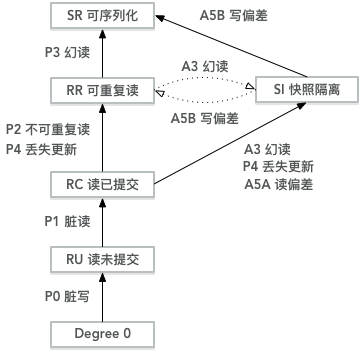
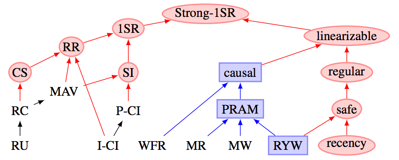
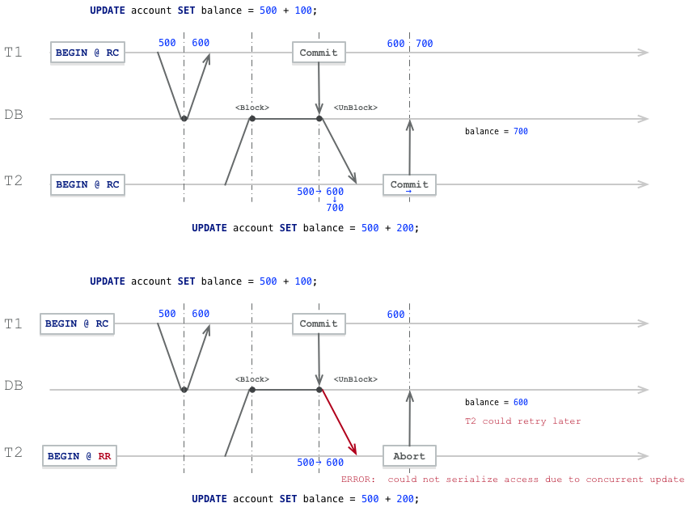
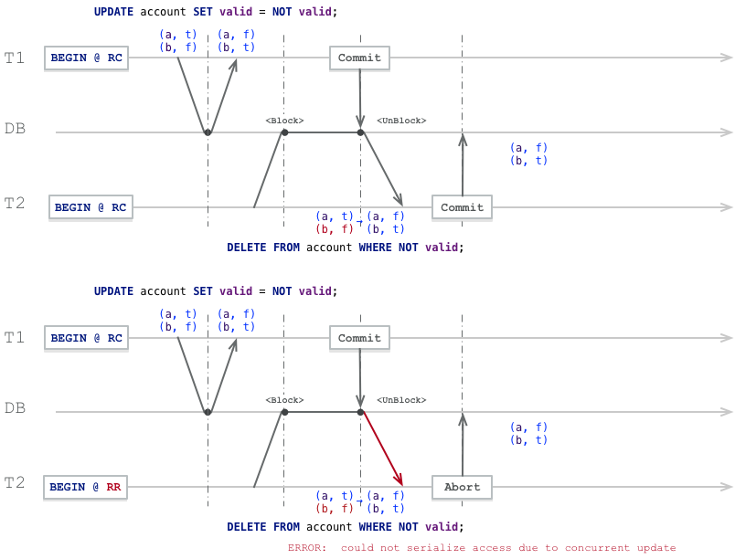

# 并发异常那些事


并发程序很难写对，更难写好。很多程序员也没有真正弄清楚这些问题，不过是一股脑地把这些问题丢给数据库而已。并发异常并不仅仅是一个理论问题：这些异常曾经造成过很多资金损失，耗费过大量财务审计人员的心血。但即使是最流行、最强大的关系型数据库（通常被认为是“ACID”数据库），也会使用弱隔离级别，所以它们也不一定能防止这些并发异常的发生。
​	
比起盲目地依赖工具，我们应该对存在的并发问题的种类，以及如何防止这些问题有深入的理解。	本文将阐述SQL92标准中定义的隔离级别及其缺陷，现代模型中的隔离级别与定义这些级别的异常现象。


## 0x01 引子

大多数数据库都会同时被多个客户端访问。如果它们各自读写数据库的不同部分，这是没有问题的，但是如果它们访问相同的数据库记录，则可能会遇到**并发异常**。

下图是一个简单的并发异常案例：两个客户端同时在数据库中增长一个计数器。（假设数据库中没有自增操作）每个客户端需要读取计数器的当前值，加1再回写新值。因为有两次增长操作，计数器应该从42增至44；但由于并发异常，实际上只增长至43。


**图 两个客户之间的竞争状态同时递增计数器**

事务ACID特性中的I，即**隔离性（Isolation）**就是为了解决这种问题。隔离性意味着，**同时执行的事务是相互隔离的**：它们不能相互踩踏。传统的数据库教科书将**隔离性**形式化为**可串行化（Serializability）**，这意味着每个事务可以假装它是唯一在整个数据库上运行的事务。数据库确保当事务已经提交时，结果与它们按顺序运行（一个接一个）是一样的，尽管实际上它们可能是并发运行的。
​	
如果两个事务不触及相同的数据，它们可以安全地**并行（parallel）**运行，因为两者都不依赖于另一个。当一个事务读取由另一个事务同时进行修改的数据时，或者当两个事务试图**同时**修改相同的数据时，并发问题（竞争条件）才会出现。只读事务之间不会有问题，但只要至少一个事务涉及到写操作，就有可能出现**冲突**，或曰：并发异常。
​	
并发异常很难通过测试找出来，因为这样的错误只有在特殊时机下才会触发。这样的时机可能很少，通常很难重现。也很难对并发问题进行推理研究，特别是在大型应用中，你不一定知道有没有其他的应用代码正在访问数据库。在一次只有一个用户时，应用开发已经很麻烦了，有许多并发用户使其更加困难，因为任何数据都可能随时改变。
​	
出于这个原因，数据库一直尝试通过提供**事务隔离（transaction isolation）**来隐藏应用开发中的并发问题。从理论上讲，隔离可以通过假装没有并发发生，让程序员的生活更加轻松：**可串行化**的隔离等级意味着数据库保证事务的效果与真的串行执行（即一次一个事务，没有任何并发）是等价的。
​	
实际上不幸的是：隔离并没有那么简单。**可串行化**会有性能损失，许多数据库与应用不愿意支付这个代价。因此，系统通常使用**较弱的隔离级别**来防止一部分，而不是全部的并发问题。这些弱隔离等级难以理解，并且会导致微妙的错误，但是它们仍然在实践中被使用。一些流行的数据库如Oracle 11g，甚至没有实现可串行化。在Oracle中有一个名为“可串行化”的隔离级别，但实际上它实现了一种叫做**快照隔离（snapshot isolation）**的功能，**这是一种比可串行化更弱的保证**。
​	
在研究现实世界中的并发异常前，让我们先来复习一下SQL92标准定义的事务隔离等级。


## 0x02 SQL92标准

按照ANSI SQL92的标准，三种**现象（phenomena）**区分出了四种隔离等级，如下表所示：

|  隔离等级  | 脏写P0 | 脏读 P1 | 不可重复读 P2 | 幻读 P3 |
| :--------: | :----: | :-----: | :-----------: | :-----: |
| 读未提交RU |   ✅    |    ⚠️    |       ⚠️       |    ⚠️    |
| 读已提交RC |   ✅    |    ✅    |       ⚠️       |    ⚠️    |
| 可重复读RR |   ✅    |    ✅    |       ✅       |    ⚠️    |
| 可串行化SR |   ✅    |    ✅    |       ✅       |    ✅    |

* 四种**现象**分别缩写为P0，P1，P2，P3，P是**现象（Phenonmena）**的首字母。
* **脏写**没有在标准中指明，但却是任何隔离等级都需要必须避免的异常

这四种异常可以概述如下：

**P0 脏写（Dirty Write）**

事务T1修改了数据项，而另一个事务T2在T1提交或回滚之前就修改了T1修改的数据项。
​	
无论如何，事务必须避免这种情况。

**P1 脏读（Dirty Read）**

事务T1修改了数据项，另一个事务T2在T1提交或回滚前就读到了这个数据项。
​	
如果T1选择了回滚，那么T2实际上读到了一个事实上不存在（未提交）的数据项。

**P2 不可重复读（ Non-repeatable or Fuzzy Read）**

事务T1读取了一个数据项，然后另一个事务T2修改或删除了该数据项并提交。
​	
如果T1尝试重新读取该数据项，它就会看到修改过后的值，或发现值已经被删除。

**P3 幻读（Phantom）**

事务T1读取了满足某一**搜索条件**的数据项集合，事务T2**创建**了新的满足该搜索条件的数据项并提交。
​	
如果T1再次使用同样的*搜索条件*查询，它会获得与第一次查询不同的结果。

### 标准的问题

SQL92标准对于隔离级别的定义是**有缺陷的** —— 模糊，不精确，并不像标准应有的样子独立于实现。标准其实针对的是基于锁调度的实现来讲的，而基于多版本的实现就很难对号入座。有几个数据库实现了“可重复读”，但它们实际提供的保证存在很大的差异，尽管表面上是标准化的，但没有人真正知道**可重复读**的意思。
​	
标准还有其他的问题，例如在P3中只提到了创建/插入的情况，但实际上任何写入都可能导致异常现象。	此外，标准对于**可串行化**也语焉不详，只是说“`SERIALIZABLE`隔离级别必须保证通常所知的完全序列化执行”。


> #### 现象与异常
>
> **现象（phenomena）**与**异常（anomalies）**并不相同。**现象**不一定是**异常**，但**异常**肯定是**现象**。例如在脏读的例子中，如果T1回滚而T2提交，那么这肯定算一种**异常**：看到了不存在的东西。但无论T1和T2各自选择回滚还是提交，这都是一种可能导致脏读的**现象**。通常而言，**异常**是一种严格解释，而**现象**是一种宽泛解释。


## 0x03 现代模型

相比之下，现代的隔离等级与一致性等级对于这个问题有更清晰的阐述，如图所示：



**图：隔离等级偏序关系图**



**图：一致性与隔离等级偏序关系**

右子树主要讨论的是多副本情况下的一致性等级，略过不提。为了讨论便利起见，本图中刨除了MAV、CS、I-CI、P-CI等隔离等级，主要需要关注的是**快照隔离SI**。

**表：各个隔离等级及其可能出现的异常现象**

| 等级\现象     |  P0  |  P1  | P4C  |  P4  |  P2  |  P3  | A5A  | A5B  |
| ------------- | :--: | :--: | :--: | :--: | :--: | :--: | :--: | :--: |
| 读未提交 RU   |  ✅   |  ⚠️   |  ⚠️   |  ⚠️   |  ⚠️   |  ⚠️   |  ⚠️   |  ⚠️   |
| 读已提交 RC   |  ✅   |  ✅   |  ⚠️   |  ⚠️   |  ⚠️   |  ⚠️   |  ⚠️   |  ⚠️   |
| 游标稳定性 CS |  ✅   |  ✅   |  ✅   |  ⚠️?  |  ⚠️?  |  ⚠️   |  ⚠️   |  ⚠️?  |
| 可重复读 RR   |  ✅   |  ✅   |  ✅   |  ✅   |  ✅   |  ⚠️   |  ✅   |  ✅   |
| 快照隔离 SI   |  ✅   |  ✅   |  ✅   |  ✅   |  ✅   |  ✅?  |  ✅   |  ⚠️   |
| 可序列化 SR   |  ✅   |  ✅   |  ✅   |  ✅   |  ✅   |  ✅   |  ✅   |  ✅   |

> 带有？标记的表示可能出现异常，依具体实现而异。

### 主流关系型数据库的实际隔离等级

相应地，将主流关系型数据库为了“兼容标准”而标称的隔离等级映射到现代隔离等级模型中，如下表所示：

**表：主流关系型数据库标称隔离等级与实际隔离之间的对照关系**

| 实际\标称   | PostgreSQL/9.2+ | MySQL/InnoDB | Oracle(11g) | SQL Server |
| ----------- | :-------------: | :----------: | :---------: | :--------: |
| 读未提交 RU |                 |      RU      |             |     RU     |
| 读已提交 RC |       RC        |    RC, RR    |     RC      |     RC     |
| 可重复读 RR |                 |              |             |     RR     |
| 快照隔离 SI |       RR        |              |     SR      |     SI     |
| 可序列化 SR |       SR        |      SR      |             |     SR     |

### 以PostgreSQL为例

如果按照**ANSI SQL92标准**来看，PostgreSQL实际上只有两个隔离等级：RC与SR。

| 隔离等级 | 脏读 P1 | 不可重复读 P2 | 幻读 P3 |
| -------- | :-----: | :-----------: | :-----: |
| RU，RC   |    ✅    |       ⚠️       |    ⚠️    |
| RR，SR   |    ✅    |       ✅       |    ✅    |

其中，RU和RC隔离等级中可能出现P2与P3两种异常情况。而RR与SR则能避免P1,P2,P3所有的异常。

当然实际上如果按照现代隔离等级模型，PostgreSQL的RR隔离等级实际上是快照隔离SI，无法解决A5B写偏差的问题。直到9.2引入**可串行化快照隔离SSI**之后才有真正意义上的SR，如下表所示：

| 标称 | 实际 |  P2  |  P3  | A5A  |  P4  | A5B  |
| :--: | :--: | :--: | :--: | :--: | :--: | :--: |
|  RC  |  RC  |  ⚠️   |  ⚠️   |  ⚠️   |  ⚠️   |  ⚠️   |
|  RR  |  SI  |  ✅   |  ✅   |  ✅   |  ✅   |  ⚠️   |
|  SR  |  SR  |  ✅   |  ✅   |  ✅   |  ✅   |  ✅   |

作为一种粗略的理解，可以将RC等级视作语句级快照，而将RR等级视作事务级快照。

### 以MySQL为例

MySQL的RR隔离等级因为无法阻止丢失更新问题，被认为没有提供真正意义上的快照隔离/可重复读。

| 标称 | 实际 |  P2  |  P3  | A5A  |  P4  | A5B  |
| :--: | :--: | :--: | :--: | :--: | :--: | :--: |
|  RC  |  RC  |  ⚠️   |  ⚠️   |  ⚠️   |  ⚠️   |  ⚠️   |
|  RR  |  RC  |  ✅   | ✅？  |  ✅   |  ⚠️   |  ⚠️   |
|  SR  |  SR  |  ✅   |  ✅   |  ✅   |  ✅   |  ✅   |

参考测试用例：[ept/hermitage/mysql](ept/hermitage/mysql)


## 0x04 并发异常


回到这张图来，各个异常等级恰好就是通过可能出现的异常来定义的。如果在某个隔离等级A中会出现的所有异常都不会在隔离等级B中出现，我们就认为隔离等级A弱于隔离等级B。但如果某些异常在等级A中出现，在等级B中避免，同时另一些异常在等级B中出现，却在A中避免，这两个隔离等级就无法比较强弱了。
	
例如在这幅图中：RR与SI是明显强于RC的。但RR与SI之间的相对强弱却难以比较。SI能够避免RR中可能出现的幻读P3，但会出现写偏差A5B的问题；RR不会出现写偏差A5B，但有可能出现P3幻读。
	
防止脏写与脏读可以简单地通过数据项上的读锁与写锁来阻止，其形式化表示为：

```
P0: w1[x]...w2[x]...((c1 or a1) and (c2 or a2)) in any order)

P1: w1[x]...r2[x]...((c1 or a1) and (c2 or a2)) in any order)
A1: w1[x]...r2[x]...(a1 and c2 in any order)
```

因为大多数数据库使用RC作为默认隔离等级，因此脏写P0，脏读P1等异常通常很难遇到，就不再细说了。

下面以PostgreSQL为例，介绍这几种通常情况下可能出现的并发异常现象：

* P2：不可重复读
* P3：幻读
* A5A：读偏差
* P4：丢失跟新
* A5B：写偏差

这五种异常有两种分类方式，第一可以按照隔离等级来区分。

* P2，P3，A5A，P4是RC中会出现，RR不会出现的异常；A5B是RR中会出现，SR中不会出现的异常。

第二种分类方式是按照冲突类型来分类：只读事务与读写事务之间的冲突，以及读写事务之间的冲突。

* P2，P3，A5A是读事务与写事务之间的并发异常，而P4与A5B则是读写事务之间的并发异常。

### 读-写异常

让我们先来考虑一种比较简单的情况：一个只读事务与一个读写事务之间的冲突。例如：

* P2：不可重复读。
* A5A：读偏差（一种常见的不可重复读问题）
* P3：幻读

在PostgreSQL中，这三种异常都会在RC隔离等级中出现，但使用RR（实际为SI）隔离等级就不会有这些问题。


### 不可重复读 P2

假设我们有一张账户表，存储了用户的银行账户余额，id是用户标识，balance是账户余额，其定义如下

```sql
CREATE TABLE account(
    id 		INTEGER PRIMARY KEY,
    balance	INTEGER
);
```

譬如，在事务1中前后进行两次相同的查询，但两次查询间，事务2写入并提交，结果查询得到的结果不同。

```sql
START TRANSACTION ISOLATION LEVEL READ COMMITTED; -- T1, RC, 只读
START TRANSACTION ISOLATION LEVEL READ COMMITTED; -- T2, RC, 读写

SELECT * FROM account WHERE k = 'a';  -- T1, 查询账户a，看不到任何结果
INSERT INTO account VALUES('a', 500); -- T2, 插入记录(a,500)
COMMIT; -- T2, 提交

SELECT * FROM account WHERE id = 'a'; -- T1, 重复查询，得到结果(a,500)
COMMIT; -- T1陷入迷惑，为什么同样的查询结果不同？
```

对于事务1而言，在同一个事务中执行相同的查询，竟然会出现不一样的结果，也就是说读取的结果**不可重复**。这就是不可重复读的一个例子，即现象**P2**。在PostgreSQL的RC级别中是会出现的，但如果将事务T1的隔离等级设置为RR，就不会出现这种问题了：

```sql
START TRANSACTION ISOLATION LEVEL REPEATABLE READ; -- T1, RR, 只读
START TRANSACTION ISOLATION LEVEL READ COMMITTED;  -- T2, RC, 读写

SELECT * FROM counter WHERE k = 'x'; -- T1, 查询不到任何结果
INSERT INTO counter VALUES('x', 10); -- T2, 插入记录(x,10) @ RR
COMMIT; -- T2, 提交

SELECT * FROM counter WHERE k = 'x'; -- T1, 还是查询不到任何结果
COMMIT; -- T1, 在RR下，两次查询的结果保持一致。
```

不可重复读的形式化表示：

```c
P2: r1[x]...w2[x]...((c1 or a1) and (c2 or a2) in any order)
A2: r1[x]...w2[x]...c2...r1[x]...c1
```


### 读偏差 A5A

另一类读-写异常是**读偏差（A5A）**：考虑一个直观的例子，假设用户有两个账户：a和b，各有500元。

```sql
-- 假设有一张账户表，用户有两个账户a，b，各有500元。
CREATE TABLE account(
    id 		INTEGER PRIMARY KEY,
    balance	INTEGER
);
INSERT INTO account VALUES('a', 500), ('b', 500);
```

现在用户向系统提交从账户b向账户a转账100元的请求，并从网页上并查看自己的账户余额。在RC隔离级别下，下列操作历史的结果可能会让用户感到困惑：

```sql
START TRANSACTION ISOLATION LEVEL READ COMMITTED; -- T1, RC, 只读，用户观察
START TRANSACTION ISOLATION LEVEL READ COMMITTED; -- T2, RC, 读写，系统转账

SELECT * FROM account WHERE id = 'a'; -- T1, 用户查询账户a, 500元

UPDATE account SET balance -= 100 WHERE id = 'b'; -- T2, 系统扣减账户b 100元
UPDATE account SET balance += 100 WHERE id = 'a'; -- T2, 系统添加账户a 100元
COMMIT; -- T2, 系统转账事务提交提交

SELECT * FROM account WHERE id = 'a'; -- T1, 用户查询账户b, 400元
COMMIT; -- T1, 用户陷入迷惑，为什么我总余额(400+500)少了100元？
```

这个例子中，只读事务**读取到了系统的一个不一致的快照**。这种现象称为**读偏差（read skew）**，记作A5A。但其实说到底，读偏差的根本原因是不可重复读。只要避免了P2，自然能避免A5A。
	
但读偏差是很常见的一类问题，在一些场景中，我们希望获取一致的状态快照，读偏差是不能接受的。一个典型的场景就是**备份**。通常对于大型数据库，备份需要花费若干个小时。备份进程运行时，数据库仍然会接受写入操作。因此如果存在读偏差，备份可能会包含一些旧的部分和一些新的部分。如果从这样的备份中恢复，那么不一致（比如消失的钱）就会变成永久的。此外，一些长时间运行的分析查询通常也希望能在一个一致的快照上进行。如果一个查询在不同时间看见不同的东西，那么返回的结果可能毫无意义。
	
快照隔离是这个问题最常见的解决方案。PostgreSQL的RR隔离等级实际上就是快照隔离，提供了事务级一致性快照的功能。例如，如果我们将T1的隔离等级设置为可重复读，就不会有这个问题了。

```sql
START TRANSACTION ISOLATION LEVEL REPEATABLE READ; -- T1, RR, 只读，用户观察
START TRANSACTION ISOLATION LEVEL READ COMMITTED;  -- T2, RC, 读写，系统转账

SELECT * FROM account WHERE id = 'a'; -- T1 用户查询账户a, 500元

UPDATE account SET balance -= 100 WHERE id = 'b'; -- T2 系统扣减账户b 100元
UPDATE account SET balance += 100 WHERE id = 'a'; -- T2 系统添加账户a 100元
COMMIT; -- T2, 系统转账事务提交提交

SELECT * FROM account WHERE id = 'a'; -- T1 用户查询账户b, 500元
COMMIT; -- T1没有观察到T2的写入结果{a:600,b:400}，但它观察到的是一致性的快照。
```

读偏差的形式化表示：

```c
A5A: r1[x]...w2[x]...w2[y]...c2...r1[y]...(c1 or a1)
```


### 幻读 P3

在ANSI SQL92中，幻读是用于区分RR和SR的现象，实际上它经常与不可重复读P2混为一谈。唯一的区别在于读取列时是否使用了**谓词（predicate）**，也就是Where条件。	将上一个例子中查询是否存在账户，变为满足特定条件账户的数目，就成了一个所谓的“幻读”问题。

```sql
START TRANSACTION ISOLATION LEVEL READ COMMITTED; -- T1, RC, 只读
START TRANSACTION ISOLATION LEVEL READ COMMITTED; -- T2, RC, 读写

SELECT count(*) FROM account WHERE balance > 0;  -- T1, 查询有存款的账户数目。0
INSERT INTO account VALUES('a', 500); -- T2, 插入记录(a,500)
COMMIT; -- T2, 提交

SELECT count(*) FROM account WHERE balance > 0;  -- T1, 查询有存款的账户数目。1
COMMIT; -- T1陷入迷惑，为什么冒出来一个人？
```

同理，事务1在使用PostgreSQL的RR隔离级别之后，事务1就不会看到满足谓词P的结果发生变化了。

```sql
START TRANSACTION ISOLATION LEVEL REPEATABLE READ; -- T1, RR, 只读
START TRANSACTION ISOLATION LEVEL READ COMMITTED;  -- T2, RC, 读写

SELECT count(*) FROM account WHERE balance > 0;  -- T1, 查询有存款的账户数目。0
INSERT INTO account VALUES('a', 500); -- T2, 插入记录(a,500)
COMMIT; -- T2, 提交

SELECT count(*) FROM account WHERE balance > 0;  -- T1, 查询有存款的账户数目。0
COMMIT; -- T1, 读取到了一致的快照（虽然不是最新鲜的）
```

之所以有这种相当Trivial的区分，因为基于锁的隔离等级实现往往需要额外的谓词锁机制来解决这类特殊的读-写冲突问题。但是基于MVCC的实现，以PostgreSQL的SI为例，就天然地一步到位解决了所有这些问题。

幻读的形式化表示：

```
P3: r1[P]...w2[y in P]...((c1 or a1) and (c2 or a2) any order)
A3: r1[P]...w2[y in P]...c2...r1[P]...c1
```

幻读会出现在MySQL的RC，RR隔离等级中，但不会出现在PostgreSQL的RR隔离等级（实际为SI）中。


### 写-写异常

上面几节讨论了只读事务在并发写入时可能发生的异常。通常这种读取异常可能只要稍后重试就会消失，但如果涉及到写入，问题就比较严重了，因为这种读取到的暂时不一致状态很可能经由写入变成永久性的不一致…。到目前为止我们只讨论了在并发写入发生时，只读事务可以看见什么。如果两个事务并发执行写入，还可能会有一种更有趣的写-写异常：

* **P4： 丢失更新**：PostgreSQL的RC级别存在，RR级别不存在（MySQL的RR会存在）。
* **A5B：写入偏差**：PostgreSQL的RR隔离级别会存在。

其中，**写偏差（A5B）**可以视作**丢失更新（P4）**的泛化情况。**快照隔离**能够解决**丢失更新**的问题，却无法解决**写入偏差**的问题。解决**写入偏差**需要**真正的可串行化**隔离等级。

### 丢失更新-P4-例1

仍然以上文中的账户表为例，假设有一个账户x，余额500元。

```sql
CREATE TABLE account(
    id 		TEXT PRIMARY KEY,
    balance	INTEGER
);
INSERT INTO account VALUES('x', 500);
```

有两个事务T1，T2，分别希望向该账户打入两笔钱，比如一笔100，一笔200。从顺序执行的角度来看，无论两个事务谁先执行，最后的结果都应当是余额 = 500 + 200 + 100 = 800。

```sql
START TRANSACTION ISOLATION LEVEL READ COMMITTED; -- T1
START TRANSACTION ISOLATION LEVEL READ COMMITTED; -- T2

SELECT balance FROM account WHERE id = 'x'; -- T1, 查询当前余额=500
SELECT balance FROM account WHERE id = 'x'; -- T2, 查询当前余额也=500

UPDATE account SET balance = 500 + 100; -- T1, 在原余额基础上增加100元
UPDATE account SET balance = 500 + 200; -- T2, 在原余额基础上增加200元,被T1阻塞。

COMMIT; -- T1, 提交前可以看到余额为600。T1提交后解除对T2的阻塞，T2进行了更新。
COMMIT; -- T2, T2提交,提交前可以看到余额为700
-- 最终结果为700
```

但奇妙的时机导致了意想不到的结果，最后账户的余额为700元，事务1的转账更新丢失了！
	
但令人意外的是，两个事务都看到了UPDATE 1的更新结果，都检查了自己更新的结果无误，都收到了事务成功提交的确认。结果事务1的更新丢失了，这就很尴尬了。最起码事务应当知道这里可能出现问题，而不是当成什么事都没有就混过去了。
	
如果使用RR隔离等级（主要是T2，T1可以是RC，但出于对称性尽量都用RR），后执行更新的语句就会报错中止事务。这就允许应用知耻而后勇，进行重试。

```sql
START TRANSACTION ISOLATION LEVEL REPEATABLE READ;  -- T1, 这里RC也可以
START TRANSACTION ISOLATION LEVEL REPEATABLE READ;  -- T2, 关键是T2必须为RR

SELECT balance FROM account WHERE id = 'x'; -- T1, 查询当前余额=500
SELECT balance FROM account WHERE id = 'x'; -- T2, 查询当前余额也=500

UPDATE account SET balance = 500 + 100; -- T1, 在原余额基础上增加100元
UPDATE account SET balance = 500 + 200; -- T2, 在原余额基础上增加200元,被T1阻塞。

COMMIT; -- T1, 提交前可以看到余额为600。T1提交后解除对T2的阻塞
-- T2 Update报错：ERROR:  could not serialize access due to concurrent update

ROLLBACK; -- T2, T2只能回滚
-- 最终结果为600，但T2知道了错误可以重试，并在无竞争的环境中最终达成正确的结果800。
```



当然我们可以看到，在RC隔离等级的情况中，T1提交，解除对T2的阻塞时，Update操作已经能够看到T1的变更了（balance=600）。但事务2还是用自己先前计算出的增量值覆盖了T1的写入。对于这种特殊情况，可以使用原子操作解决，例如：`UPDATE account SET balance = balance + 100;`。这样的语句在RC隔离级别中也能正确地并发更新账户。但并不是所有的问题都能简单到能用原子操作来解决的，让我们来看另一个例子。

### 丢失更新-P4-例2

让我们来看一个更微妙的例子：`UPDATE`与`DELETE`之间的冲突。

假设业务上每人最多有两个账户，用户最多能选择一个账号作为有效账号，管理员会定期删除无效账号。

账户表有一个字段valid表示该账户是否有效，定义如下所示：

```sql
CREATE TABLE account(
    id 		TEXT PRIMARY KEY,
    valid   BOOLEAN
);
INSERT INTO account VALUES('a', TRUE), ('b', FALSE);
```

现在考虑这样一种情况，用户要切换自己的有效账号，与此同时管理员要清理无效账号。

从顺序执行的角度来看，无论是用户先切换还是管理员先清理，最后结果的共同点是：总会有一个账号被删掉。

```sql
START TRANSACTION ISOLATION LEVEL READ COMMITTED;  -- T1, 用户更换有效账户
START TRANSACTION ISOLATION LEVEL READ COMMITTED;  -- T2, 管理员删除账户

UPDATE account SET valid = NOT valid; -- T1, 原子操作，将有效账户无效账户状态反转
DELETE FROM account WHERE NOT valid;  -- T2, 管理员删除无效账户。

COMMIT; -- T1, 提交，T1提交后解除对T2的阻塞
-- T2 DELETE执行完毕，返回DELETE 0

COMMIT; -- T2, T2能正常提交，但检查的话会发现自己没有删掉任何记录。
-- 无论T2选择提交还是回滚，最后的结果都是(a,f),(b,t)
```

从下图中可以看到，事务2的DELETE原本锁定了行`(b,f)`准备删除，但因为事务1的并发更新而阻塞。当T1提交解除T2的阻塞时，事务2看见了事务1的提交结果：自己锁定的那一行已经不满足删除条件了，因此只好放弃删除。



相应的，改用RR隔离等级，至少给了T2知道错误的机会，在合适的时机重试就可以达到序列执行的效果。

```sql
START TRANSACTION ISOLATION LEVEL REPEATABLE READ;  -- T1, 用户更换有效账户
START TRANSACTION ISOLATION LEVEL REPEATABLE READ;  -- T2, 管理员删除账户

UPDATE account SET valid = NOT valid; -- T1, 原子操作，将有效账户无效账户状态反转
DELETE FROM account WHERE NOT valid;  -- T2, 管理员删除无效账户。

COMMIT; -- T1, 提交，T1提交后解除对T2的阻塞
-- T2 DELETE报错：ERROR:  could not serialize access due to concurrent update
ROLLBACK; -- T2, T2只能回滚
```

### SI隔离级别小结

上面提到的异常，包括P2，P3，A5A，P4，都会在RC中出现，但却不会在SI中出现。特别需要注意的是，P3幻读问题会在RR中出现，却不会在SI中出现。从ANSI标准的意义上，SI可以算是可串行化了。SI解决的问题一言以蔽之，就是提供了真正的**事务级别的快照**。因而各种读-写异常（P2，P3，A5A）都不会再出现了。而且，SI还可以解决**丢失更新（P4）**的问题（MySQL的RR解决不了）。
	
丢失更新是一种**非常常见**的问题，因此也有不少应对的方法。典型的方式有三种：原子操作，显式锁定，冲突检测。原子操作通常是最好的解决方案，前提是你的逻辑可以用原子操作来表达。如果数据库的内置原子操作没有提供必要的功能，防止丢失更新的另一个选择是让应用**显式地锁定**将要更新的对象。然后应用程序可以执行读取-修改-写入序列，如果任何其他事务尝试同时读取同一个对象，则强制等待，直到第一个**读取-修改-写入序列**完成。（例如MySQL和PostgreSQL的`SELECT FOR UPDATE`子句）
	
另一种应对丢失更新的方法是自动冲突检测。如果事务管理器检测到丢失更新，则中止事务并强制它们重试其**读取-修改-写入序列**。这种方法的一个优点是，数据库可以结合快照隔离高效地执行此检查。事实上，PostgreSQL的可重复读，Oracle的可串行化和SQL Server的快照隔离级别，都会自动检测到丢失更新，并中止惹麻烦的事务。但是，MySQL/InnoDB的可重复读并不会检测**丢失更新**。一些专家认为，数据库必须能防止丢失更新才称得上是提供了**快照隔离**，所以在这个定义下，MySQL下没有提供快照隔离。
	
但正所谓成也快照败也快照，每个事务都能看到一致的快照，却带来了一些额外的问题。在SI等级中，一种称为**写偏差（A5B）**的问题仍然可能会发生：例如两个事务基于过时的快照更新了对方读取的数据，提交后才发现违反了约束。**丢失更新**其实是**写偏差**的一种特例：两个写入事务竞争写入同一条记录。竞争写入同一条数据能够被数据库的**丢失更新检测**机制发现，但如果两个事务基于各自的写入了不同的数据项，又怎么办呢？


### 写偏差 A5B

考虑一个运维值班的例子：互联网公司通常会要求几位运维同时值班，但底线是至少有一位运维在值班。运维可以翘班，只要至少有一个同事在值班就行：

```sql
CREATE TABLE duty (
  name   TEXT PRIMARY KEY,
  oncall BOOLEAN
);

-- Alice和Bob都在值班
INSERT INTO duty VALUES ('Alice', TRUE), ('Bob', True);
```

假如应用逻辑约束是：不允许无人值班。即：`SELECT count(*) FROM duty WHERE oncall`值必须大于0。现在假设A和B两位运维正在值班，两人都感觉不舒服决定请假。不幸的是两人同时按下了翘班按钮。则下列执行时序会导致异常的结果：

```sql
START TRANSACTION ISOLATION LEVEL REPEATABLE READ;  -- T1, Alice
START TRANSACTION ISOLATION LEVEL REPEATABLE READ;  -- T2, Bob

SELECT count(*) FROM duty WHERE oncall; -- T1, 查询当前值班人数, 2
SELECT count(*) FROM duty WHERE oncall; -- T2, 查询当前值班人数, 2

UPDATE duty SET oncall = FALSE WHERE name = 'Alice'; -- T1, 认为其他人在值班，Alice翘班
UPDATE duty SET oncall = FALSE WHERE name = 'Bob';   -- T2, 也认为其他人在值班，Bob翘班

COMMIT; -- T1
COMMIT; -- T2

SELECT count(*) FROM duty; -- 观察者, 结果为0, 没有人在值班了！ 
```

两个事务看到了同一个一致性快照，首先检查翘班条件，发现有两名运维在值班，那么自己翘班是ok的，于是更新自己的值班状态并提交。两个事务都提交之后，没有运维在值班了，违背了应用定义的一致性。
	
但如果两个事务并不是**同时（Concurrently）**执行的，而是分了先后次序，那么后一个事务在执行检查时就会发现不满足翘班条件而终止。因此，事务之间的并发导致了异常现象。
	
对事务而言，明明在执行翘班操作之前看到值班人数为2，执行翘班操作之后看到值班人数为1，但为啥提交之后看到的就是0了呢？这就好像看见幻象一样，但这与SQL92标准定义的**幻读**并不一样，标准定义的幻读是因为不可重复读的屁股没擦干净，读到了不该读的东西（对于谓词查询不可重复读取），而这里则是因为快照的存在，事务无法意识到自己读取的记录已经被改变。
	
问题的关键在于**不同读写事务之间的读写依赖**。如果某个事务读取了一些数据作为行动的前提，那么如果当该事务执行后续写入操作时，这些被读取的行已经被其他事务修改，这就意味着**事务依赖的前提可能已经改变**。

写偏差的形式化表示：

```c#
A5B: r1[x]...r2[y]...w1[y]...w2[x]...(c1 and c2 occur)
```

#### 此类问题的共性

事务基于一个**前提**采取行动（事务开始时候的事实，例如：“目前有两名运维正在值班”）。之后当事务要提交时，原始数据可能已经改变——前提可能不再成立。

1. 一个`SELECT`查询找出符合条件的行，并检查是否满足一些约束（至少有两个运维在值班）。

2. 根据第一个查询的结果，应用代码决定是否继续。（可能会继续操作，也可能中止并报错）

3. 如果应用决定继续操作，就执行写入（插入、更新或删除），并提交事务。

   **这个写入的效果改变了步骤2 中的先决条件。**换句话说，如果在提交写入后，重复执行一次步骤1 的SELECT查询，将会得到不同的结果。因为写入改变符合搜索条件的行集（只有一个运维在值班）。

在SI中，每个事务都拥有自己的一致性快照。但SI是不提供**线性一致性（强一致性）**保证的。事务看到的快照副本可能因为其他事务的写入而变得*陈旧*，但事务中的写入无法意识到这一点。

#### 与丢失更新的联系

作为一个特例，如果不同读写事务是对**同一数据对象**进行写入，这就成了**丢失更新问题**。通常会在RC中出现，在RR/SI隔离级别中避免。对于相同对象的并发写入可以被数据库检测出来，但如果是向不同数据对象写入，违背应用逻辑定义的约束，那RR/SI隔离等级下的数据库就无能为力了。

#### 解决方案

有很多种方案能应对这些问题，可串行化当然是ok的，但也存在一些其他手段，例如**锁**

##### 显式锁定

```sql
START TRANSACTION ISOLATION LEVEL REPEATABLE READ;  -- T1, 用户更换有效账户
START TRANSACTION ISOLATION LEVEL REPEATABLE READ;  -- T2, 管理员删除账户

SELECT count(*) FROM duty WHERE oncall FOR UPDATE; -- T1, 查询当前值班人数, 2
SELECT count(*) FROM duty WHERE oncall FOR UPDATE; -- T2, 查询当前值班人数, 2

WITH candidate AS (SELECT name FROM duty WHERE oncall FOR UPDATE)
SELECT count(*) FROM candidate; -- T1

WITH candidate AS (SELECT name FROM duty WHERE oncall FOR UPDATE)
SELECT count(*) FROM candidate; -- T2, 被T1阻塞

UPDATE duty SET oncall = FALSE WHERE name = 'Alice'; -- T1, 执行更新
COMMIT; -- T1, 解除T2的阻塞

-- T2报错：ERROR:  could not serialize access due to concurrent update
ROLLBACK; -- T2 只能回滚
```

使用`SELECT FOR UPDATE`语句，可以显式锁定待更新的行，这样，当后续事务想要获取相同的锁时就会被阻塞。这种方法在MySQL中称为悲观锁。这种方法本质上属于一种**物化冲突**，将写偏差的问题转换成了丢失更新的问题，因此允许在RR级别解决原本SR级别才能解决的问题。
	
在最极端的情况下（比如表没有唯一索引），显式锁定可能蜕化为表锁。无论如何，这种方式都有相对严重的性能问题，而且可能更频繁地导致死锁。因此也存一些基于谓词锁和索引范围锁的优化。

##### 显式约束

如果应用逻辑定义的约束可以使用数据库约束表达，那是最方便的。因为事务会在提交时（或语句执行时）检查约束，违背了约束的事务会被中止。不幸的是，很多应用约束都难以表述为数据库约束，或者难以承受这种数据库约束表示的性能负担。

##### 可串行化

使用可串行化隔离等级可以避免这一问题，这也是可串行化的定义：避免一切序列化异常。这可能是最简单的方法了，只需要使用`SERIALIZABLE`的事务隔离等级就可以了。

```sql
START TRANSACTION ISOLATION LEVEL SERIALIZABLE;  -- T1, Alice
START TRANSACTION ISOLATION LEVEL SERIALIZABLE;  -- T2, Bob

SELECT count(*) FROM duty WHERE oncall; -- T1, 查询当前值班人数, 2
SELECT count(*) FROM duty WHERE oncall; -- T2, 查询当前值班人数, 2

UPDATE duty SET oncall = FALSE WHERE name = 'Alice'; -- T1, 认为其他人在值班，Alice翘班
UPDATE duty SET oncall = FALSE WHERE name = 'Bob';   -- T2, 也认为其他人在值班，Bob翘班

COMMIT; -- T1
COMMIT; -- T2, 报错中止
-- ERROR:  could not serialize access due to read/write dependencies among transactions
-- DETAIL:  Reason code: Canceled on identification as a pivot, during commit attempt.
-- HINT:  The transaction might succeed if retried.
```

在事务2提交的时候，会发现自己读取的行已经被T1改变了，因此中止了事务。稍后重试很可能就不会有问题了。

PostgreSQL使用SSI实现可串行化隔离等级，这是一种乐观并发控制机制：如果有足够的备用容量，并且事务之间的争用不是太高，乐观并发控制技术往往表现比悲观的要好不少。
	
数据库**约束**，**物化冲突**在某些场景下是很方便的。如果应用约束能用数据库约束表示，那么事务在写入或提交时就会意识到冲突并中止冲突事务。但并不是所有的问题都能用这种方式解决的，可串行化的隔离等级是一种更为通用的方案。


## 0x06 并发控制技术

本文简要介绍了并发异常，这也是事务ACID中的“隔离性”所要解决的问题。本文简单讲述了ANSI SQL92标准定义的隔离等级以及其缺陷，并简单介绍了现代模型中的隔离等级（简化）。最后详细介绍了区分隔离等级的几种异常现象。当然，这篇文章只讲异常问题，不讲解决方案与实现原理，关于这些隔离等级背后的实现原理，将留到下一篇文章来陈述。但这里可以大概提一下：
	
从宽泛的意义来说，有两大类并发控制技术：**多版本并发控制（MVCC）**，**严格两阶段锁定（S2PL）**，每种技术都有多种变体。
	
在MVCC中，每个写操作都会创建数据项的一个新版本，同时保留旧版本。当事务读取数据对象时，系统会选择其中的一个版本，来确保各个事务间相互隔离。 MVCC的主要优势在于“读不会阻塞写，而写也不会阻塞读”。相反，基于S2PL的系统在写操作发生时必须阻塞读操作，因为因为写入者获取了对象的排他锁。
	
PostgreSQL、SQL Server、Oracle使用一种MVCC的变体，称为**快照隔离（Snapshot Isolation，SI）**。为了实现SI，一些RDBMS（例如Oracle）使用回滚段。当写入新的数据对象时，旧版本的对象先被写入回滚段，随后用新对象覆写至数据区域。 PostgreSQL使用更简单的方法：一个新数据对象被直接插入到相关的表页中。读取对象时，PostgreSQL通过**可见性检查规则**，为每个事物选择合适的对象版本作为响应。
	
但数据库技术发展至今，这两种技术已经不是那样泾渭分明，进入了一个你中有我我中有你的状态：例如在PostgreSQL中，DML操作使用SI/SSI，而DDL操作仍然会使用2PL。但具体的细节，就留到下一篇吧。


## Reference

【1】Designing Data-Intensive Application，ch7

【2】Highly Available Transactions: Virtues and Limitations 

【3】A Critique of ANSI SQL Isolation Levels 

【4】Granularity of Locks and Degrees of Consistency in a Shared Data Base

【5】Hermitage: Testing the 'I' in ACID