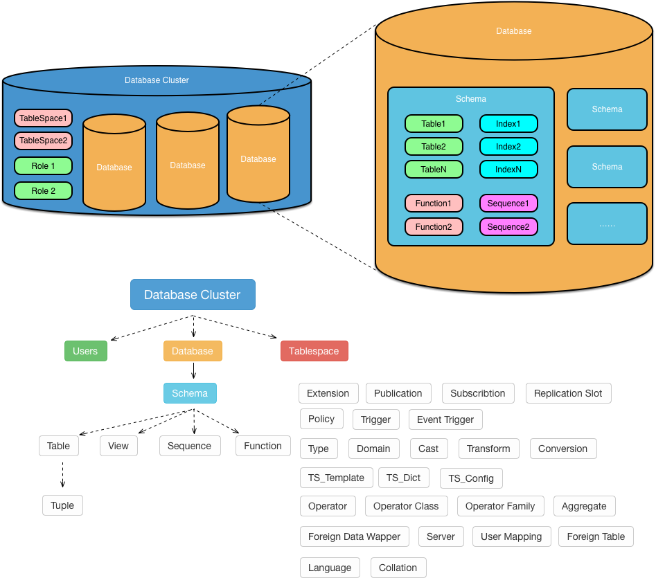

# PostgreSQL架构概览

本文简要介绍了PostgreSQL的架构，包括数据库在逻辑上的组织形式，以及在物理上的实现方式。


## 引言

状态机可以视为计算的通用模型。因此当谈论架构时，我们需要讨论两个方面：

* 内存与磁盘中的状态是如何组织的？
* 操作系统中的进程又是如何与状态交互的？


## 逻辑结构

​	数据库在逻辑上由许许多多，各式各样的对象组成：数据库集簇（Database Cluster），数据库（Database），表空间（Tablespace），用户/角色（Role），模式（Schema），表（Table），索引（Index），序列（Sequence），等等等。数据库的状态就保存在这些对象之中，如图所示：



**图1：PG中的对象层次结构（只列出了部分对象）**

#### 逻辑组织

​	数据库中的对象间存在层次关系，数据库对象的隶属关系在逻辑上组织为一颗树。：数据库集簇是整个数据库的根，它有三类子节点：数据库，表空间，角色。数据库又包含着模式（Schema，实际上是命名空间），数据库或者模式又包含着各式各样的对象：表，索引，序列，函数，运算符，类型，等等等等。而表中的元组，实际上也是一种对象。

#### 系统目录与`oid`

​	除了大多数普通元组之外，所有数据库对象都有一个全局分配的“主键”，称为对象标识符（Object Identifer，`oid`）。数据库中的对象，可以通过系统目录查询，即`pg_catalog`中的表与视图。例如`pg_database`中就包含了所有数据库对象，`pg_tablespace`中的元组与表空间一一对应，而`pg_class`则包含了一切长得像表的对象。对象标识符，就是这些系统对象表的“主键”。例如：

```bash
$ psql -c 'SELECT oid, datname FROM pg_database;'
   oid   |   datname
---------+-------------
   12558 | postgres
   16384 | vonng
       1 | template1
   12557 | template0
   16386 | meta
 4309371 | geo
 3537573 | adcode
```

​	元组比较特殊，因为`oid`实际上是32位整型，如果为任何元组都分配一个`oid`，那一旦数据库中超过43亿条记录，对象标识符就被元组消耗干净了。因此除了一些特殊的，被配置为`WITH OIDS`的表，其他表中的元组都不会分配对象标识符。


## 物理结构

​	数据库对象是逻辑上的概念，但这些概念如何落地，对应到内存中的数据结构与磁盘中的文件呢？这就是具体实现要解决的问题了。让我们自顶向下来观察这些对象是如何实现的。

* 数据库集簇

* 数据库

* 关系

* 页面

* 元组


## 进程结构


## 内存结构