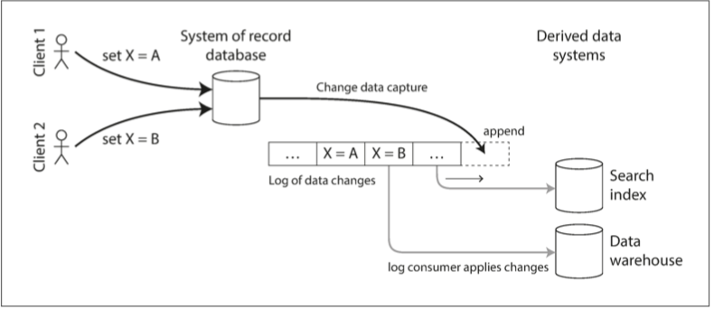

# PostgreSQL变更数据捕获

[TOC]


## 前驱知识

### CDC与ETL

数据库在本质上是一个**状态集合**，任何对数据库的**变更**（增删改）本质上都是对状态的修改。

在实际生产中，我们经常需要把数据库的状态同步到其他地方去，例如同步到数据仓库进行分析，同步到消息队列供下游消费，同步到缓存以加速查询。总的来说，搬运状态有两大类方法：ETL与CDC。

*  ETL（ExtractTransformLoad）着眼于状态本身，用定时批量轮询的方式拉取状态本身。

* CDC（ChangeDataCapture）则着眼于变更，以流式的方式持续收集状态变化事件（变更）。

ETL大家都耳熟能详，每天批量跑ETL任务，从生产OLTP数据库**拉取（E）**，**转换（T）**格式，**导入（L）**数据仓库，在此不赘述。相对ETL，CDC算是个新鲜玩意，随着流计算的崛起也越来越多地进入人们的视线。

**变更数据捕获（change data capture, CDC）**是一种观察写入数据库的所有数据变更，并将其提取并转换为可以复制到其他系统中的形式的过程。 CDC很有意思，特别是当**变更**能在被写入数据库后立刻用于后续的**流处理**时。

例如，你可以捕获数据库中的变更，并不断将相同的变更应用至**搜索索引**（e.g elasticsearch）。如果变更日志以相同的顺序应用，则可以预期搜索索引中的数据与数据库中的数据是匹配的。同理，这些变更也可以应用于后台刷新**缓存**（redis），导入**数据仓库**（EventSourcing，存储不可变的事实事件记录而不是每天取快照），**收集统计数据与监控**，等等等等。在这种意义下，外部索引，缓存，数仓都成为了PostgreSQL在逻辑上的从库，这些衍生数据系统都成为了变更流的消费者。（所以应用只需要操心怎样把数据写入数据库，而不是终日操心保持这么多异构数据组件同步的问题）。




### 逻辑解码

PostgreSQL本身的**预写式日志WAL**就是变更事件的记录。大多数数据库的复制日志的问题在于，它们一直被当做数据库的内部实现细节，而不是公开的API。客户端应该通过其数据模型和查询语言来查询数据库，而不是解析复制日志并尝试从中提取数据。许多数据库根本没有记录在案的获取变更日志的方式。因此捕获数据库中所有的变更然后将其复制到其他状态存储（搜索索引，缓存，数据仓库）中是相当困难的。

不过，PostgreSQL在9.4版本后提供了一种称为**逻辑解码（Logical Decoding）**的机制，提供了一套从数据库中获取变更的机制。它允许对数据库进行变更时，将数据库的变更（WAL二进制记录）解码成为逻辑变更（表增删改事件），并以流式的方式发送给订阅者。

逻辑解码要解决的问题是这样的，虽然PostgreSQL的WAL日志中已经包含了完整的，权威的变更事件记录，但这种记录格式过于底层。用户并不会对磁盘上某个数据页里的二进制变感兴趣，他们感兴趣的是某张表中增删改了哪些行哪些字段。**逻辑解码**就是将物理变更记录翻译为用户期望的逻辑变更事件的机制。

即：逻辑解码可以将数据库的二进制变更内容（文件A页面B偏移量C追加写入二进制数据D）翻译为逻辑上用户感兴趣的事件（表A上的增删改事件）。

例，PostgreSQL WAL日志中的二进制变更内容（使用`pg_waldump`解析）

```
rmgr: Btree       len (rec/tot):     64/    64, tx:       1342, lsn: 2D/AAFFC9F0, prev 2D/AAFFC810, desc: INSERT_LEAF off 126, blkref #0: rel 1663/3101882/3105398 blk 4
rmgr: Heap        len (rec/tot):    485/   485, tx:       1342, lsn: 2D/AAFFCA30, prev 2D/AAFFC9F0, desc: INSERT off 10, blkref #0: rel 1663/3101882/3105391 blk 139
```

我们想要的逻辑解码后的内容：

```json
{"change":[{"kind":"insert","schema":"public","table":"test","columnnames":["id","data"],"columntypes":["integer","text"],"columnvalues":[12,"xixi"]}]}

{"change":[{"kind":"update","schema":"public","table":"test","columnnames":["id","data"],"columntypes":["integer","text"],"columnvalues":[1,"hoho"],"oldkeys":{"keynames":["id"],"keytypes":["integer"],"keyvalues":[1]}}]}
```


### 逻辑复制

解决了变更内容形式的问题，另一个问题在于怎么样"**订阅**"变更。用户期望的是一个类似于Kafka消费者的接口，用户的客户端程序可以不断地接受最新的变更通知，而不是自己去轮询，或者去人肉解析已经落盘的日志。PostgreSQL的Replication接口提供了这样一种功能，在这里，CDC客户端可以将自己伪装成一个PostgreSQL的从库，从而不断地实时从PostgreSQL主库中接收逻辑解码后的变更内容。同时CDC客户端还可以通过PostgreSQL提供的**复制槽（Replication Slot）**机制来保存自己的**消费者偏移量**，即消费进度，从而实现类似消息队列**恰好一次**的保证，保证不错过变更数据。

```sql
postgres=# table pg_stat_replication; -- 查看当前从库
-[ RECORD 1 ]----+------------------------------
pid              | 14082
usesysid         | 10
usename          | vonng
application_name | cdc
client_addr      | 10.1.1.95
client_hostname  |
client_port      | 56609
backend_start    | 2019-05-19 13:14:34.606014+08
backend_xmin     |
state            | streaming
sent_lsn         | 2D/AB269AB8     -- 服务端已经发送的消息坐标
write_lsn        | 2D/AB269AB8     -- 客户端已经执行完写入的消息坐标
flush_lsn        | 2D/AB269AB8     -- 客户端已经刷盘的消息坐标（不会丢失）
replay_lsn       | 2D/AB269AB8     -- 客户端已经应用的消息坐标（已经生效）
write_lag        |
flush_lag        |
replay_lag       |
sync_priority    | 0
sync_state       | async

postgres=# table pg_replication_slots;  -- 查看当前复制槽
-[ RECORD 1 ]-------+------------
slot_name           | test
plugin              | decoder_raw
slot_type           | logical
datoid              | 13382
database            | postgres
temporary           | f
active              | t
active_pid          | 14082
xmin                |
catalog_xmin        | 1371
restart_lsn         | 2D/AB269A80       -- 下次客户端重连时将从这里开始重放
confirmed_flush_lsn | 2D/AB269AB8       -- 客户端确认完成的消息进度
```


## 快速上手

### 从SQL接口开始

逻辑复制槽的增删查

```sql
pg_create_logical_replication_slot(slot_name name, plugin name) -- 增
pg_drop_replication_slot(slot_name name) -- 删
TABLE pg_replication_slots; -- 查
```

从逻辑复制槽中获取最新的变更数据

```sql
pg_logical_slot_get_changes(slot_name name, ...)  -- 消费掉
pg_logical_slot_peek_changes(slot_name name, ...) -- 只查看不消费
```

文档提供的逻辑解码样例：https://www.postgresql.org/docs/11/logicaldecoding-example.html

```sql
-- create table & slot
DROP TABLE IF EXISTS test;
CREATE TABLE test(id SERIAL PRIMARY KEY, data TEXT);
SELECT * FROM pg_create_logical_replication_slot('test_slot', 'test_decoding');

-- test1
INSERT INTO test(data) VALUES ('xixi');
INSERT INTO test(data) VALUES ('haha');
SELECT * FROM pg_logical_slot_get_changes('test_slot', NULL, NULL);

-- test2
UPDATE test SET data = 'hoho' WHERE id = 1;
DELETE FROM test WHERE id = 2;
SELECT * FROM  pg_logical_slot_get_changes('test_slot', NULL, NULL);

-- drop slot
SELECT pg_drop_replication_slot('test_slot');
```

### 使用客户端接收变更

下面是使用PostgreSQL自带的CDC客户端程序持续接收逻辑解码产生的数据流的例子。

```bash
# 启动一个CDC客户端，连接数据库postgres，创建名为test_slot的槽，使用decoder_raw解码插件，标准输出
pg_recvlogical -d postgres \
	--create-slot --if-not-exists --slot=test_slot \
	--plugin=decoder_raw --start -f -

# 开启另一个会话，执行以下命令，观察上一会话的输出结果。
psql -c 'DROP TABLE IF EXISTS test; CREATE TABLE test(id SERIAL PRIMARY KEY, data TEXT);'
psql postgres -c "INSERT INTO test(data) VALUES ('xixi');"
psql postgres -c "UPDATE test SET data = 'hoho' WHERE id = 1;"

# 输出结果
BEGIN 51286
table public.test: INSERT: id[integer]:11 data[text]:'xixi'
COMMIT 51286
BEGIN 51287
table public.test: UPDATE: id[integer]:1 data[text]:'hoho'
COMMIT 51287

# 擦屁股：删除创建的复制槽
pg_recvlogical -d postgres --drop-slot --slot=test_slot
```

### 输出解释

PostgreSQL的变更日志（WAL）是紧凑的二进制格式，而且需要一些系统目录（catalog）中的元数据才能正确解读。因此外部组件想要像Parse MySQL Binlog一样尝试直接从PostgreSQL WAL中解析变更事件出来是比较麻烦的。PostgreSQL9.4开始提供了逻辑解码机制，即，在变更事件（事务开始，结束，行的增删改）发生时，通过调用输出插件提供的**回调函数**，把这些事件格式化成特定形式并输出。

上面的例子中，主要的变更事件包括事务的**开始**与**结束**，以及**数据行的增删改**。这里默认的`test_decoding`插件的输出格式为：

```
BEGIN {事务标识}
table {模式名}.{表名} {命令INSERT|UPDATE|DELETE}  {列名}[{类型}]:{取值} ...
COMMIT {事务标识}
```


## 其他输出格式

获取变更只是问题之一，需要解决的第二个问题是选择合适的输出格式。PostgreSQL自带的`test_decoding`插件使用的是很朴素的输出格式：

```
BEGIN 51281
table public.test: INSERT: id[integer]:8 data[text]:'hoho'
COMMIT 51281
BEGIN 51282
table public.test: INSERT: id[integer]:9 data[text]:'xixi'
COMMIT 51282
```

这种输出格式已经包含了大部分我们感兴趣的信息：表名称，模式名称，每一列的名称，类型，以及取值。

不过这样的格式并不适合解析，想当然的解析逻辑很可能会被一些特殊字符所破坏。更为通用的格式，例如SQL，JSON，Protobuf也许是一个更好的选择。

PostgreSQL Wiki给出了一系列逻辑解码输出插件：https://wiki.postgresql.org/wiki/Logical_Decoding_Plugins

* PostgreSQL自带的逻辑解码输出插件：https://github.com/postgres/postgres/blob/master/contrib/test_decoding/test_decoding.c
* JSON格式输出插件：https://github.com/eulerto/wal2json
* SQL格式输出插件：https://github.com/michaelpq/pg_plugins/tree/master/decoder_raw
* Protobuf输出插件：https://github.com/debezium/postgres-decoderbufs
* 当然还有PostgreSQL自带逻辑复制所使用的消息格式：https://www.postgresql.org/docs/11/protocol-logicalrep-message-formats.html

安装这些插件是很简单的，有一些输出插件（例如`wal2json`）可以直接从官方二进制源轻松安装。即使是编译安装也并不复杂，编译这些插件时只需要确保`pg_config`已经在你的`PATH`中，然后执行`make & sudo make install`两板斧即可。

```bash
# CentOS
yum install wal2json11

# Ubuntu
apt install postgresql-11-wal2json

# 这次使用wal2json作为输出插件
pg_recvlogical -d postgres \
	--create-slot --if-not-exists --slot=test_slot \
	--plugin=wal2json --start -f -
```

再次执行上面的变更命令，输出结果变为JSON格式：

```json
{"change":[{"kind":"insert","schema":"public","table":"test","columnnames":["id","data"],"columntypes":["integer","text"],"columnvalues":[12,"xixi"]}]}

{"change":[{"kind":"update","schema":"public","table":"test","columnnames":["id","data"],"columntypes":["integer","text"],"columnvalues":[1,"hoho"],"oldkeys":{"keynames":["id"],"keytypes":["integer"],"keyvalues":[1]}}]}
```

换用`decoder_raw`插件，输出结果变为SQL语句，注意解码得到的SQL语句效果等价于原语句，但形式上并不一定相同。

```bash
$ pg_recvlogical -d postgres \
→ --create-slot --if-not-exists --slot=test_slot \
→ --plugin=decoder_raw --start -f -
INSERT INTO public.test (id, data) VALUES (13, 'xixi');
INSERT INTO public.test (id, data) VALUES (14, 'hoho');
```

`decoder_raw`可以用于抽取SQL形式表示的状态变更，将这些抽取得到的SQL语句在同样的基础状态上重放，即可得到相同的结果。PostgreSQL就是使用这样的机制实现逻辑复制的。

一个典型的应用场景就是数据库不停机迁移。在传统不停机迁移模式（双写，改读，改写）中，第三步改写完成后是无法快速回滚的，因为写入流量在切换至新主库后如果发现有问题想立刻回滚，老主库上会丢失一些数据。这时候就可以使用`decoder_raw`提取主库上的最新变更，并通过一行简单的Bash命令，将新主库上的变更实时同步到旧主库。保证迁移过程中任何时刻都可以快速回滚至老主库。

```bash
pg_recvlogical -d <new_master_url> --slot=test_slot --plugin=decoder_raw --start -f - |
psql <old_master_url>
```

既然可以将变更事件转化为SQL格式，当然也可以转换成各种各样的其他格式，例如解码输出为Redis的kv操作用于后台刷新缓存，或者仅仅抽取一些关键字段用于更新统计数据或者构建外部索引。怎样使用这些变更事件流有着很大的想象空间。

逻辑解码输出插件的编写可以参阅这一篇官方文档：https://www.postgresql.org/docs/11/logicaldecoding-output-plugin.html。编写自定义的逻辑解码输出插件一点儿都不复杂，因为逻辑解码输出插件本质上不过是一个拼字符串的回调函数集合，往往只有一个简单的两三百行都C文件，在官方样例的基础上稍作修改，即可实现一个你自己的逻辑解码输出插件。


## CDC客户端

PostgreSQL自带了一个名为`pg_recvlogical`的客户端应用，可以将逻辑变更的事件流写至标准输出。但并不是所有的消费者都可以或者愿意使用Unix Pipe来完成所有工作的。此外，根据端到端原则，使用`pg_recvlogical`将变更数据流落盘并不意味着消费者已经拿到并确认了该消息，只有消费者自己亲自向数据库确认才可以。

编写CDC客户端，实际上是实现了一个"猴版”数据库从库，实现了一个逻辑复制订阅者。客户端向数据库建立一条Replication连接，假装自己是一个从库，从主库获取解码或者原始二进制的变更数据流，并周期性地向主库汇报自己的消费进度（落盘进度，刷盘进度，应用进度）。

### 复制连接

CDC客户端通常会使用**复制连接（Replication Connection）**，来从数据库捕获变更事件。复制连接，顾名思义，就是用于物理/逻辑复制的特殊数据库连接。设置连接参数`replication`即可建立复制连接

譬如下面这条命令就会建立一条复制连接

```bash
$ psql 'postgres://localhost:5432/postgres?replication=on&application_name=mocker'
```

从系统视图`pg_stat_replication`可以看到主库识别到了一个新的"从库"

```
vonng=# table pg_stat_replication ;
-[ RECORD 1 ]----+-----------------------------
pid              | 7218
usesysid         | 10
usename          | vonng
application_name | mocker
client_addr      | ::1
client_hostname  |
client_port      | 53420
```

复制连接可以执行一些特殊的命令，例如`IDENTIFY_SYSTEM`, `TIMELINE_HISTORY`, `CREATE_REPLICATION_SLOT`, `START_REPLICATION`, `BASE_BACKUP`, 在逻辑复制的情况下，还可以执行一些简单的SQL查询。具体细节可以参考PostgreSQL官方文档中前后端协议一章：https://www.postgresql.org/docs/current/protocol-replication.html

### 编写自定义逻辑

无论是JDBC还是Go语言的PostgreSQL驱动，都提供了相应的接口。这里让我们用Go语言编写一个简单的CDC客户端，从数据库持续接受变更数据流。

```go
package main

import (
	"log"
	"time"
	"context"
	"github.com/jackc/pgx"
)

type Subscriber struct {
	URL    string
	Slot   string
	Plugin string
	Conn   *pgx.ReplicationConn
	LSN    uint64
}

// Connect 会建立到服务器的复制连接，区别在于自动添加了replication=on|1|yes|dbname参数
func (s *Subscriber) Connect() {
	connConfig, _ := pgx.ParseURI(s.URL)
	s.Conn, _ = pgx.ReplicationConnect(connConfig)
}

// ReportProgress 会向主库汇报写盘，刷盘，应用的进度坐标（消费者偏移量）
func (s *Subscriber) ReportProgress() {
	status, _ := pgx.NewStandbyStatus(s.LSN)
	s.Conn.SendStandbyStatus(status)
}

// CreateReplicationSlot 会创建逻辑复制槽，并使用给定的解码插件
func (s *Subscriber) CreateReplicationSlot() {
	if consistPoint, snapshotName, err := s.Conn.CreateReplicationSlotEx(s.Slot, s.Plugin); err != nil {
		log.Fatalf("fail to create replication slot: %s", err.Error())
	} else {
		log.Printf("create replication slot %s with plugin %s : consist snapshot: %s, snapshot name: %s", s.Slot, s.Plugin, consistPoint, snapshotName)
		s.LSN, _ = pgx.ParseLSN(consistPoint)
	}
}

// StartReplication 会启动逻辑复制（服务器会开始发送事件消息）
func (s *Subscriber) StartReplication() {
	if err := s.Conn.StartReplication(s.Slot, 0, -1); err != nil {
		log.Fatalf("fail to start replication on slot %s : %s", s.Slot, err.Error())
	}
}

// DropReplicationSlot 会使用临时普通连接删除复制槽（如果存在）,注意如果复制连接正在使用这个槽是没法删的。
func (s *Subscriber) DropReplicationSlot() {
	connConfig, _ := pgx.ParseURI(s.URL)
	conn, _ := pgx.Connect(connConfig)
	var slotExists bool
	conn.QueryRow(`SELECT EXISTS(SELECT 1 FROM pg_replication_slots WHERE slot_name = $1)`, s.Slot).Scan(&slotExists)
	if slotExists {
		if s.Conn != nil {
			s.Conn.Close()
		}
		conn.Exec("SELECT pg_drop_replication_slot($1)", s.Slot)
	}
}

// Subscribe 开始订阅变更事件，主消息循环
func (s *Subscriber) Subscribe() {
	var message *pgx.ReplicationMessage
	for {
		// 等待一条消息, 消息有可能是真的消息，也可能只是心跳包
		message, _ = s.Conn.WaitForReplicationMessage(context.Background())
		if message.WalMessage != nil { // 如果是真的消息就消费它，可能是成功写入kafka，或者只是简单地打印出来。
			log.Printf("Message: %s", string(message.WalMessage.WalData))
			if message.WalMessage.WalStart > s.LSN { // 更新消费进度并向主库汇报
				s.LSN = message.WalMessage.WalStart + uint64(len(message.WalMessage.WalData))
				s.ReportProgress()
			}
		}
		if message.ServerHeartbeat != nil && message.ServerHeartbeat.ReplyRequested == 1 {
			s.ReportProgress() // 如果服务器心跳包要求回送进度，则汇报进度
		}
	}
}

func main() {
	subscriber := &Subscriber{
		URL:    "postgres://10.1.1.10:5432/postgres?application_name=cdc",
		Slot:   "test",
		Plugin: "decoder_raw",
	} // 创建新的CDC客户端
	subscriber.DropReplicationSlot()       // 如果存在，清理掉遗留的Slot
	subscriber.Connect()                   // 建立复制连接
	defer subscriber.DropReplicationSlot() // 擦屁股
	subscriber.CreateReplicationSlot()     // 创建复制槽
	subscriber.StartReplication()          // 开始接收变更流
	go func() {
		for {
			time.Sleep(5 * time.Second)
			subscriber.ReportProgress()
		}
	}() // 协程2周期性地向主库汇报进度
	subscriber.Subscribe() // 主消息循环
}

```


## 限制

理论和实践之间是存在不少的差异的。想要在生产环境中使用CDC，还需要考虑一些其他的问题。

### Failover

对目前PostgreSQL的CDC来说，Failover是最大的难点与痛点。逻辑复制依赖复制槽，而目前的实现而言，复制槽只能用在Master上，且复制槽本身并不会被复制到从库上。因此当主库进行Failover时，就会丢失消费者偏移量。如果在新的主库承接任何写入之前没有重新建好逻辑复制槽，就有可能会丢失一些数据。

因此对于非常严格的场景，使用这个功能时仍然需要谨慎。好在这个问题是可解的，2Quadrant已经提出了Failover Slot的Patch，将会在后续版本中加入并解决这个问题。

### DDL Change

目前PostgreSQL的逻辑解码只提供了以下几个Hook：

```
LogicalDecodeStartupCB startup_cb;
LogicalDecodeBeginCB begin_cb;
LogicalDecodeChangeCB change_cb;
LogicalDecodeTruncateCB truncate_cb;
LogicalDecodeCommitCB commit_cb;
LogicalDecodeMessageCB message_cb;
LogicalDecodeFilterByOriginCB filter_by_origin_cb;
LogicalDecodeShutdownCB shutdown_cb;
```

其中比较重要，也是必须提供的是三个回调函数：

- begin：事务开始
- change：行级别增删改事件
- commit：事务提交

因此像DDL变化这一类的事件目前还没法从逻辑解码中获得（当然也是有work around的办法）。好消息是这个问题是可解的，后续版本会陆续提供支持。

