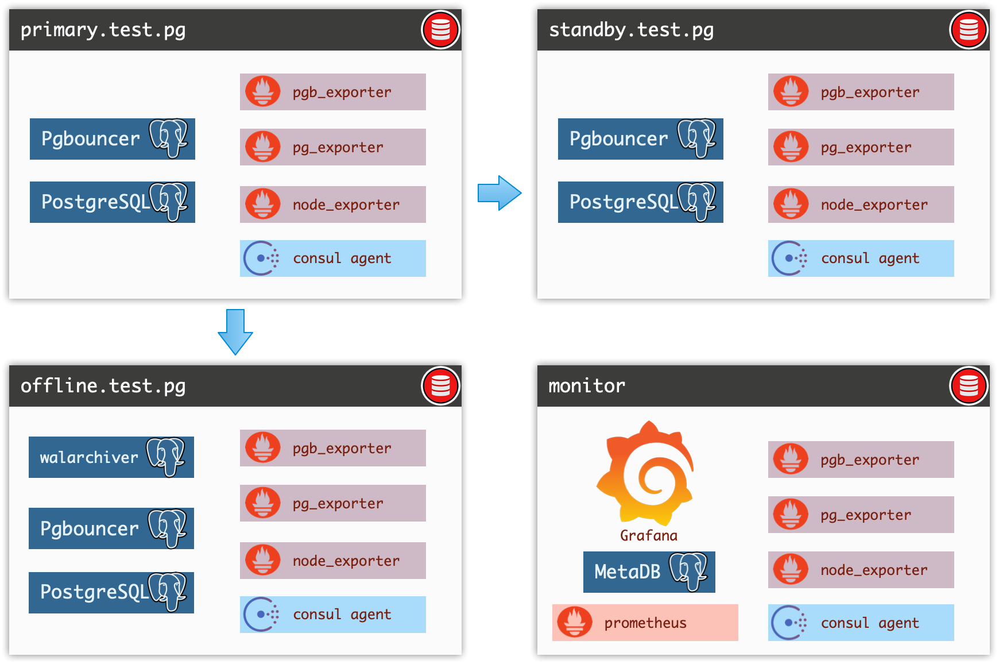
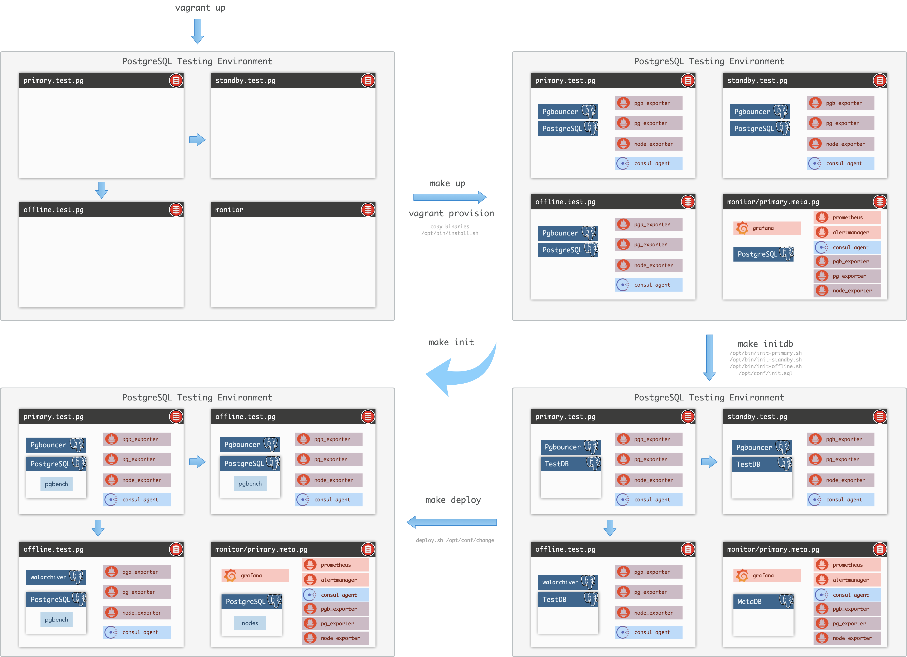
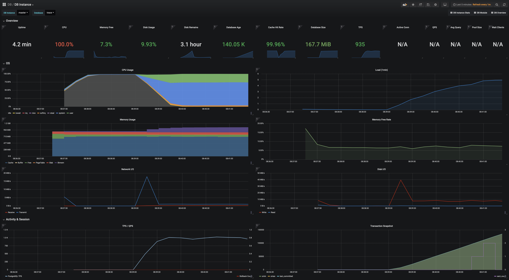
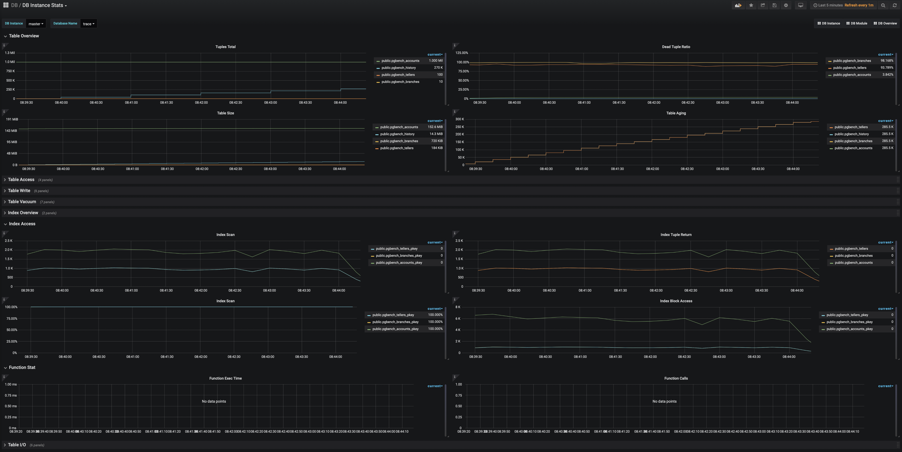
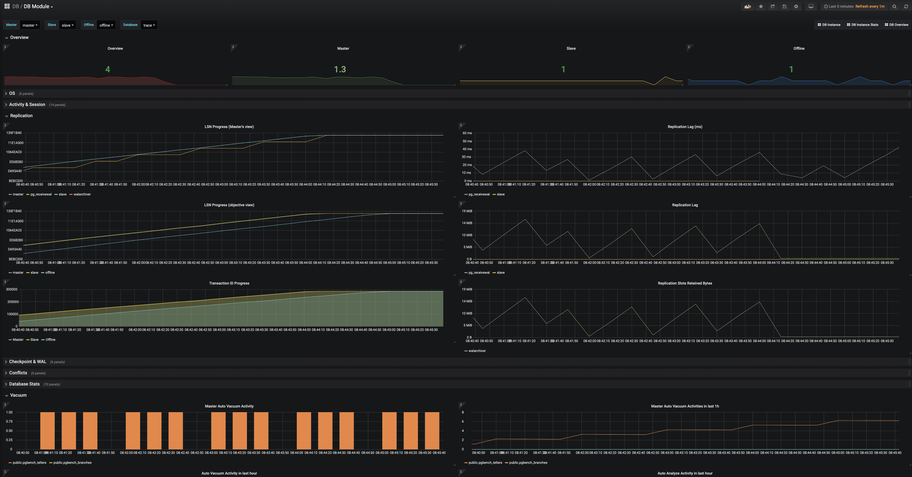
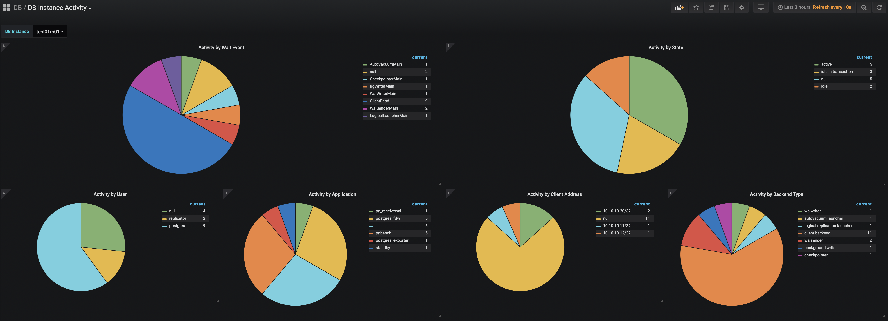
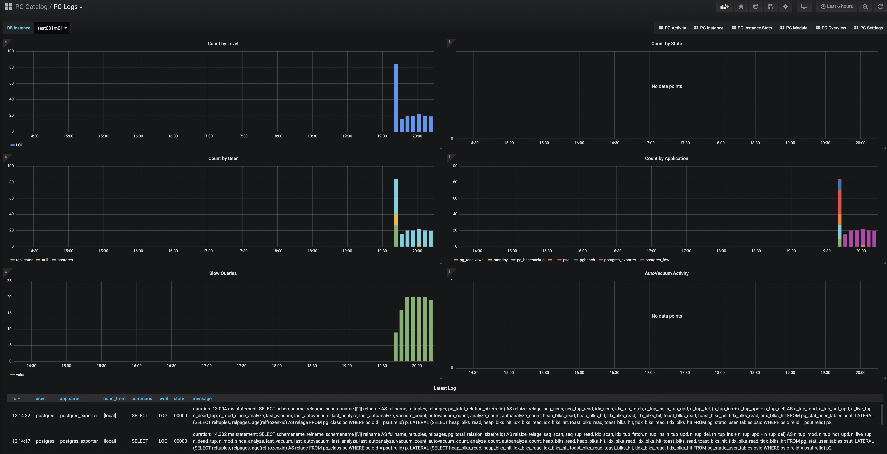

# PostgreSQL Testing Environment

This repo provide a testing environment of PostgreSQL cluster via [vagrant](https://vagrantup.com/), Which provide a minimal HA Unit consist of 3 nodes: [Primary](node/primary.test.pg), [Standby](node/standby.test.pg), [Offline](node/offline.test.pg) , and a battery included [Monitor](node/monitor) system with a simple CMDB. 

This repo is also about illustrating some best practice on running PostgreSQL in production.




## Quick start

### Install

Make sure you already have [Vagrant](https://vagrantup.com/) installed with a proper VM provider ([VirtualBox](https://www.virtualbox.org/)), Then perform following steps in command line (Assume you are using Mac, or *nix environment with proper settings)

```bash
# Step 1: install vagrant & VirtualBox
brew install vagrant
open https://www.virtualbox.org/wiki/Downloads

# Step 2: clone this repo and enter
git clone https://github.com/Vonng/pg && cd pg/test

# Step 3: only run this for the first time to setup DNS to your localhost
sudo make dns
```

### Setup

```bash
# teardown and launch all four instance
make new

# init database cluster & setup replication, initialize database schema & deploy changes
make init

# going to dashboard (default: admin/admin)
make view
```

* Grafana dashboard: http://monitor:3000 
* Prometheus Console: http://monitor:9090

```bash
# These command will add activity to database
make test
```

### Notes

It may take 5~20 minutes to complete the first-time-run init procdure, depends on your network condition (some package already put in `pkg` while some package still needs download). After that if you **** things up ,if it is just about database stuff. Run `make init` will gives you a whole new cluster in serval seconds.




## Content

### Infrastructures

- [x] [DNS](bin/setup-dns.sh)
- [x] [ssh](bin/setup-ssh.sh)
- [x] [System Utils / NTP](bin/install-utils.sh)
- [x] [consul](bin/install-consul.sh)
- [x] [node_exporter](bin/install-node-exporter.sh)
- [x] [postgresql](bin/install-postgres.sh)
- [x] [walarchiver](pkg/walarchiver)
- [x] [postgres_exporter](bin/install-postgres-exporter.sh)
- [x] [pgbouncer](bin/install-pgbouncer.sh)
- [ ] [pgbouncer_exporter](bin/install-pgbouncer-exporter.sh)
- [x] [primary](bin/init-primary.sh)
- [x] [standby](bin/init-standby.sh)
- [x] [offline](bin/init-offline.sh)
- [x] [CMDB](node/monitor/init.sql)
- [ ] chronosync 
- [ ] pacemaker
- [ ] keepalived
- [x] Prometheus
- [x] Grafana
- [ ] Alertmanager
- [ ] DNS
- [ ] HA Proxy


### Moniotring

> These are local links: `http://monitor:3000/xxxx`
>

- [x] [DB Overview](http://monitor:3000/d/Wydmsfb/pg-overview?orgId=1)
- [x] [DB Module](http://monitor:3000/d/yQg0oM_ik/pg-module?orgId=1)
- [x] [DB Instance](http://monitor:3000/d/g9znmlizf/pg-instance?orgId=1)
- [x] [DB Instance Stats](http://monitor:3000/d/g9zn4mliz/pg-instance-stats?orgId=1)
- [x] [PG Logs](http://monitor:3000/d/ejPhiJjiz/pg-logs?orgId=1)
- [ ] [PG Activities](http://monitor:3000/d/ACTIVITY/pg-activity?orgId=1)
- [ ] [PG Settings](http://monitor:3000/d/38BztPCmz/pg-settings?orgId=1)
- [ ] [PG Tables](http://monitor:3000/d/Ob_5pEjik/pg-tables?orgId=1)
- [ ] Grafana Provision
- [ ] Swtich to node id in PG Metrics
- [ ] Merge `postgres_exporter` and `pgbouncer_exporter` into one.












### DBA/OPS Scritps

(on-going)

- [x] deploy
- [ ] vacuum
- [ ] repack
- [ ] analyze
- [ ] report
- [ ] fencing
- [ ] failover
- [ ] pgbouncer_ctl
- [ ] rewind
- [ ] ……..  


## Architecture

### Overview

This cluster is consist of three Database nodes: Primary, Standby, Offline

* Primary: PostgreSQL, Pgbouncer, Consul, NodeExporter, PostgresExporter
* Standby: PostgreSQL, Pgbouncer, Consul, NodeExporter, PostgresExporter
* Offline: PostgreSQL, walarchiver, Consul, NodeExporter, PostgreSQL
* Monitor: PostgreSQL, pgbouncer, Consul, NodeExporter, Grafana, Prometheus


### File structure

```
pkg                 -> /opt/pkg   # softwares/binarys/scripts
bin                 -> /opt/bin   # init scripts
node/<node_id>      -> /opt/conf  # configuration
bin/pg              -> /pg/bin    # DBA scripts
```


Each node have a directory in `dba/node` named with their hostname (e.g primary instance have a corresponding  `dba/node/primary` directory), That directory will maps to `$HOSTNAME:/opt/conf` when vagrant launch. Self defined configuration files (such as `postgresql.conf`, `pg_bouncer.ini`, `postgres_exporter.yaml`,etc…) will overwrite default settings.


## About

Author：Vonng ([fengruohang@outlook.com](mailto:fengruohang@outlook.com))
