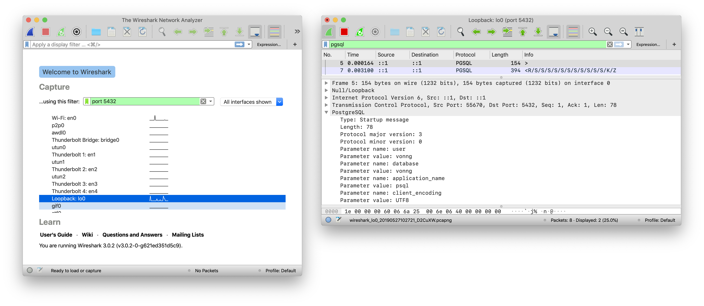
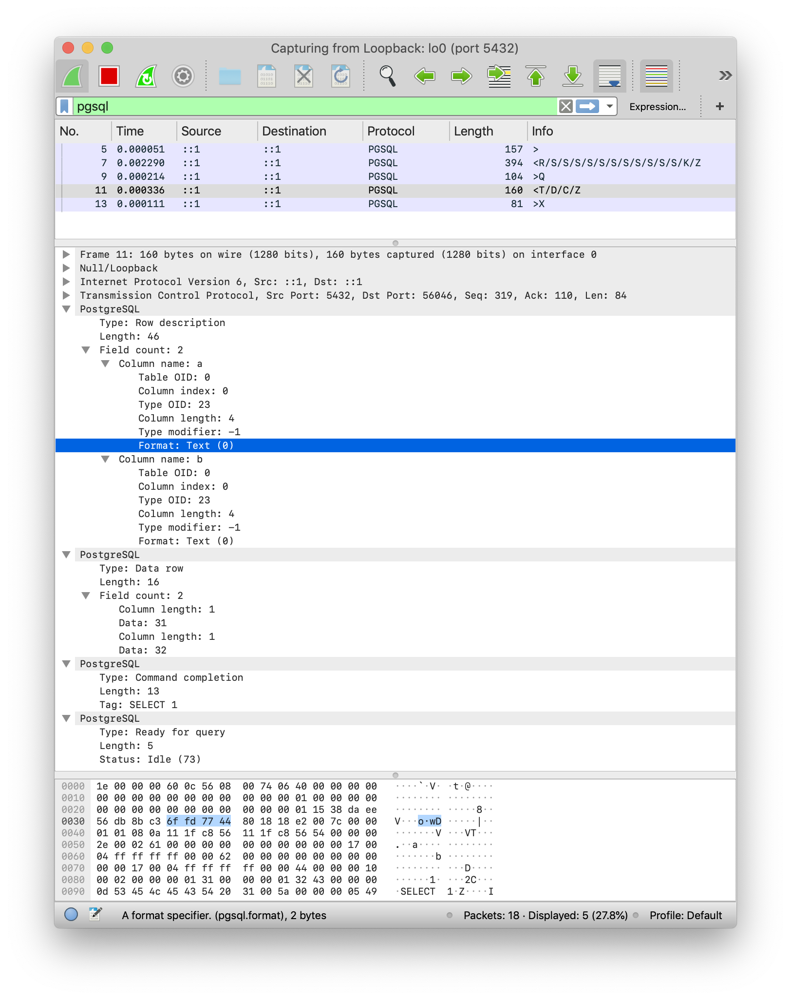

# Wireshark Capture

Wireshark是一个很有用的工具，特别适合用来分析网络协议。

这里简单介绍使用Wireshark抓包分析PostgreSQL协议的方法。

假设调试本地PostgreSQL实例：127.0.0.1:5432

## 快速开始

1. 下载并安装Wireshark：[下载地址](https://www.wireshark.org/download.html)

2. 选择要抓包的网卡，如果是本地测试选择`lo0`即可。
3. 添加抓包过滤器，如果PostgreSQL使用默认设置，使用`port 5432`即可。
4. 开始抓包
5. 添加显示过滤器`pgsql`，这样就可以滤除无关的TCP协议报文。

6. 然后就可以执行一些操作，观察并分析协议了




## 样例

我们先从最简单的case开始，不使用认证，也不使用SSL，执行以下命令建立一条到PostgreSQL的连接。

```bash
psql postgres://localhost:5432/postgres?sslmode=disable -c 'SELECT 1 AS a, 2 AS b;'
```

注意这里`sslmode=disable`是不能省略的，不然客户端会默认尝试发送SSL请求。`localhost`也是不能省略的，不然客户端会默认尝试使用unix socket。

这条Bash命令实际上在PostgreSQL对应着三个协议阶段与5组协议报文

* 启动阶段：客户端建立一条到PostgreSQL服务器的连接。
* 简单查询协议：客户端发送查询命令，服务器回送查询结果。
* 终止：客户端中断连接。



Wireshark内建了对PGSQL的解码，允许我们方便地查看PostgreSQL协议报文的内容。

启动阶段，客户端向服务端发送了一条`StartupMessage (F)`，而服务端回送了一系列消息，包括`AuthenticationOK(R)`， `ParameterStatus(S)`, `BackendKeyData(K)` , `ReadyForQuery(Z)`。这里这几条消息都打包在同一个TCP报文中发送给客户端。

简单查询阶段，客户端发送了一条`Query (F)`消息，将SQL语句`SELECT 1 AS a, 2 AS b;`直接作为内容发送给服务器。服务器依次返回了`RowDescription(T)`,`DataRow(D)`,`CommandComplete(C)`,`ReadyForQuery(Z)`.

终止阶段，客户端发送了一条`Terminate(X)`消息，终止连接。